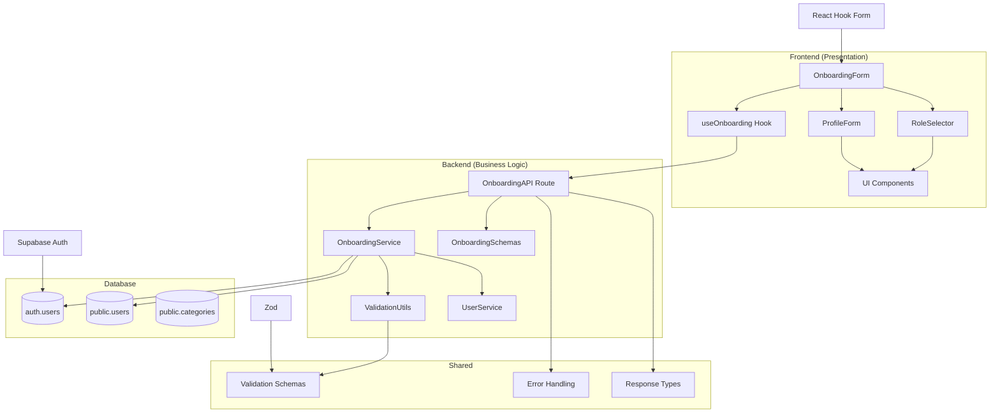

# 구현 계획: 역할 선택 & 온보딩

## 개요

### 구현할 모듈 목록

| 모듈명 | 위치 | 설명 |
|--------|------|------|
| **OnboardingForm** | `src/features/onboarding/components/onboarding-form.tsx` | 단계별 온보딩 폼 컴포넌트 |
| **RoleSelector** | `src/features/onboarding/components/role-selector.tsx` | 역할 선택 UI 컴포넌트 |
| **ProfileForm** | `src/features/onboarding/components/profile-form.tsx` | 프로필 정보 입력 폼 |
| **OnboardingAPI** | `src/features/onboarding/backend/route.ts` | 온보딩 API 엔드포인트 |
| **OnboardingService** | `src/features/onboarding/backend/service.ts` | 온보딩 비즈니스 로직 |
| **OnboardingSchemas** | `src/features/onboarding/backend/schema.ts` | 요청/응답 스키마 정의 |
| **OnboardingHooks** | `src/features/onboarding/hooks/useOnboarding.ts` | 온보딩 상태 관리 훅 |
| **ValidationUtils** | `src/lib/validation/onboarding.ts` | 공통 검증 로직 |
| **FormComponents** | `src/components/ui/` | 재사용 가능한 폼 컴포넌트 확장 |

## Diagram



## Implementation Plan

### 1. Shared Modules (공통 모듈)

#### 1.1 ValidationUtils (`src/lib/validation/onboarding.ts`)
```typescript
// 온보딩 관련 공통 검증 로직
export const validateEmail = (email: string) => { /* ... */ }
export const validatePassword = (password: string) => { /* ... */ }
export const validatePhoneNumber = (phone: string) => { /* ... */ }
export const validateFullName = (name: string) => { /* ... */ }
```

**Unit Tests:**
- ✅ 이메일 형식 검증 (유효/무효 케이스)
- ✅ 비밀번호 강도 검증 (길이, 복잡성)
- ✅ 휴대폰 번호 형식 검증 (010-XXXX-XXXX)
- ✅ 이름 길이 및 문자 검증 (2-50자, 한글/영문)

#### 1.2 OnboardingSchemas (`src/features/onboarding/backend/schema.ts`)
```typescript
// Zod 스키마 정의
export const SignupRequestSchema = z.object({
  email: z.string().email(),
  password: z.string().min(8),
  role: z.enum(['learner', 'instructor']),
  profile: z.object({
    fullName: z.string().min(2).max(50),
    phone: z.string().regex(/^010-\d{4}-\d{4}$/),
    termsAgreed: z.boolean().refine(val => val === true)
  })
});
```

### 2. Backend Modules (비즈니스 로직)

#### 2.1 OnboardingAPI (`src/features/onboarding/backend/route.ts`)
```typescript
export const registerOnboardingRoutes = (app: Hono<AppEnv>) => {
  // POST /api/onboarding/signup - 회원가입
  // POST /api/onboarding/check-email - 이메일 중복 체크
  // GET /api/onboarding/roles - 역할 목록 조회
}
```

**API Endpoints:**
- `POST /api/onboarding/signup` - 전체 온보딩 프로세스
- `POST /api/onboarding/check-email` - 이메일 중복 체크
- `GET /api/onboarding/roles` - 사용 가능한 역할 목록

#### 2.2 OnboardingService (`src/features/onboarding/backend/service.ts`)
```typescript
export const createUserAccount = async (data: SignupRequest) => {
  // 1. Supabase Auth 계정 생성
  // 2. 프로필 정보 저장
  // 3. 역할별 초기 권한 설정
  // 4. 온보딩 완료 처리
}

export const checkEmailExists = async (email: string) => {
  // 이메일 중복 체크 로직
}
```

**Unit Tests:**
- ✅ 계정 생성 성공 시나리오
- ✅ 이메일 중복 시 에러 처리
- ✅ 프로필 저장 실패 시 롤백
- ✅ 역할별 권한 설정 검증
- ✅ 네트워크 오류 시 에러 처리

### 3. Frontend Modules (프레젠테이션)

#### 3.1 OnboardingForm (`src/features/onboarding/components/onboarding-form.tsx`)
```typescript
export const OnboardingForm = () => {
  // 다단계 폼 상태 관리
  // 단계별 유효성 검사
  // 진행률 표시
  // 에러 상태 처리
}
```

**QA Sheet:**
- [ ] 이메일 입력 시 실시간 형식 검증
- [ ] 비밀번호 강도 표시기 동작
- [ ] 역할 선택 시 설명 표시
- [ ] 프로필 정보 필수 필드 검증
- [ ] 약관 동의 체크박스 필수 검증
- [ ] 제출 중 로딩 상태 표시
- [ ] 네트워크 오류 시 재시도 옵션
- [ ] 성공 시 적절한 페이지 리다이렉트

#### 3.2 RoleSelector (`src/features/onboarding/components/role-selector.tsx`)
```typescript
export const RoleSelector = ({ value, onChange }: RoleSelectorProps) => {
  // 역할 선택 UI
  // 역할별 설명 표시
  // 선택 상태 시각화
}
```

**QA Sheet:**
- [ ] Learner/Instructor 역할 선택 가능
- [ ] 선택된 역할 시각적 피드백
- [ ] 역할별 권한 설명 표시
- [ ] 키보드 네비게이션 지원
- [ ] 접근성 (ARIA) 속성 적용

#### 3.3 ProfileForm (`src/features/onboarding/components/profile-form.tsx`)
```typescript
export const ProfileForm = ({ onSubmit, isLoading }: ProfileFormProps) => {
  // 프로필 정보 입력 폼
  // 실시간 유효성 검사
  // 약관 동의 처리
}
```

**QA Sheet:**
- [ ] 이름 입력 필드 (2-50자 제한)
- [ ] 휴대폰 번호 형식 자동 포맷팅
- [ ] 약관 동의 체크박스 필수
- [ ] 약관 내용 팝업 표시
- [ ] 입력 오류 시 필드별 에러 메시지
- [ ] 폼 제출 시 로딩 상태

#### 3.4 useOnboarding Hook (`src/features/onboarding/hooks/useOnboarding.ts`)
```typescript
export const useOnboarding = () => {
  // 온보딩 상태 관리
  // API 호출 로직
  // 에러 상태 관리
  // 성공 시 리다이렉트
}
```

**Unit Tests:**
- ✅ 이메일 중복 체크 API 호출
- ✅ 회원가입 API 호출 및 응답 처리
- ✅ 에러 상태 관리 (네트워크, 서버 오류)
- ✅ 성공 시 사용자 정보 업데이트
- ✅ 역할별 리다이렉트 로직

### 4. UI Components Extension

#### 4.1 Enhanced Form Components
기존 `src/components/ui/` 컴포넌트 확장:

- **PasswordInput**: 비밀번호 강도 표시기 포함
- **PhoneInput**: 자동 하이픈 포맷팅
- **StepIndicator**: 다단계 폼 진행률 표시
- **RoleCard**: 역할 선택 카드 컴포넌트

### 5. Integration Points

#### 5.1 기존 Auth 시스템 연동
- `CurrentUserProvider` 업데이트
- `useCurrentUser` 훅 확장
- 로그인 후 온보딩 상태 체크

#### 5.2 라우팅 통합
- `/signup` 페이지 업데이트
- 온보딩 완료 후 리다이렉트 로직
- 보호된 라우트 가드 업데이트

#### 5.3 데이터베이스 연동
- `users` 테이블 스키마 활용
- `categories` 테이블 연동 (역할별 카테고리)
- 트랜잭션 처리 (Auth + Profile 저장)

## 구현 순서

1. **Phase 1**: Shared 모듈 (ValidationUtils, Schemas)
2. **Phase 2**: Backend API (Service, Route)
3. **Phase 3**: Frontend Components (Form, RoleSelector, ProfileForm)
4. **Phase 4**: Integration & Testing
5. **Phase 5**: QA & Polish

## 테스트 전략

### Unit Tests
- 모든 비즈니스 로직 함수 100% 커버리지
- Zod 스키마 검증 테스트
- API 서비스 모킹 테스트

### Integration Tests
- 전체 온보딩 플로우 E2E 테스트
- 에러 시나리오 통합 테스트
- 데이터베이스 트랜잭션 테스트

### QA Checklist
- 모든 사용자 시나리오 수동 테스트
- 접근성 (a11y) 검증
- 모바일 반응형 테스트
- 브라우저 호환성 테스트
