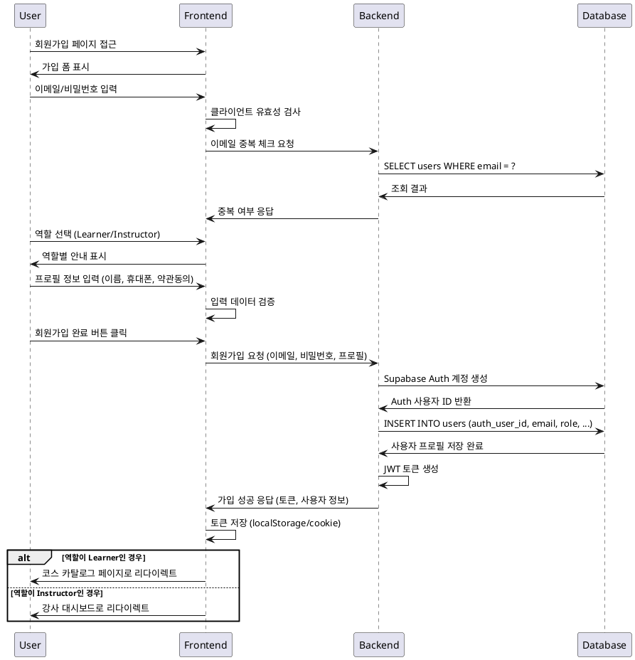

# 유스케이스 001: 역할 선택 & 온보딩

## 개요
신규 사용자가 회원가입을 통해 계정을 생성하고, 역할(학습자/강사)을 선택하여 시스템에 온보딩되는 과정

## 상세 명세

### Primary Actor
- 신규 사용자 (미가입 상태)

### Precondition
- 사용자가 LMS 시스템에 접근 가능한 환경
- 유효한 이메일 주소 보유
- 인터넷 연결 상태

### Trigger
- 사용자가 회원가입 페이지에 접근하여 가입 프로세스 시작

### Main Scenario

1. **회원가입 정보 입력**
   - 사용자가 이메일, 비밀번호 입력
   - 시스템이 이메일 형식 및 비밀번호 강도 검증

2. **역할 선택**
   - 사용자가 역할 선택 (Learner 또는 Instructor)
   - 역할별 권한 및 기능 안내 표시

3. **프로필 정보 입력**
   - 필수 정보 입력: 이름, 휴대폰번호
   - 약관 동의 체크박스 확인

4. **계정 생성 및 검증**
   - Supabase Auth를 통한 계정 생성
   - 이메일 인증 발송 (선택적)

5. **프로필 저장**
   - 사용자 정보를 데이터베이스에 저장
   - 선택한 역할에 따른 권한 설정

6. **온보딩 완료**
   - Learner: 코스 카탈로그 페이지로 리다이렉트
   - Instructor: 강사 대시보드로 리다이렉트

### Edge Cases

**이메일 중복**
- 기존 계정 존재 시 로그인 페이지로 안내
- "이미 가입된 이메일입니다" 메시지 표시

**네트워크 오류**
- 연결 실패 시 재시도 옵션 제공
- 임시 저장된 입력 데이터 복원

**필수 정보 누락**
- 실시간 유효성 검사로 누락 필드 하이라이트
- 단계별 진행 차단 및 안내 메시지

**약관 미동의**
- 약관 동의 없이 진행 불가
- 약관 내용 팝업으로 확인 가능

### Business Rules

**BR-001: 이메일 유일성**
- 시스템 내 이메일 주소는 고유해야 함
- 대소문자 구분 없이 중복 체크

**BR-002: 역할 필수 선택**
- 모든 사용자는 Learner 또는 Instructor 역할을 가져야 함
- 역할 변경은 별도 프로세스를 통해서만 가능

**BR-003: 필수 정보 검증**
- 이름: 2-50자 한글/영문
- 휴대폰: 010-XXXX-XXXX 형식
- 약관 동의 필수

**BR-004: 비밀번호 정책**
- 최소 8자 이상
- 영문, 숫자, 특수문자 조합 권장

**BR-005: 온보딩 완료 조건**
- Auth 계정 생성 완료
- 프로필 정보 저장 완료
- 역할별 초기 권한 부여 완료

## Sequence Diagram

