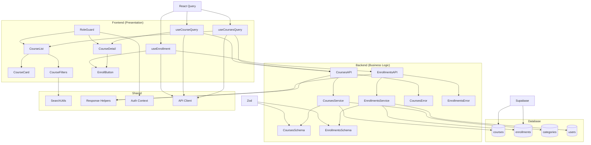

# 코스 탐색 & 수강신청/취소 기능 구현 계획

## 개요

### 핵심 모듈 목록

| 모듈명 | 위치 | 설명 |
|--------|------|------|
| **CoursesAPI** | `src/features/courses/backend/route.ts` | 코스 관련 API 엔드포인트 (조회, 검색, 필터링) |
| **CoursesService** | `src/features/courses/backend/service.ts` | 코스 비즈니스 로직 (DB 접근, 데이터 변환) |
| **CoursesSchema** | `src/features/courses/backend/schema.ts` | 코스 요청/응답 Zod 스키마 정의 |
| **CoursesError** | `src/features/courses/backend/error.ts` | 코스 관련 에러 코드 정의 |
| **EnrollmentsAPI** | `src/features/enrollments/backend/route.ts` | 수강신청/취소 API 엔드포인트 |
| **EnrollmentsService** | `src/features/enrollments/backend/service.ts` | 수강신청 비즈니스 로직 |
| **EnrollmentsSchema** | `src/features/enrollments/backend/schema.ts` | 수강신청 요청/응답 스키마 |
| **EnrollmentsError** | `src/features/enrollments/backend/error.ts` | 수강신청 관련 에러 코드 |
| **CourseCard** | `src/features/courses/components/course-card.tsx` | 코스 카드 컴포넌트 |
| **CourseList** | `src/features/courses/components/course-list.tsx` | 코스 목록 컴포넌트 |
| **CourseFilters** | `src/features/courses/components/course-filters.tsx` | 검색/필터/정렬 컴포넌트 |
| **CourseDetail** | `src/features/courses/components/course-detail.tsx` | 코스 상세 컴포넌트 |
| **EnrollButton** | `src/features/enrollments/components/enroll-button.tsx` | 수강신청/취소 버튼 컴포넌트 |
| **useCoursesQuery** | `src/features/courses/hooks/useCoursesQuery.ts` | 코스 목록 조회 훅 |
| **useCourseQuery** | `src/features/courses/hooks/useCourseQuery.ts` | 코스 상세 조회 훅 |
| **useEnrollment** | `src/features/enrollments/hooks/useEnrollment.ts` | 수강신청/취소 훅 |
| **CoursesDTO** | `src/features/courses/lib/dto.ts` | 클라이언트 측 DTO 재노출 |
| **EnrollmentsDTO** | `src/features/enrollments/lib/dto.ts` | 수강신청 DTO 재노출 |
| **SearchUtils** | `src/lib/utils/search.ts` | 검색 관련 공통 유틸리티 |
| **RoleGuard** | `src/components/auth/role-guard.tsx` | 역할 기반 접근 제어 컴포넌트 |

---

## Diagram



---

## Implementation Plan

### 1. Shared Modules (공통 모듈)

#### 1.1 SearchUtils (`src/lib/utils/search.ts`)
```typescript
// 검색 관련 공통 유틸리티 함수
export const buildSearchQuery = (searchTerm: string) => { /* ... */ }
export const buildFilterQuery = (filters: CourseFilters) => { /* ... */ }
export const buildSortQuery = (sort: SortOption) => { /* ... */ }
export const sanitizeSearchTerm = (term: string) => { /* ... */ }
```

**Unit Tests:**
- ✅ 검색어 정규화 테스트 (공백 제거, 특수문자 처리)
- ✅ 필터 쿼리 빌드 테스트 (카테고리, 난이도 조합)
- ✅ 정렬 쿼리 빌드 테스트 (최신순, 인기순)
- ✅ SQL 인젝션 방지 테스트

#### 1.2 RoleGuard (`src/components/auth/role-guard.tsx`)
```typescript
// 역할 기반 접근 제어 컴포넌트
interface RoleGuardProps {
  allowedRoles: ('learner' | 'instructor' | 'operator')[];
  children: ReactNode;
  fallback?: ReactNode;
}
```

**QA Sheet:**
- ✅ Learner 역할로 로그인 시 코스 목록 접근 가능
- ✅ Instructor 역할로 로그인 시 접근 차단
- ✅ 비로그인 사용자 접근 차단
- ✅ 권한 없음 메시지 표시

### 2. Backend Modules (비즈니스 로직)

#### 2.1 CoursesAPI (`src/features/courses/backend/route.ts`)
```typescript
export const registerCoursesRoutes = (app: Hono<AppEnv>) => {
  // GET /api/courses - 코스 목록 조회 (검색, 필터, 정렬)
  // GET /api/courses/:id - 코스 상세 조회
  // GET /api/courses/:id/enrollment-status - 수강신청 상태 확인
}
```

**Unit Tests:**
- ✅ 코스 목록 조회 성공 케이스
- ✅ 검색어 포함 코스 목록 조회
- ✅ 카테고리/난이도 필터링
- ✅ 정렬 옵션별 결과 검증
- ✅ 잘못된 파라미터 처리
- ✅ 권한 없는 접근 차단

#### 2.2 CoursesService (`src/features/courses/backend/service.ts`)
```typescript
export const getCourses = async (
  client: SupabaseClient,
  params: CoursesQueryParams
): Promise<HandlerResult<CoursesResponse, CoursesServiceError, unknown>>

export const getCourseById = async (
  client: SupabaseClient,
  id: string,
  userId?: string
): Promise<HandlerResult<CourseDetailResponse, CoursesServiceError, unknown>>

export const getEnrollmentStatus = async (
  client: SupabaseClient,
  courseId: string,
  userId: string
): Promise<HandlerResult<EnrollmentStatusResponse, CoursesServiceError, unknown>>
```

**Unit Tests:**
- ✅ published 상태 코스만 조회
- ✅ 검색어 매칭 로직 (제목, 설명)
- ✅ 카테고리/난이도 필터링 로직
- ✅ 정렬 로직 (최신순, 인기순)
- ✅ 페이지네이션 처리
- ✅ 수강신청 상태 확인 로직
- ✅ 데이터베이스 오류 처리

#### 2.3 EnrollmentsAPI (`src/features/enrollments/backend/route.ts`)
```typescript
export const registerEnrollmentsRoutes = (app: Hono<AppEnv>) => {
  // POST /api/enrollments - 수강신청
  // DELETE /api/enrollments/:courseId - 수강취소
}
```

**Unit Tests:**
- ✅ 수강신청 성공 케이스
- ✅ 중복 수강신청 차단
- ✅ 비공개 코스 수강신청 차단
- ✅ 수강취소 성공 케이스
- ✅ 권한 검증 (Learner만 허용)
- ✅ 트랜잭션 처리 검증

#### 2.4 EnrollmentsService (`src/features/enrollments/backend/service.ts`)
```typescript
export const createEnrollment = async (
  client: SupabaseClient,
  courseId: string,
  userId: string
): Promise<HandlerResult<EnrollmentResponse, EnrollmentsServiceError, unknown>>

export const deleteEnrollment = async (
  client: SupabaseClient,
  courseId: string,
  userId: string
): Promise<HandlerResult<void, EnrollmentsServiceError, unknown>>
```

**Unit Tests:**
- ✅ 수강신청 생성 로직
- ✅ 중복 체크 로직
- ✅ 코스 상태 검증 로직
- ✅ 수강취소 로직
- ✅ 트랜잭션 롤백 테스트
- ✅ 동시성 제어 테스트

### 3. Frontend Modules (프레젠테이션)

#### 3.1 CourseList (`src/features/courses/components/course-list.tsx`)
```typescript
interface CourseListProps {
  searchTerm?: string;
  filters?: CourseFilters;
  sortBy?: SortOption;
}
```

**QA Sheet:**
- ✅ 코스 목록 정상 표시
- ✅ 로딩 상태 표시
- ✅ 에러 상태 처리
- ✅ 빈 결과 메시지 표시
- ✅ 무한 스크롤 또는 페이지네이션
- ✅ 반응형 레이아웃 (모바일/데스크톱)

#### 3.2 CourseCard (`src/features/courses/components/course-card.tsx`)
```typescript
interface CourseCardProps {
  course: Course;
  showEnrollButton?: boolean;
}
```

**QA Sheet:**
- ✅ 코스 정보 정확 표시 (제목, 설명, 강사명, 난이도)
- ✅ 플레이스홀더 이미지 표시
- ✅ 수강신청 버튼 상태 반영
- ✅ 호버 효과 및 클릭 가능 영역
- ✅ 접근성 (키보드 네비게이션, 스크린 리더)

#### 3.3 CourseFilters (`src/features/courses/components/course-filters.tsx`)
```typescript
interface CourseFiltersProps {
  onSearchChange: (term: string) => void;
  onFilterChange: (filters: CourseFilters) => void;
  onSortChange: (sort: SortOption) => void;
}
```

**QA Sheet:**
- ✅ 검색어 입력 및 디바운싱
- ✅ 카테고리 드롭다운 동작
- ✅ 난이도 필터 동작
- ✅ 정렬 옵션 변경
- ✅ 필터 초기화 기능
- ✅ 모바일 반응형 레이아웃

#### 3.4 CourseDetail (`src/features/courses/components/course-detail.tsx`)
```typescript
interface CourseDetailProps {
  courseId: string;
}
```

**QA Sheet:**
- ✅ 코스 상세 정보 표시
- ✅ 강사 정보 표시
- ✅ 커리큘럼 표시
- ✅ 수강신청 상태 반영
- ✅ 로딩/에러 상태 처리
- ✅ 뒤로가기 버튼

#### 3.5 EnrollButton (`src/features/enrollments/components/enroll-button.tsx`)
```typescript
interface EnrollButtonProps {
  courseId: string;
  isEnrolled: boolean;
  onEnrollmentChange?: (enrolled: boolean) => void;
}
```

**QA Sheet:**
- ✅ 수강신청/취소 버튼 상태 표시
- ✅ 로딩 상태 표시
- ✅ 성공/실패 피드백
- ✅ 확인 다이얼로그 (수강취소 시)
- ✅ 권한 없는 사용자 처리
- ✅ 버튼 비활성화 상태

### 4. Hooks (데이터 관리)

#### 4.1 useCoursesQuery (`src/features/courses/hooks/useCoursesQuery.ts`)
```typescript
export const useCoursesQuery = (params: CoursesQueryParams) => {
  // React Query를 사용한 코스 목록 조회
  // 캐싱, 백그라운드 업데이트, 에러 처리
}
```

**Unit Tests:**
- ✅ 쿼리 파라미터 변경 시 재요청
- ✅ 캐시 무효화 로직
- ✅ 에러 상태 관리
- ✅ 로딩 상태 관리

#### 4.2 useCourseQuery (`src/features/courses/hooks/useCourseQuery.ts`)
```typescript
export const useCourseQuery = (courseId: string) => {
  // 코스 상세 정보 조회
  // 수강신청 상태 포함
}
```

**Unit Tests:**
- ✅ 코스 ID 변경 시 재요청
- ✅ 수강신청 상태 동기화
- ✅ 404 에러 처리
- ✅ 권한 오류 처리

#### 4.3 useEnrollment (`src/features/enrollments/hooks/useEnrollment.ts`)
```typescript
export const useEnrollment = () => {
  // 수강신청/취소 뮤테이션
  // 낙관적 업데이트
  // 관련 쿼리 무효화
}
```

**Unit Tests:**
- ✅ 수강신청 성공 시 상태 업데이트
- ✅ 수강취소 성공 시 상태 업데이트
- ✅ 실패 시 롤백 처리
- ✅ 관련 쿼리 무효화

### 5. Schema Definitions (스키마 정의)

#### 5.1 CoursesSchema (`src/features/courses/backend/schema.ts`)
```typescript
export const CoursesQueryParamsSchema = z.object({
  search: z.string().optional(),
  category: z.string().uuid().optional(),
  difficulty: z.enum(['beginner', 'intermediate', 'advanced']).optional(),
  sortBy: z.enum(['latest', 'popular']).optional(),
  page: z.number().min(1).optional(),
  limit: z.number().min(1).max(100).optional(),
});

export const CourseResponseSchema = z.object({
  id: z.string().uuid(),
  title: z.string(),
  description: z.string().nullable(),
  instructorName: z.string(),
  categoryName: z.string().nullable(),
  difficulty: z.enum(['beginner', 'intermediate', 'advanced']),
  enrollmentCount: z.number(),
  averageRating: z.number(),
  createdAt: z.string(),
});
```

#### 5.2 EnrollmentsSchema (`src/features/enrollments/backend/schema.ts`)
```typescript
export const EnrollmentRequestSchema = z.object({
  courseId: z.string().uuid(),
});

export const EnrollmentResponseSchema = z.object({
  id: z.string().uuid(),
  courseId: z.string().uuid(),
  learnerId: z.string().uuid(),
  enrolledAt: z.string(),
  isActive: z.boolean(),
});
```

### 6. Error Handling (에러 처리)

#### 6.1 CoursesError (`src/features/courses/backend/error.ts`)
```typescript
export const coursesErrorCodes = {
  fetchError: 'COURSES_FETCH_ERROR',
  notFound: 'COURSE_NOT_FOUND',
  validationError: 'COURSES_VALIDATION_ERROR',
  unauthorized: 'COURSES_UNAUTHORIZED',
} as const;
```

#### 6.2 EnrollmentsError (`src/features/enrollments/backend/error.ts`)
```typescript
export const enrollmentsErrorCodes = {
  duplicateEnrollment: 'DUPLICATE_ENROLLMENT',
  courseNotAvailable: 'COURSE_NOT_AVAILABLE',
  enrollmentNotFound: 'ENROLLMENT_NOT_FOUND',
  unauthorized: 'ENROLLMENTS_UNAUTHORIZED',
} as const;
```

---

## 구현 순서

### Phase 1: Backend Foundation
1. CoursesSchema, EnrollmentsSchema 정의
2. CoursesError, EnrollmentsError 정의
3. SearchUtils 공통 유틸리티 구현
4. CoursesService, EnrollmentsService 구현
5. CoursesAPI, EnrollmentsAPI 라우터 구현

### Phase 2: Frontend Foundation
6. CoursesDTO, EnrollmentsDTO 재노출
7. useCoursesQuery, useCourseQuery, useEnrollment 훅 구현
8. RoleGuard 컴포넌트 구현

### Phase 3: UI Components
9. CourseCard 컴포넌트 구현
10. CourseFilters 컴포넌트 구현
11. EnrollButton 컴포넌트 구현
12. CourseList 컴포넌트 구현
13. CourseDetail 컴포넌트 구현

### Phase 4: Integration & Testing
14. 페이지 레벨 통합 (`/courses`, `/courses/[id]`)
15. 단위 테스트 작성
16. QA 테스트 수행
17. 성능 최적화 및 버그 수정

---

## 기술적 고려사항

### 성능 최적화
- React Query를 통한 적극적 캐싱
- 무한 스크롤 또는 페이지네이션으로 대용량 데이터 처리
- 이미지 레이지 로딩
- 검색어 디바운싱

### 접근성
- 키보드 네비게이션 지원
- 스크린 리더 호환성
- 적절한 ARIA 레이블
- 색상 대비 준수

### 보안
- 역할 기반 접근 제어
- SQL 인젝션 방지
- XSS 방지
- CSRF 토큰 검증

### 확장성
- 모듈화된 구조로 기능 추가 용이
- 제네릭 타입 활용으로 재사용성 증대
- 설정 가능한 필터/정렬 옵션
- 다국어 지원 준비
