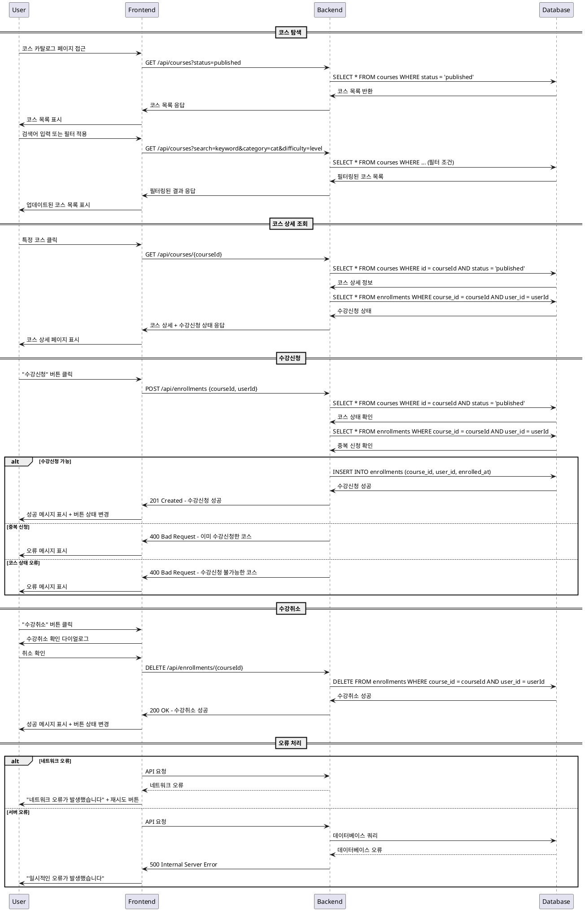

# 코스 탐색 & 수강신청/취소 (Learner) - 상세 유스케이스

## Use Case: 코스 탐색 및 수강신청/취소

### Primary Actor
- **Learner** (학습자)

### Precondition
- 사용자가 Learner 역할로 로그인되어 있음
- 사용자가 온보딩 과정을 완료한 상태

### Trigger
- 사용자가 코스 카탈로그 페이지에 접근
- 사용자가 코스 검색, 필터링, 정렬 기능을 사용
- 사용자가 특정 코스의 상세 페이지에 진입
- 사용자가 "수강신청" 또는 "수강취소" 버튼을 클릭

### Main Scenario

#### 1. 코스 탐색
1. 사용자가 코스 카탈로그 페이지에 접근한다
2. 시스템은 `published` 상태의 모든 코스를 표시한다
3. 사용자는 다음 기능을 사용할 수 있다:
   - **검색**: 코스 제목, 설명에서 키워드 검색
   - **필터링**: 카테고리, 난이도별 필터
   - **정렬**: 최신순, 인기순 정렬
4. 시스템은 사용자의 입력에 따라 코스 목록을 동적으로 업데이트한다

#### 2. 코스 상세 조회
1. 사용자가 관심 있는 코스를 클릭한다
2. 시스템은 코스 상세 정보를 표시한다:
   - 코스 제목, 설명, 커리큘럼
   - 강사 정보
   - 카테고리, 난이도
   - 현재 수강신청 상태 (신청됨/미신청)

#### 3. 수강신청
1. 사용자가 "수강신청" 버튼을 클릭한다
2. 시스템은 수강신청 가능 여부를 검증한다:
   - 코스 상태가 `published`인지 확인
   - 이미 수강신청한 코스가 아닌지 확인
3. 검증 통과 시, `enrollments` 테이블에 새 레코드를 생성한다
4. 시스템은 수강신청 성공 메시지를 표시한다
5. 버튼이 "수강취소"로 변경된다

#### 4. 수강취소
1. 사용자가 "수강취소" 버튼을 클릭한다
2. 시스템은 수강취소 확인 다이얼로그를 표시한다
3. 사용자가 확인하면, `enrollments` 테이블에서 해당 레코드를 삭제한다
4. 시스템은 수강취소 성공 메시지를 표시한다
5. 버튼이 "수강신청"으로 변경된다

### Edge Cases

#### 1. 네트워크 오류
- **상황**: API 요청 중 네트워크 오류 발생
- **처리**: 에러 메시지 표시 및 재시도 버튼 제공

#### 2. 중복 수강신청 시도
- **상황**: 이미 수강신청한 코스에 다시 신청 시도
- **처리**: "이미 수강신청한 코스입니다" 메시지 표시

#### 3. 비공개 코스 접근
- **상황**: `draft` 또는 `archived` 상태의 코스에 직접 URL로 접근
- **처리**: 404 페이지 또는 "접근할 수 없는 코스입니다" 메시지 표시

#### 4. 권한 없는 접근
- **상황**: 로그인하지 않은 사용자 또는 Instructor 역할 사용자의 접근
- **처리**: 로그인 페이지로 리다이렉트 또는 권한 오류 메시지 표시

#### 5. 서버 오류
- **상황**: 데이터베이스 연결 실패 또는 서버 내부 오류
- **처리**: "일시적인 오류가 발생했습니다. 잠시 후 다시 시도해주세요" 메시지 표시

### Business Rules

#### 1. 코스 공개 정책
- `published` 상태의 코스만 학습자에게 노출
- `draft` 상태는 강사에게만 보임
- `archived` 상태는 신규 수강신청 불가, 기존 수강생은 계속 접근 가능

#### 2. 수강신청 정책
- 한 학습자는 동일 코스에 중복 수강신청 불가
- 수강신청 시점에 코스가 `published` 상태여야 함
- 수강신청은 즉시 처리됨 (승인 과정 없음)

#### 3. 수강취소 정책
- 언제든지 수강취소 가능
- 수강취소 시 관련 성적 데이터는 집계에서 제외
- 수강취소 후 재신청 가능

#### 4. 검색 및 필터링 정책
- 검색은 코스 제목과 설명을 대상으로 함
- 대소문자 구분하지 않음
- 카테고리와 난이도는 메타데이터 테이블 기준
- 정렬 기본값은 최신순

#### 5. 데이터 일관성 정책
- 수강신청/취소는 트랜잭션으로 처리
- 동시성 제어를 위한 낙관적 잠금 사용
- 수강신청 상태는 실시간 반영

---

## Sequence Diagram

