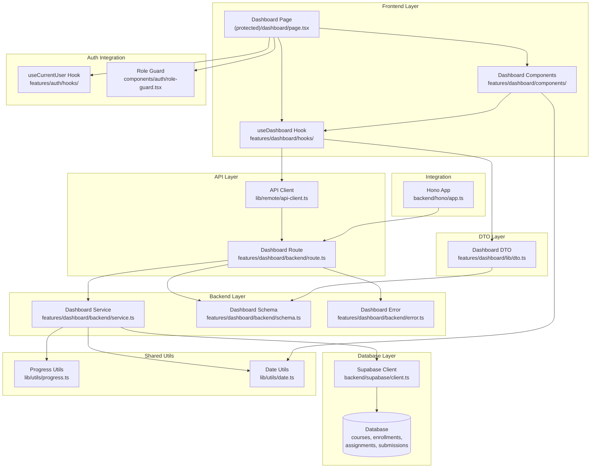

# Learner 대시보드 - 구현 계획

## 개요

### 구현 모듈 목록

| 모듈명 | 위치 | 설명 |
|--------|------|------|
| **Dashboard Backend Route** | `src/features/dashboard/backend/route.ts` | 대시보드 API 엔드포인트 정의 |
| **Dashboard Backend Service** | `src/features/dashboard/backend/service.ts` | 대시보드 비즈니스 로직 및 데이터 처리 |
| **Dashboard Backend Schema** | `src/features/dashboard/backend/schema.ts` | 요청/응답 Zod 스키마 정의 |
| **Dashboard Backend Error** | `src/features/dashboard/backend/error.ts` | 대시보드 관련 에러 코드 정의 |
| **Dashboard DTO** | `src/features/dashboard/lib/dto.ts` | 클라이언트 측 스키마 재노출 |
| **Dashboard Hook** | `src/features/dashboard/hooks/useDashboard.ts` | React Query 기반 대시보드 데이터 훅 |
| **Dashboard Components** | `src/features/dashboard/components/` | 대시보드 UI 컴포넌트들 |
| **Dashboard Page** | `src/app/(protected)/dashboard/page.tsx` | 대시보드 페이지 (기존 파일 수정) |
| **Progress Utils** | `src/lib/utils/progress.ts` | 진행률 계산 공통 유틸리티 |
| **Date Utils** | `src/lib/utils/date.ts` | 날짜 관련 공통 유틸리티 |

### 공통 모듈 및 제네릭 고려사항

- **Progress Utils**: 진행률 계산 로직은 다른 기능(강사 대시보드 등)에서도 재사용 가능
- **Date Utils**: 마감일 계산, 상대적 시간 표시 등은 전체 앱에서 공통 사용
- **Dashboard Components**: 카드 형태의 위젯들은 강사 대시보드에서도 재사용 가능한 구조로 설계

## Diagram



## Implementation Plan

### 1. Dashboard Backend Schema (`src/features/dashboard/backend/schema.ts`)

**목적**: 대시보드 API 요청/응답 스키마 정의

**구현 내용**:
```typescript
// 대시보드 응답 스키마
export const DashboardResponseSchema = z.object({
  courses: z.array(CourseProgressSchema),
  upcomingAssignments: z.array(UpcomingAssignmentSchema),
  recentFeedback: z.array(RecentFeedbackSchema),
});

// 코스 진행률 스키마
export const CourseProgressSchema = z.object({
  id: z.string(),
  title: z.string(),
  progress: z.number().min(0).max(100),
  totalAssignments: z.number().min(0),
  completedAssignments: z.number().min(0),
  status: z.enum(['published']),
});
```

**Unit Test 케이스**:
- 스키마 유효성 검증 테스트
- 진행률 범위 검증 (0-100)
- 필수 필드 누락 시 에러 처리
- 잘못된 데이터 타입 처리

### 2. Dashboard Backend Error (`src/features/dashboard/backend/error.ts`)

**목적**: 대시보드 관련 에러 코드 정의

**구현 내용**:
```typescript
export const dashboardErrorCodes = {
  fetchError: 'DASHBOARD_FETCH_ERROR',
  noEnrollments: 'DASHBOARD_NO_ENROLLMENTS',
  unauthorized: 'DASHBOARD_UNAUTHORIZED',
  invalidRole: 'DASHBOARD_INVALID_ROLE',
} as const;

export type DashboardServiceError = {
  code: typeof dashboardErrorCodes[keyof typeof dashboardErrorCodes];
  message: string;
  details?: unknown;
};
```

**Unit Test 케이스**:
- 에러 코드 상수 검증
- 에러 타입 정의 검증

### 3. Dashboard Backend Service (`src/features/dashboard/backend/service.ts`)

**목적**: 대시보드 데이터 조회 비즈니스 로직

**구현 내용**:
```typescript
export const getDashboardData = async (
  client: SupabaseClient,
  userId: string
): Promise<HandlerResult<DashboardResponse, DashboardServiceError, unknown>> => {
  // 1. 사용자 역할 확인 (Learner만 허용)
  // 2. 수강 중인 코스 목록 조회
  // 3. 각 코스별 진행률 계산
  // 4. 마감 임박 과제 조회 (7일 이내)
  // 5. 최근 피드백 조회 (7일 이내, 최대 5개)
};
```

**Unit Test 케이스**:
- 정상적인 대시보드 데이터 조회
- 수강 중인 코스가 없는 경우
- 권한 없는 사용자 접근 (Instructor 역할)
- 데이터베이스 연결 실패
- 진행률 계산 정확성 검증
- 마감 임박 과제 필터링 검증
- 최근 피드백 정렬 및 제한 검증

### 4. Dashboard Backend Route (`src/features/dashboard/backend/route.ts`)

**목적**: 대시보드 API 엔드포인트 정의

**구현 내용**:
```typescript
export const registerDashboardRoutes = (app: Hono<AppEnv>) => {
  app.get('/api/dashboard', async (c) => {
    // 1. 인증 확인
    // 2. 사용자 ID 추출
    // 3. 대시보드 서비스 호출
    // 4. 응답 반환
  });
};
```

**Unit Test 케이스**:
- 정상 요청 처리
- 인증되지 않은 요청 처리
- 서비스 에러 처리
- 응답 형식 검증

### 5. Shared Utils - Progress (`src/lib/utils/progress.ts`)

**목적**: 진행률 계산 공통 유틸리티

**구현 내용**:
```typescript
export const calculateProgress = (
  completed: number,
  total: number
): number => {
  if (total === 0) return 0;
  return Math.round((completed / total) * 100 * 10) / 10; // 소수점 첫째 자리
};

export const getProgressColor = (progress: number): string => {
  // 진행률에 따른 색상 반환
};
```

**Unit Test 케이스**:
- 정상적인 진행률 계산
- 전체가 0인 경우 처리
- 완료가 전체보다 큰 경우 처리
- 소수점 반올림 검증

### 6. Shared Utils - Date (`src/lib/utils/date.ts`)

**목적**: 날짜 관련 공통 유틸리티

**구현 내용**:
```typescript
export const getDaysUntilDue = (dueDate: string): number => {
  // 마감일까지 남은 일수 계산
};

export const isUpcomingDeadline = (dueDate: string, days: number = 7): boolean => {
  // 지정된 일수 내 마감 여부 확인
};

export const formatRelativeTime = (date: string): string => {
  // 상대적 시간 표시 (예: "3일 전", "2시간 후")
};
```

**Unit Test 케이스**:
- 마감일까지 남은 일수 계산 정확성
- 마감 임박 판정 로직 검증
- 상대적 시간 표시 형식 검증
- 잘못된 날짜 형식 처리

### 7. Dashboard Hook (`src/features/dashboard/hooks/useDashboard.ts`)

**목적**: React Query 기반 대시보드 데이터 관리

**구현 내용**:
```typescript
export const useDashboard = () => {
  return useQuery({
    queryKey: ['dashboard'],
    queryFn: async () => {
      const response = await apiClient.get('/api/dashboard');
      return DashboardResponseSchema.parse(response.data.data);
    },
    staleTime: 0, // 항상 최신 데이터 조회
    refetchOnWindowFocus: true,
  });
};
```

**QA Sheet**:
- [ ] 로딩 상태가 올바르게 표시되는가?
- [ ] 에러 상태가 적절히 처리되는가?
- [ ] 데이터 새로고침이 정상 작동하는가?
- [ ] 캐싱 정책이 요구사항에 맞는가?

### 8. Dashboard Components

#### 8.1 Course Progress Card (`src/features/dashboard/components/course-progress-card.tsx`)

**목적**: 코스별 진행률 표시 카드

**구현 내용**:
- 코스 제목, 진행률 바, 완료/전체 과제 수 표시
- 진행률에 따른 색상 변화
- 코스 상세 페이지로 이동 링크

**QA Sheet**:
- [ ] 진행률 바가 정확한 비율로 표시되는가?
- [ ] 진행률에 따른 색상이 올바르게 적용되는가?
- [ ] 코스 링크가 정상 작동하는가?
- [ ] 반응형 디자인이 적용되었는가?

#### 8.2 Upcoming Assignments (`src/features/dashboard/components/upcoming-assignments.tsx`)

**목적**: 마감 임박 과제 목록 표시

**구현 내용**:
- 과제명, 코스명, 마감일, 남은 일수 표시
- 마감일 기준 정렬
- 과제 상세 페이지로 이동 링크

**QA Sheet**:
- [ ] 마감일 순으로 정렬되어 표시되는가?
- [ ] 남은 일수가 정확히 계산되는가?
- [ ] 마감 임박도에 따른 시각적 구분이 있는가?
- [ ] 빈 상태 처리가 적절한가?

#### 8.3 Recent Feedback (`src/features/dashboard/components/recent-feedback.tsx`)

**목적**: 최근 피드백 요약 표시

**구현 내용**:
- 과제명, 점수, 피드백 미리보기, 작성일 표시
- 피드백 작성일 기준 내림차순 정렬
- 전체 피드백 페이지로 이동 링크

**QA Sheet**:
- [ ] 피드백이 최신순으로 정렬되어 표시되는가?
- [ ] 피드백 미리보기가 적절한 길이로 잘리는가?
- [ ] 점수가 올바른 형식으로 표시되는가?
- [ ] 빈 상태 메시지가 적절한가?

### 9. Dashboard Page Update (`src/app/(protected)/dashboard/page.tsx`)

**목적**: 기존 대시보드 페이지를 Learner 전용으로 개선

**구현 내용**:
```typescript
export default function DashboardPage({ params }: DashboardPageProps) {
  const { user } = useCurrentUser();
  const { data, isLoading, error } = useDashboard();

  // 역할 기반 라우팅 (Instructor는 /instructor/dashboard로 리다이렉트)
  // 로딩/에러 상태 처리
  // 대시보드 컴포넌트들 렌더링
}
```

**QA Sheet**:
- [ ] Learner 역할만 접근 가능한가?
- [ ] Instructor는 적절히 리다이렉트되는가?
- [ ] 로딩 상태가 사용자 친화적으로 표시되는가?
- [ ] 에러 상태에서 복구 옵션이 제공되는가?
- [ ] 빈 상태(수강 중인 코스 없음)가 적절히 처리되는가?

### 10. Integration Tasks

#### 10.1 Hono App Integration (`src/backend/hono/app.ts`)

**구현 내용**:
```typescript
import { registerDashboardRoutes } from '@/features/dashboard/backend/route';

// registerDashboardRoutes(app) 추가
```

#### 10.2 DTO Export (`src/features/dashboard/lib/dto.ts`)

**구현 내용**:
```typescript
export {
  DashboardResponseSchema,
  CourseProgressSchema,
  // ... 기타 스키마 재노출
} from '../backend/schema';
```

## 구현 우선순위

1. **Phase 1**: Backend 기반 구조
   - Schema, Error, Service, Route 구현
   - 공통 Utils 구현

2. **Phase 2**: Frontend 기반 구조
   - Hook, DTO 구현
   - 기본 컴포넌트 구현

3. **Phase 3**: UI/UX 완성
   - 상세 컴포넌트 구현
   - 페이지 통합 및 테스트

4. **Phase 4**: 통합 테스트 및 최적화
   - E2E 테스트
   - 성능 최적화
   - 에러 처리 개선

## 테스트 전략

### Backend Tests
- Unit Tests: 각 서비스 함수별 테스트
- Integration Tests: API 엔드포인트 테스트
- Database Tests: 쿼리 성능 및 정확성 테스트

### Frontend Tests
- Component Tests: 각 컴포넌트별 렌더링 테스트
- Hook Tests: React Query 훅 동작 테스트
- E2E Tests: 사용자 시나리오 기반 테스트

### Performance Tests
- API 응답 시간 측정
- 대량 데이터 처리 성능 테스트
- 메모리 사용량 모니터링
