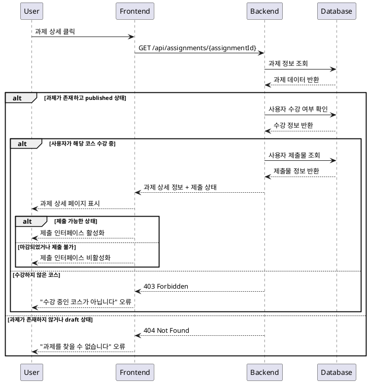

# 과제 상세 열람 (Learner) - 유스케이스 명세서

## 개요
학습자가 수강 중인 코스의 과제 상세 정보를 열람하고 제출 인터페이스에 접근하는 기능

## 유스케이스 정보

### Primary Actor
- **Learner** (학습자)

### Precondition
- 사용자가 학습자 역할로 로그인되어 있음
- 사용자가 해당 코스에 수강 신청되어 있음
- 내 코스 대시보드 또는 코스 상세 페이지에서 과제 목록을 확인할 수 있음

### Trigger
- 학습자가 내 코스 → Assignment 목록 → Assignment 상세를 클릭

### Main Scenario

1. **과제 목록 접근**
   - 학습자가 내 코스 페이지에서 특정 코스 선택
   - 해당 코스의 Assignment 목록 확인

2. **과제 상세 선택**
   - 학습자가 특정 Assignment 항목 클릭
   - 시스템이 과제 상세 페이지로 이동

3. **권한 검증**
   - 시스템이 사용자의 코스 등록 여부 확인
   - 과제의 공개 상태(`published`) 확인

4. **과제 정보 표시**
   - 과제 제목, 설명, 마감일 표시
   - 점수 비중, 지각 허용 여부, 재제출 허용 여부 표시
   - 제출 현황 및 상태 표시

5. **제출 인터페이스 제공**
   - Text 입력 필드 (필수)
   - Link 입력 필드 (선택, URL 형식)
   - 제출 버튼 (상태에 따라 활성화/비활성화)

### Edge Cases

#### 접근 권한 오류
- **상황**: 수강하지 않은 코스의 과제에 접근 시도
- **처리**: 403 Forbidden 오류, "수강 중인 코스가 아닙니다" 메시지 표시

#### 과제 상태 오류
- **상황**: `draft` 상태의 과제에 접근 시도
- **처리**: 404 Not Found 또는 "아직 공개되지 않은 과제입니다" 메시지

#### 마감된 과제
- **상황**: `closed` 상태의 과제 접근
- **처리**: 과제 정보는 표시하되 제출 버튼 비활성화, "마감된 과제입니다" 안내

#### 네트워크 오류
- **상황**: 서버 통신 실패
- **처리**: 로딩 실패 메시지, 재시도 버튼 제공

#### 존재하지 않는 과제
- **상황**: 삭제되거나 존재하지 않는 과제 ID로 접근
- **처리**: 404 페이지, "과제를 찾을 수 없습니다" 메시지

### Business Rules

#### 접근 권한 규칙
- 과제 상태가 `published`인 경우에만 열람 가능
- 해당 코스에 수강 등록된 학습자만 접근 가능
- 로그인된 학습자 역할의 사용자만 접근 가능

#### 제출 상태 규칙
- `closed` 상태의 과제는 제출 버튼 비활성화
- 마감일이 지난 과제의 경우:
  - 지각 허용 = true: 제출 가능하지만 지각 표시
  - 지각 허용 = false: 제출 불가능

#### 재제출 규칙
- 재제출 허용 = true: 기존 제출물이 있어도 재제출 가능
- 재제출 허용 = false: 한 번 제출 후 수정 불가능
- 채점 완료 후 재제출 요청 상태인 경우 재제출 가능

#### 데이터 표시 규칙
- 과제 설명은 마크다운 형식으로 렌더링
- 마감일은 사용자 로컬 시간대로 표시
- 점수 비중은 백분율(%)로 표시
- 제출 현황은 실시간으로 업데이트

## PlantUML 시퀀스 다이어그램

## 관련 API 엔드포인트

### GET /api/assignments/{assignmentId}
- **목적**: 특정 과제의 상세 정보 조회
- **인증**: 필수 (Bearer Token)
- **응답**: 과제 정보, 제출 상태, 권한 정보

### GET /api/enrollments/check/{courseId}
- **목적**: 사용자의 코스 수강 여부 확인
- **인증**: 필수 (Bearer Token)
- **응답**: 수강 상태 정보

## 관련 데이터베이스 테이블
- `assignments`: 과제 정보
- `enrollments`: 수강 신청 정보
- `submissions`: 제출물 정보
- `users`: 사용자 정보
