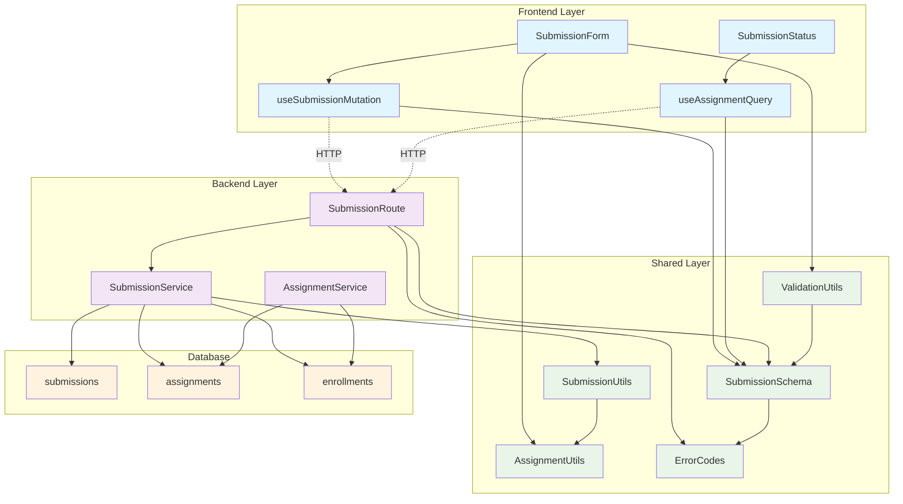

# 과제 제출/재제출 기능 - 모듈화 설계

## 개요

과제 제출/재제출 기능을 구현하기 위한 모듈 설계입니다. 기존 코드베이스의 구조와 패턴을 따라 백엔드(Hono + Supabase), 프론트엔드(React + React Query), 공통 유틸리티로 구성됩니다.

### 모듈 목록

| 모듈명 | 위치 | 설명 |
|--------|------|------|
| **Backend API** | `src/features/assignments/backend/` | 제출물 CRUD API 라우터 및 서비스 |
| **Frontend Components** | `src/features/assignments/components/` | 제출 폼 및 상태 표시 컴포넌트 |
| **React Query Hooks** | `src/features/assignments/hooks/` | 제출물 관련 데이터 페칭 훅 |
| **Validation Utils** | `src/lib/validation/` | 제출물 검증 로직 (공통) |
| **Assignment Utils** | `src/lib/utils/` | 제출 상태 및 마감일 유틸리티 (공통) |
| **Schema & Types** | `src/features/assignments/backend/schema.ts` | 제출물 관련 스키마 및 타입 |
| **Error Handling** | `src/features/assignments/backend/error.ts` | 제출물 관련 에러 코드 |

## Diagram



## Implementation Plan

### 1. Backend Layer

#### 1.1 Schema 확장 (`src/features/assignments/backend/schema.ts`)
```typescript
// 제출물 생성 요청 스키마
export const CreateSubmissionRequestSchema = z.object({
  content: z.string().min(1, '과제 내용을 입력해주세요.').max(5000, '내용이 너무 깁니다.'),
  linkUrl: z.string().url('올바른 URL 형식을 입력해주세요.').optional().nullable(),
});

// 제출물 업데이트 요청 스키마  
export const UpdateSubmissionRequestSchema = CreateSubmissionRequestSchema;

// 제출물 응답 스키마
export const SubmissionResponseSchema = z.object({
  id: z.string().uuid(),
  assignmentId: z.string().uuid(),
  content: z.string(),
  linkUrl: z.string().nullable(),
  isLate: z.boolean(),
  status: z.enum(['submitted', 'graded', 'resubmission_required']),
  submittedAt: z.string(),
  canResubmit: z.boolean(),
});
```

**Unit Tests:**
- 스키마 검증 테스트 (유효/무효 데이터)
- 타입 추론 테스트
- 에러 메시지 검증 테스트

#### 1.2 Service 확장 (`src/features/assignments/backend/service.ts`)
```typescript
// 제출물 생성 서비스
export const createSubmission = async (
  client: SupabaseClient,
  assignmentId: string,
  userId: string,
  data: CreateSubmissionRequest
): Promise<HandlerResult<SubmissionResponse, string, unknown>>

// 제출물 업데이트 서비스 (재제출)
export const updateSubmission = async (
  client: SupabaseClient,
  submissionId: string,
  userId: string,
  data: UpdateSubmissionRequest
): Promise<HandlerResult<SubmissionResponse, string, unknown>>

// 제출물 조회 서비스
export const getSubmission = async (
  client: SupabaseClient,
  assignmentId: string,
  userId: string
): Promise<HandlerResult<SubmissionResponse | null, string, unknown>>
```

**Unit Tests:**
- 정상 제출 테스트
- 지각 제출 테스트 (허용/불허)
- 재제출 테스트 (허용/불허)
- 권한 검증 테스트 (수강신청 여부)
- 마감일 검증 테스트
- 에러 케이스 테스트 (존재하지 않는 과제, 중복 제출 등)

#### 1.3 Route 확장 (`src/features/assignments/backend/route.ts`)
```typescript
// POST /api/assignments/:id/submissions - 제출물 생성
// PUT /api/assignments/:id/submissions - 제출물 업데이트 (재제출)
// GET /api/assignments/:id/submissions - 제출물 조회
```

**QA Sheet:**
- API 엔드포인트 동작 확인
- 요청/응답 데이터 형식 검증
- HTTP 상태 코드 확인
- 에러 응답 형식 검증
- 인증/권한 검증

### 2. Frontend Layer

#### 2.1 React Query Hooks (`src/features/assignments/hooks/`)

**useSubmissionMutation.ts**
```typescript
export const useSubmissionMutation = (assignmentId: string) => {
  return useMutation({
    mutationFn: (data: CreateSubmissionRequest) => 
      submitAssignment(assignmentId, data),
    onSuccess: () => {
      queryClient.invalidateQueries(['assignment', assignmentId]);
      queryClient.invalidateQueries(['dashboard']);
    },
  });
};

export const useResubmissionMutation = (assignmentId: string) => {
  return useMutation({
    mutationFn: (data: UpdateSubmissionRequest) => 
      resubmitAssignment(assignmentId, data),
    onSuccess: () => {
      queryClient.invalidateQueries(['assignment', assignmentId]);
    },
  });
};
```

**useSubmissionQuery.ts**
```typescript
export const useSubmissionQuery = (assignmentId: string) => {
  return useQuery({
    queryKey: ['submission', assignmentId],
    queryFn: () => getSubmission(assignmentId),
    enabled: Boolean(assignmentId),
    staleTime: 30 * 1000, // 30초
  });
};
```

#### 2.2 Components (`src/features/assignments/components/`)

**submission-form.tsx**
```typescript
interface SubmissionFormProps {
  assignment: Assignment;
  existingSubmission?: Submission | null;
  onSubmitSuccess?: () => void;
}

export const SubmissionForm: React.FC<SubmissionFormProps>
```

**QA Sheet:**
- 폼 필드 검증 (필수/선택 필드)
- 실시간 검증 메시지 표시
- 제출 버튼 상태 관리 (로딩, 비활성화)
- 마감일 경고 표시
- 재제출 모드 전환
- 에러 메시지 표시
- 성공 메시지 표시

**submission-status.tsx**
```typescript
interface SubmissionStatusProps {
  assignment: Assignment;
  submission?: Submission | null;
  className?: string;
}

export const SubmissionStatus: React.FC<SubmissionStatusProps>
```

**QA Sheet:**
- 제출 상태별 UI 표시 (미제출, 제출완료, 지각제출, 재제출요청)
- 마감일 표시 및 경고
- 점수 및 피드백 표시 (채점 완료 시)
- 재제출 버튼 표시 조건

### 3. Shared Layer

#### 3.1 Validation Utils (`src/lib/validation/submission.ts`)
```typescript
// URL 검증
export const validateSubmissionUrl = (url?: string): ValidationResult

// 제출 내용 검증  
export const validateSubmissionContent = (content: string): ValidationResult

// 제출 가능 여부 검증
export const canSubmitAssignment = (
  assignment: Assignment, 
  existingSubmission?: Submission
): { canSubmit: boolean; reason?: string }
```

**Unit Tests:**
- URL 형식 검증 테스트
- 내용 길이 검증 테스트
- 제출 가능 조건 테스트 (마감일, 정책 등)

#### 3.2 Assignment Utils 확장 (`src/lib/utils/assignment.ts`)
```typescript
// 마감일 관련
export const isAssignmentOverdue = (dueDate: string): boolean
export const getTimeUntilDue = (dueDate: string): string
export const canSubmitLate = (assignment: Assignment): boolean

// 제출 상태 관련
export const getSubmissionStatusText = (
  submission?: Submission, 
  assignment?: Assignment
): string
export const getSubmissionStatusColor = (
  submission?: Submission, 
  assignment?: Assignment
): 'default' | 'warning' | 'success' | 'destructive'

// 재제출 관련
export const canResubmit = (
  assignment: Assignment, 
  submission?: Submission
): boolean
```

**Unit Tests:**
- 마감일 계산 테스트
- 상태 텍스트/색상 매핑 테스트
- 재제출 가능 조건 테스트

### 4. Error Handling 확장

#### 4.1 Error Codes (`src/features/assignments/backend/error.ts`)
```typescript
export const submissionErrorCodes = {
  // 제출 관련
  submissionNotFound: 'SUBMISSION_NOT_FOUND',
  duplicateSubmission: 'DUPLICATE_SUBMISSION',
  submissionClosed: 'SUBMISSION_CLOSED',
  
  // 권한 관련
  notEnrolled: 'NOT_ENROLLED',
  assignmentNotPublished: 'ASSIGNMENT_NOT_PUBLISHED',
  
  // 정책 관련
  lateSubmissionNotAllowed: 'LATE_SUBMISSION_NOT_ALLOWED',
  resubmissionNotAllowed: 'RESUBMISSION_NOT_ALLOWED',
  
  // 검증 관련
  contentRequired: 'CONTENT_REQUIRED',
  contentTooLong: 'CONTENT_TOO_LONG',
  invalidUrl: 'INVALID_URL',
} as const;
```

### 5. Integration Points

#### 5.1 기존 Assignment Detail 컴포넌트 확장
- `assignment-detail.tsx`에 `SubmissionForm` 및 `SubmissionStatus` 통합
- 조건부 렌더링 로직 추가

#### 5.2 Dashboard 연동
- 제출 완료 시 대시보드 데이터 무효화
- 마감 임박 과제 목록 업데이트

#### 5.3 API Client 확장
- `src/lib/remote/api-client.ts`에 제출물 관련 API 함수 추가

### 6. Testing Strategy

#### 6.1 Unit Tests
- 모든 서비스 함수 테스트
- 유틸리티 함수 테스트  
- 스키마 검증 테스트

#### 6.2 Integration Tests
- API 엔드포인트 테스트
- 데이터베이스 연동 테스트
- 권한 검증 테스트

#### 6.3 E2E Tests
- 제출 플로우 테스트
- 재제출 플로우 테스트
- 에러 케이스 테스트

### 7. Performance Considerations

#### 7.1 Caching Strategy
- React Query 캐시 설정 최적화
- 제출물 데이터 stale time 설정

#### 7.2 Optimistic Updates
- 제출 시 즉시 UI 업데이트
- 실패 시 롤백 처리

#### 7.3 Error Recovery
- 네트워크 오류 시 재시도 로직
- 부분 실패 시 복구 메커니즘

### 8. Security Considerations

#### 8.1 Input Validation
- 클라이언트/서버 양쪽 검증
- XSS 방지를 위한 콘텐츠 이스케이프

#### 8.2 Authorization
- 수강신청 여부 검증
- 제출물 소유권 검증

#### 8.3 Rate Limiting
- 제출 요청 빈도 제한 고려
- 스팸 방지 메커니즘
