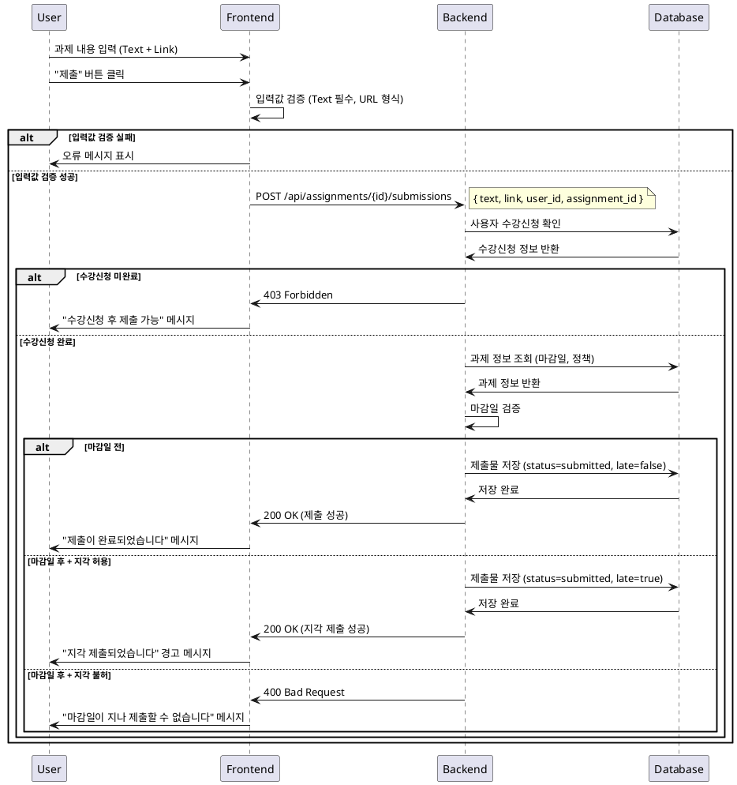

# 과제 제출/재제출 (Learner) - 상세 유스케이스

## 개요
학습자가 수강 중인 코스의 과제를 제출하거나 재제출하는 기능입니다. 마감일, 지각 허용 정책, 재제출 허용 정책을 고려하여 제출 가능 여부를 판단하고 처리합니다.

## Primary Actor
- **Learner (학습자)**: 수강 중인 코스의 과제를 제출하는 사용자

## Precondition (사용자 관점)
- 학습자로 로그인되어 있음
- 해당 코스에 수강신청이 완료되어 있음
- 과제가 `published` 상태임
- 과제 상세 페이지에 접근한 상태임

## Trigger
- 학습자가 과제 상세 페이지에서 "제출" 버튼을 클릭

## Main Scenario

### 1. 정상 제출 (마감일 전)
1. 학습자가 Text 필드(필수)에 과제 내용을 입력
2. Link 필드(선택)에 참고 URL을 입력 (URL 형식 검증)
3. "제출" 버튼 클릭
4. 시스템이 마감일 검증 (현재 시간 < 마감일)
5. 제출물 저장 (`status=submitted`, `late=false`)
6. 제출 성공 메시지 표시
7. 과제 상태가 "제출 완료"로 업데이트

### 2. 지각 제출 (마감일 후, 지각 허용)
1. 학습자가 과제 내용 입력 및 제출 시도
2. 시스템이 마감일 검증 (현재 시간 > 마감일)
3. 과제의 지각 허용 정책 확인 (`allow_late=true`)
4. 제출물 저장 (`status=submitted`, `late=true`)
5. 지각 제출 경고 메시지와 함께 제출 성공 알림
6. 과제 상태가 "지각 제출"로 업데이트

### 3. 재제출
1. 기존 제출물이 `resubmission_required` 상태인 과제 접근
2. 과제의 재제출 허용 정책 확인 (`allow_resubmission=true`)
3. 새로운 내용으로 Text/Link 필드 입력
4. 재제출 처리 (기존 제출물 업데이트 또는 새 버전 생성)
5. 재제출 성공 메시지 표시
6. 과제 상태가 "재제출 완료"로 업데이트

## Edge Cases

### 1. 입력 검증 오류
- **Text 필드 미입력**: "과제 내용을 입력해주세요" 오류 메시지
- **잘못된 URL 형식**: "올바른 URL 형식을 입력해주세요" 오류 메시지
- **내용 길이 초과**: "입력 가능한 최대 길이를 초과했습니다" 오류 메시지

### 2. 제출 불가 상황
- **마감일 후 + 지각 불허**: "마감일이 지나 제출할 수 없습니다" 오류 메시지
- **과제 상태가 `closed`**: "마감된 과제는 제출할 수 없습니다" 오류 메시지
- **재제출 불허 + 이미 제출**: "재제출이 허용되지 않는 과제입니다" 오류 메시지

### 3. 권한 오류
- **수강신청 미완료**: "수강신청 후 과제를 제출할 수 있습니다" 오류 메시지
- **로그인 세션 만료**: 로그인 페이지로 리다이렉트

### 4. 시스템 오류
- **네트워크 오류**: "네트워크 연결을 확인해주세요" 오류 메시지
- **서버 오류**: "일시적인 오류가 발생했습니다. 잠시 후 다시 시도해주세요" 오류 메시지

## Business Rules

### 1. 제출 정책
- Text 필드는 필수, Link 필드는 선택사항
- Link 필드 입력 시 유효한 URL 형식이어야 함
- 과제당 최대 1개의 활성 제출물만 유지

### 2. 마감일 정책
- 마감일 전: 정상 제출 (`late=false`)
- 마감일 후 + 지각 허용: 지각 제출 (`late=true`)
- 마감일 후 + 지각 불허: 제출 차단

### 3. 재제출 정책
- 재제출 허용 과제: 무제한 재제출 가능
- 재제출 불허 과제: 최초 1회만 제출 가능
- 재제출 시 기존 제출물은 덮어쓰기 또는 버전 관리

### 4. 상태 관리
- `submitted`: 제출 완료 (채점 대기)
- `graded`: 채점 완료
- `resubmission_required`: 재제출 요청됨

### 5. 권한 검증
- 해당 코스 수강신청 완료 학습자만 제출 가능
- 과제 소유 코스와 학습자 수강 코스 일치 검증

## Sequence Diagram

## 관련 테이블
- `assignments`: 과제 정보 (마감일, 정책)
- `submissions`: 제출물 정보
- `enrollments`: 수강신청 정보
- `users`: 사용자 정보
