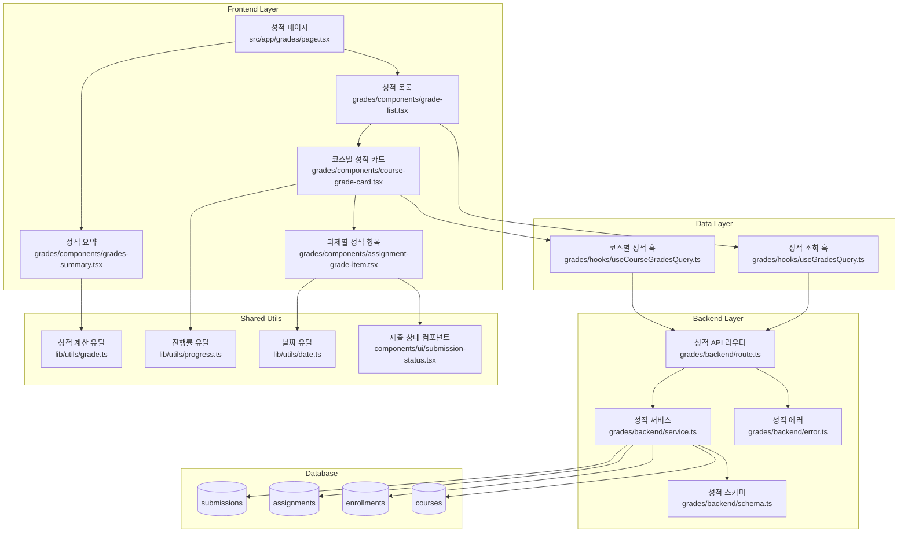

# 성적 & 피드백 열람 (Learner) - 구현 계획

## 개요

성적 & 피드백 열람 기능을 구현하기 위한 모듈화 설계입니다. 기존 코드베이스의 패턴을 따라 feature-based 구조로 구현하며, 재사용 가능한 공통 모듈을 활용합니다.

### 모듈 목록

| 모듈명 | 위치 | 설명 |
|--------|------|------|
| **grades** | `src/features/grades/` | 성적 조회 메인 기능 모듈 |
| **grades-backend** | `src/features/grades/backend/` | 성적 조회 API 및 비즈니스 로직 |
| **grades-components** | `src/features/grades/components/` | 성적 표시 UI 컴포넌트 |
| **grades-hooks** | `src/features/grades/hooks/` | React Query 기반 데이터 페칭 훅 |
| **grades-lib** | `src/features/grades/lib/` | 프론트엔드 DTO 및 타입 재노출 |
| **grade-utils** | `src/lib/utils/grade.ts` | 성적 계산 공통 유틸리티 (신규) |
| **submission-status** | `src/components/ui/submission-status.tsx` | 제출 상태 표시 공통 컴포넌트 (기존 활용) |

## Diagram



## Implementation Plan

### 1. Backend Layer

#### 1.1 grades/backend/schema.ts
**목적**: 성적 조회 API의 요청/응답 스키마 정의

**구현 내용**:
```typescript
// 성적 조회 응답 스키마
export const GradesResponseSchema = z.object({
  courses: z.array(CourseGradeSchema),
  summary: GradeSummarySchema,
});

export const CourseGradeSchema = z.object({
  courseId: z.string().uuid(),
  courseTitle: z.string(),
  assignments: z.array(AssignmentGradeSchema),
  totalScore: z.number(),
  averageScore: z.number(),
  progress: z.number(),
});

export const AssignmentGradeSchema = z.object({
  assignmentId: z.string().uuid(),
  assignmentTitle: z.string(),
  dueDate: z.string(),
  scoreWeight: z.number(),
  status: z.enum(['submitted', 'graded', 'resubmission_required', 'not_submitted']),
  score: z.number().nullable(),
  feedback: z.string().nullable(),
  isLate: z.boolean(),
  submittedAt: z.string().nullable(),
});
```

**Unit Test 계획**:
- 스키마 유효성 검증 테스트
- 타입 안전성 테스트
- 에지 케이스 데이터 검증 테스트

#### 1.2 grades/backend/service.ts
**목적**: 성적 조회 비즈니스 로직 구현

**구현 내용**:
```typescript
// 사용자의 모든 성적 조회
export const getUserGrades = async (
  client: SupabaseClient,
  userId: string
): Promise<HandlerResult<GradesResponse, string, unknown>>

// 특정 코스의 성적 조회
export const getCourseGrades = async (
  client: SupabaseClient,
  userId: string,
  courseId: string
): Promise<HandlerResult<CourseGrade, string, unknown>>
```

**Unit Test 계획**:
- 정상적인 성적 조회 테스트
- 권한 검증 테스트 (본인 성적만 조회)
- 수강하지 않은 코스 접근 테스트
- 데이터베이스 오류 처리 테스트
- 빈 데이터 처리 테스트

#### 1.3 grades/backend/route.ts
**목적**: 성적 조회 API 엔드포인트 정의

**구현 내용**:
```typescript
// GET /api/grades - 전체 성적 조회
// GET /api/grades/courses/:courseId - 특정 코스 성적 조회
```

**Unit Test 계획**:
- API 엔드포인트 응답 테스트
- 인증/인가 미들웨어 테스트
- 파라미터 검증 테스트

#### 1.4 grades/backend/error.ts
**목적**: 성적 조회 관련 에러 코드 정의

**구현 내용**:
```typescript
export const gradesErrorCodes = {
  unauthorized: 'GRADES_UNAUTHORIZED',
  courseNotFound: 'GRADES_COURSE_NOT_FOUND',
  notEnrolled: 'GRADES_NOT_ENROLLED',
  fetchError: 'GRADES_FETCH_ERROR',
  databaseError: 'GRADES_DATABASE_ERROR',
} as const;
```

### 2. Frontend Layer

#### 2.1 grades/hooks/useGradesQuery.ts
**목적**: React Query를 사용한 성적 데이터 페칭

**구현 내용**:
```typescript
export const useGradesQuery = () => {
  return useQuery({
    queryKey: ['grades'],
    queryFn: () => apiClient.get('/grades'),
    staleTime: 5 * 60 * 1000, // 5분
  });
};
```

**QA Sheet**:
- [ ] 로딩 상태가 올바르게 표시되는가?
- [ ] 에러 상태가 적절히 처리되는가?
- [ ] 데이터 캐싱이 정상 작동하는가?
- [ ] 실시간 업데이트가 반영되는가?

#### 2.2 grades/components/grade-list.tsx
**목적**: 전체 성적 목록 표시 컴포넌트

**구현 내용**:
```typescript
interface GradeListProps {
  grades: GradesResponse;
  isLoading?: boolean;
  error?: Error | null;
}

export const GradeList: React.FC<GradeListProps> = ({ grades, isLoading, error }) => {
  // 성적 목록 렌더링 로직
};
```

**QA Sheet**:
- [ ] 로딩 스켈레톤이 적절히 표시되는가?
- [ ] 에러 상태에서 재시도 버튼이 작동하는가?
- [ ] 빈 데이터 상태가 올바르게 표시되는가?
- [ ] 반응형 디자인이 적용되었는가?
- [ ] 접근성 요구사항을 만족하는가?

#### 2.3 grades/components/course-grade-card.tsx
**목적**: 코스별 성적 카드 컴포넌트

**구현 내용**:
```typescript
interface CourseGradeCardProps {
  courseGrade: CourseGrade;
  onAssignmentClick?: (assignmentId: string) => void;
}

export const CourseGradeCard: React.FC<CourseGradeCardProps> = ({ courseGrade, onAssignmentClick }) => {
  // 코스별 성적 카드 렌더링
};
```

**QA Sheet**:
- [ ] 진행률 바가 정확히 표시되는가?
- [ ] 총점 계산이 올바른가?
- [ ] 과제 클릭 시 상세 페이지로 이동하는가?
- [ ] 상태별 색상 구분이 명확한가?

#### 2.4 grades/components/assignment-grade-item.tsx
**목적**: 개별 과제 성적 항목 컴포넌트

**구현 내용**:
```typescript
interface AssignmentGradeItemProps {
  assignment: AssignmentGrade;
  showFeedback?: boolean;
}

export const AssignmentGradeItem: React.FC<AssignmentGradeItemProps> = ({ assignment, showFeedback }) => {
  // 과제별 성적 항목 렌더링
};
```

**QA Sheet**:
- [ ] 제출 상태가 정확히 표시되는가?
- [ ] 지각 제출 표시가 올바른가?
- [ ] 피드백 토글이 정상 작동하는가?
- [ ] 점수가 올바르게 포맷팅되는가?

#### 2.5 grades/components/grades-summary.tsx
**목적**: 성적 요약 정보 표시 컴포넌트

**구현 내용**:
```typescript
interface GradesSummaryProps {
  summary: GradeSummary;
}

export const GradesSummary: React.FC<GradesSummaryProps> = ({ summary }) => {
  // 성적 요약 정보 렌더링
};
```

**QA Sheet**:
- [ ] 전체 평균 점수가 정확히 계산되는가?
- [ ] 완료율이 올바르게 표시되는가?
- [ ] 차트/그래프가 정상 렌더링되는가?

### 3. Shared Utils Layer

#### 3.1 lib/utils/grade.ts (신규)
**목적**: 성적 계산 관련 공통 유틸리티

**구현 내용**:
```typescript
// 코스 총점 계산 (과제 점수 × 비중)
export const calculateCourseTotal = (assignments: AssignmentGrade[]): number

// 평균 점수 계산
export const calculateAverageScore = (assignments: AssignmentGrade[]): number

// 성적 등급 계산 (A, B, C, D, F)
export const calculateGrade = (score: number): string

// 제출 상태 우선순위 정렬
export const sortBySubmissionStatus = (assignments: AssignmentGrade[]): AssignmentGrade[]
```

**Unit Test 계획**:
- 총점 계산 정확성 테스트
- 평균 점수 계산 테스트
- 등급 계산 경계값 테스트
- 빈 배열 처리 테스트
- 잘못된 입력값 처리 테스트

#### 3.2 기존 컴포넌트 활용
- `src/components/ui/submission-status.tsx`: 제출 상태 표시
- `src/lib/utils/progress.ts`: 진행률 계산
- `src/lib/utils/date.ts`: 날짜 포맷팅

### 4. Page Layer

#### 4.1 src/app/grades/page.tsx (신규)
**목적**: 성적 조회 메인 페이지

**구현 내용**:
```typescript
export default async function GradesPage() {
  // 사용자 인증 확인
  // 성적 데이터 조회
  // 성적 목록 컴포넌트 렌더링
}
```

**QA Sheet**:
- [ ] 페이지 로딩이 빠른가?
- [ ] SEO 메타데이터가 적절히 설정되었는가?
- [ ] 브레드크럼 네비게이션이 작동하는가?
- [ ] 모바일에서 정상 작동하는가?

### 5. Integration Points

#### 5.1 기존 시스템과의 연동
- **Dashboard**: 최근 피드백 데이터 공유
- **Assignments**: 과제 상세 정보 연동
- **Courses**: 코스 정보 연동
- **Auth**: 사용자 인증 정보 활용

#### 5.2 API 엔드포인트 등록
- `src/backend/hono/app.ts`에 `registerGradesRoutes(app)` 추가

### 6. 구현 순서

1. **Backend 구현** (1-2일)
   - schema.ts → error.ts → service.ts → route.ts 순서
   - Unit Test 작성 및 검증

2. **Shared Utils 구현** (0.5일)
   - grade.ts 유틸리티 함수 구현
   - Unit Test 작성

3. **Frontend Hooks 구현** (0.5일)
   - useGradesQuery.ts 구현
   - React Query 설정

4. **Frontend Components 구현** (2-3일)
   - 하위 컴포넌트부터 상위 컴포넌트 순서
   - assignment-grade-item → course-grade-card → grade-list → grades-summary

5. **Page 구현 및 통합** (1일)
   - grades/page.tsx 구현
   - 라우팅 설정
   - 전체 통합 테스트

6. **QA 및 최적화** (1일)
   - 사용자 시나리오 테스트
   - 성능 최적화
   - 접근성 검증

### 7. 성능 고려사항

- **데이터 캐싱**: React Query를 통한 5분 캐싱
- **지연 로딩**: 큰 데이터셋에 대한 페이지네이션 고려
- **최적화된 쿼리**: 필요한 데이터만 조회하는 SQL 최적화
- **메모이제이션**: 계산 집약적인 성적 계산 함수 메모이제이션

### 8. 보안 고려사항

- **권한 검증**: 본인 성적만 조회 가능하도록 엄격한 검증
- **데이터 마스킹**: 민감한 정보 노출 방지
- **SQL 인젝션 방지**: Supabase ORM 활용으로 안전한 쿼리 실행
