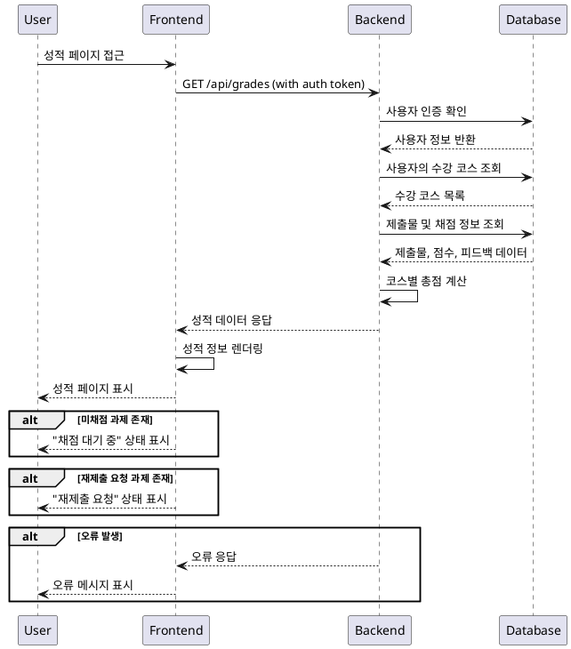

# 성적 & 피드백 열람 (Learner) - 상세 유스케이스

## Primary Actor
- **Learner**: 수강 중인 코스의 과제 성적과 피드백을 확인하고자 하는 학습자

## Precondition
- 사용자가 Learner 역할로 로그인되어 있음
- 최소 하나 이상의 코스에 수강신청되어 있음
- 해당 코스에서 제출한 과제가 존재함

## Trigger
- Learner가 성적 페이지에 접근
- 대시보드에서 "성적 보기" 버튼 클릭
- 코스 상세 페이지에서 "내 성적" 메뉴 선택

## Main Scenario

### 1. 성적 페이지 접근
1. Learner가 성적 페이지 URL에 접근하거나 관련 버튼을 클릭
2. 시스템이 사용자 인증 상태를 확인
3. 사용자의 수강 중인 코스 목록을 조회

### 2. 성적 데이터 조회
1. 시스템이 사용자의 모든 제출물(submissions)을 조회
2. 각 제출물의 채점 상태, 점수, 피드백 정보를 수집
3. 과제별 점수와 비중을 기반으로 코스별 총점을 계산

### 3. 성적 정보 표시
1. 코스별로 그룹화된 성적 정보를 화면에 표시
2. 각 과제별로 다음 정보를 표시:
   - 과제명 및 마감일
   - 제출 상태 (제출완료/지각제출/미제출/재제출요청)
   - 획득 점수 (채점 완료 시)
   - 강사 피드백 (존재 시)
   - 지각 여부 표시
3. 코스별 총점 및 평균 점수 요약 표시

## Edge Cases

### E1. 미채점 과제 존재
- **상황**: 제출했지만 아직 채점되지 않은 과제가 있는 경우
- **처리**: "채점 대기 중" 상태로 표시, 점수는 "-"로 표시

### E2. 제출하지 않은 과제 존재
- **상황**: 마감일이 지났지만 제출하지 않은 과제가 있는 경우
- **처리**: "미제출" 상태로 표시, 점수는 0점으로 계산

### E3. 재제출 요청된 과제
- **상황**: 강사가 재제출을 요청한 과제가 있는 경우
- **처리**: "재제출 요청" 상태로 표시, 기존 점수는 유지하되 재제출 가능 안내

### E4. 수강 중인 코스가 없는 경우
- **상황**: 아직 수강신청한 코스가 없는 경우
- **처리**: "수강 중인 코스가 없습니다" 메시지와 함께 코스 탐색 링크 제공

### E5. 네트워크 오류
- **상황**: 데이터 조회 중 네트워크 오류 발생
- **처리**: 오류 메시지 표시 및 새로고침 버튼 제공

## Business Rules

### BR1. 접근 권한
- 본인의 성적만 조회 가능
- 다른 학습자의 성적 정보는 접근 불가

### BR2. 점수 계산
- 코스 총점 = Σ(과제 점수 × 과제 비중)
- 미제출 과제는 0점으로 계산
- 재제출 요청 상태의 과제는 기존 점수로 계산

### BR3. 피드백 표시
- 채점 완료된 과제만 피드백 표시
- 피드백이 없는 경우 "피드백 없음" 표시

### BR4. 상태 우선순위
1. 재제출 요청 (최우선)
2. 지각 제출
3. 정상 제출
4. 미제출

### BR5. 데이터 실시간성
- 성적 정보는 실시간으로 업데이트
- 강사가 채점을 완료하면 즉시 반영

## Sequence Diagram

