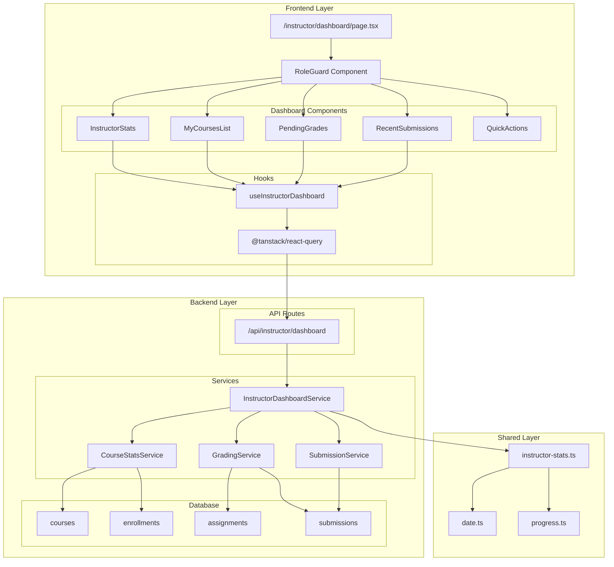

# Instructor 대시보드 구현 계획

## 개요

Instructor 전용 대시보드 기능을 구현하기 위한 모듈화 설계입니다. 기존 Learner 대시보드 패턴을 참고하여 일관성 있는 아키텍처를 유지하면서, Instructor의 특화된 요구사항을 충족하는 새로운 feature 모듈을 구현합니다.

### 모듈 목록

| 모듈 이름 | 위치 | 설명 |
|-----------|------|------|
| **InstructorDashboard Feature** | `src/features/instructor-dashboard/` | Instructor 대시보드 전용 feature 모듈 |
| **Backend Service** | `src/features/instructor-dashboard/backend/` | 대시보드 데이터 조회 및 집계 로직 |
| **Frontend Components** | `src/features/instructor-dashboard/components/` | 대시보드 UI 컴포넌트들 |
| **React Query Hooks** | `src/features/instructor-dashboard/hooks/` | 서버 상태 관리 훅 |
| **Shared Statistics Utils** | `src/lib/utils/instructor-stats.ts` | 통계 계산 공통 유틸리티 |
| **Page Integration** | `src/app/instructor/dashboard/page.tsx` | 기존 페이지 업데이트 |

## Diagram



## Implementation Plan

### 1. Backend Layer

#### 1.1 Feature Module Structure
```
src/features/instructor-dashboard/
├── backend/
│   ├── route.ts          # API 라우터 정의
│   ├── service.ts        # 비즈니스 로직 및 데이터 조회
│   ├── schema.ts         # 요청/응답 스키마 정의
│   └── error.ts          # 에러 코드 정의
├── components/
│   ├── instructor-stats.tsx
│   ├── my-courses-list.tsx
│   ├── pending-grades.tsx
│   ├── recent-submissions.tsx
│   └── quick-actions.tsx
├── hooks/
│   └── useInstructorDashboard.ts
└── lib/
    └── dto.ts            # 스키마 재노출
```

#### 1.2 API Endpoint Design
- **GET** `/api/instructor/dashboard`
  - **권한**: Instructor 역할만 접근 가능
  - **응답**: 대시보드 통합 데이터
  - **캐시**: 5분 TTL

#### 1.3 Service Layer Functions

**InstructorDashboardService** (`service.ts`):
```typescript
// 메인 대시보드 데이터 조회 함수
export const getInstructorDashboardData = async (
  client: SupabaseClient,
  instructorId: string
): Promise<HandlerResult<InstructorDashboardResponse, string, unknown>>

// 강사의 코스 목록 및 통계 조회
const getInstructorCoursesWithStats = async (
  client: SupabaseClient,
  instructorId: string
): Promise<HandlerResult<InstructorCourse[], string, unknown>>

// 채점 대기 제출물 조회
const getPendingGradingSubmissions = async (
  client: SupabaseClient,
  instructorId: string
): Promise<HandlerResult<PendingSubmission[], string, unknown>>

// 최근 제출물 조회 (7일 이내)
const getRecentSubmissions = async (
  client: SupabaseClient,
  instructorId: string
): Promise<HandlerResult<RecentSubmission[], string, unknown>>
```

**Unit Tests** (`service.test.ts`):
```typescript
describe('InstructorDashboardService', () => {
  describe('getInstructorDashboardData', () => {
    it('should return dashboard data for valid instructor', async () => {
      // 정상적인 강사 ID로 대시보드 데이터 조회 테스트
    });
    
    it('should fail for non-instructor user', async () => {
      // 강사가 아닌 사용자 접근 시 실패 테스트
    });
    
    it('should handle database errors gracefully', async () => {
      // 데이터베이스 오류 처리 테스트
    });
  });
  
  describe('getInstructorCoursesWithStats', () => {
    it('should return courses with enrollment counts', async () => {
      // 코스별 수강생 수 포함 조회 테스트
    });
    
    it('should filter courses by status', async () => {
      // 코스 상태별 필터링 테스트
    });
  });
  
  describe('getPendingGradingSubmissions', () => {
    it('should return submissions ordered by priority', async () => {
      // 채점 우선순위 정렬 테스트
    });
    
    it('should limit results to instructor courses only', async () => {
      // 강사 본인 코스만 조회 테스트
    });
  });
});
```

#### 1.4 Schema Definitions (`schema.ts`)
```typescript
// 응답 스키마
export const InstructorDashboardResponseSchema = z.object({
  stats: z.object({
    totalCourses: z.number(),
    totalStudents: z.number(),
    pendingGrades: z.number(),
    averageRating: z.number(),
  }),
  courses: z.array(InstructorCourseSchema),
  pendingSubmissions: z.array(PendingSubmissionSchema),
  recentSubmissions: z.array(RecentSubmissionSchema),
});

export const InstructorCourseSchema = z.object({
  id: z.string().uuid(),
  title: z.string(),
  status: z.enum(['draft', 'published', 'archived']),
  enrollmentCount: z.number(),
  averageRating: z.number().nullable(),
  createdAt: z.string(),
  updatedAt: z.string(),
});

export const PendingSubmissionSchema = z.object({
  id: z.string().uuid(),
  assignmentTitle: z.string(),
  courseTitle: z.string(),
  learnerName: z.string(),
  submittedAt: z.string(),
  isLate: z.boolean(),
  daysOverdue: z.number().nullable(),
});
```

### 2. Frontend Layer

#### 2.1 React Query Hook (`useInstructorDashboard.ts`)
```typescript
export const useInstructorDashboard = () => {
  return useQuery({
    queryKey: ['instructor-dashboard'],
    queryFn: async (): Promise<InstructorDashboardResponse> => {
      const response = await apiClient.get('/api/instructor/dashboard');
      return InstructorDashboardResponseSchema.parse(response.data.data);
    },
    staleTime: 5 * 60 * 1000, // 5분 캐시
    refetchOnWindowFocus: true,
    refetchInterval: 5 * 60 * 1000, // 5분마다 자동 새로고침
    retry: 3,
    retryDelay: (attemptIndex) => Math.min(1000 * 2 ** attemptIndex, 30000),
  });
};
```

#### 2.2 Component Architecture

**InstructorStats** (`instructor-stats.tsx`):
- 통계 카드 4개 (총 코스 수, 총 수강생 수, 채점 대기, 평균 평점)
- 로딩/에러 상태 처리
- 반응형 그리드 레이아웃

**MyCoursesList** (`my-courses-list.tsx`):
- 코스 상태별 탭 (Draft/Published/Archived)
- 각 코스별 수강생 수, 평점 표시
- 코스 상태별 액션 버튼 (편집/게시/보관)

**PendingGrades** (`pending-grades.tsx`):
- 채점 대기 제출물 목록 (최대 10개)
- 우선순위 정렬 (마감일 지남 > 오래된 제출물)
- 빠른 채점 링크 제공

**RecentSubmissions** (`recent-submissions.tsx`):
- 최근 7일 제출물 목록
- 제출 시간, 학습자명, 과제명 표시
- 채점 상태별 색상 구분

**QuickActions** (`quick-actions.tsx`):
- 새 코스 만들기
- 과제 관리
- 채점하기
- 수강생 관리

#### 2.3 QA Sheet (Presentation Layer)

| 컴포넌트 | 테스트 시나리오 | 예상 결과 | 검증 방법 |
|----------|----------------|-----------|-----------|
| **InstructorStats** | 데이터 로딩 중 | 스켈레톤 UI 표시 | 로딩 상태 확인 |
| | 통계 데이터 표시 | 4개 카드에 정확한 수치 표시 | 데이터 바인딩 확인 |
| | 에러 발생 시 | 에러 메시지 및 재시도 버튼 | 에러 처리 확인 |
| **MyCoursesList** | 코스가 없는 경우 | "첫 코스 만들기" 안내 표시 | 빈 상태 처리 |
| | 코스 상태별 필터링 | 탭 클릭 시 해당 상태 코스만 표시 | 필터링 로직 |
| | 코스 액션 버튼 | 상태에 따른 적절한 버튼 표시 | 조건부 렌더링 |
| **PendingGrades** | 채점 대기 없음 | "채점할 제출물이 없습니다" 표시 | 빈 상태 처리 |
| | 우선순위 정렬 | 마감일 지난 것 우선 표시 | 정렬 로직 |
| | 빠른 채점 링크 | 클릭 시 해당 제출물 채점 페이지 이동 | 네비게이션 |
| **RecentSubmissions** | 최근 제출물 없음 | "최근 제출물이 없습니다" 표시 | 빈 상태 처리 |
| | 제출물 목록 표시 | 최대 10개, 시간 순 정렬 | 데이터 제한 및 정렬 |
| | 채점 상태 표시 | 상태별 색상 구분 표시 | 스타일링 |
| **QuickActions** | 버튼 클릭 | 해당 기능 페이지로 이동 | 네비게이션 |
| | 권한 체크 | Instructor만 모든 버튼 활성화 | 권한 기반 UI |

### 3. Shared Utilities

#### 3.1 Instructor Statistics Utils (`src/lib/utils/instructor-stats.ts`)
```typescript
/**
 * 채점 우선순위 계산 함수
 */
export const calculateGradingPriority = (
  submission: PendingSubmission
): number => {
  // 마감일 지남 여부와 제출일 기준으로 우선순위 계산
  const now = new Date();
  const submittedDate = new Date(submission.submittedAt);
  const daysSinceSubmission = differenceInDays(now, submittedDate);
  
  let priority = daysSinceSubmission; // 기본: 오래된 제출물 우선
  
  if (submission.isLate) {
    priority += 1000; // 지각 제출물 최우선
  }
  
  if (submission.daysOverdue && submission.daysOverdue > 0) {
    priority += submission.daysOverdue * 100; // 마감일 지난 정도에 따라 가중치
  }
  
  return priority;
};

/**
 * 코스 완료율 계산 함수
 */
export const calculateCourseCompletionRate = (
  totalSubmissions: number,
  gradedSubmissions: number
): number => {
  if (totalSubmissions === 0) return 0;
  return Math.round((gradedSubmissions / totalSubmissions) * 100);
};

/**
 * 평균 평점 계산 함수
 */
export const calculateAverageRating = (ratings: number[]): number => {
  if (ratings.length === 0) return 0;
  const sum = ratings.reduce((acc, rating) => acc + rating, 0);
  return Math.round((sum / ratings.length) * 100) / 100; // 소수점 2자리
};
```

### 4. Integration Points

#### 4.1 Page Update (`src/app/instructor/dashboard/page.tsx`)
기존 정적 페이지를 동적 데이터 기반으로 업데이트:
```typescript
"use client";

import { RoleGuard } from "@/components/auth/role-guard";
import { useInstructorDashboard } from "@/features/instructor-dashboard/hooks/useInstructorDashboard";
import { InstructorStats } from "@/features/instructor-dashboard/components/instructor-stats";
import { MyCoursesList } from "@/features/instructor-dashboard/components/my-courses-list";
import { PendingGrades } from "@/features/instructor-dashboard/components/pending-grades";
import { RecentSubmissions } from "@/features/instructor-dashboard/components/recent-submissions";
import { QuickActions } from "@/features/instructor-dashboard/components/quick-actions";

export default function InstructorDashboardPage({ params }: InstructorDashboardPageProps) {
  void params;
  
  return (
    <RoleGuard allowedRoles={['instructor']}>
      <div className="container mx-auto py-8">
        <div className="space-y-6">
          <div>
            <h1 className="text-3xl font-bold">강사 대시보드</h1>
            <p className="text-muted-foreground mt-2">
              코스와 과제를 관리하고 학습자들의 진행상황을 확인하세요.
            </p>
          </div>
          
          <InstructorStats />
          <MyCoursesList />
          
          <div className="grid gap-6 lg:grid-cols-2">
            <PendingGrades />
            <RecentSubmissions />
          </div>
          
          <QuickActions />
        </div>
      </div>
    </RoleGuard>
  );
}
```

#### 4.2 Backend Route Registration
`src/backend/hono/app.ts`에 새로운 라우터 등록:
```typescript
import { registerInstructorDashboardRoutes } from '@/features/instructor-dashboard/backend/route';

// 기존 라우터들과 함께 등록
registerInstructorDashboardRoutes(app);
```

### 5. Performance Considerations

#### 5.1 Database Query Optimization
- 인덱스 활용: `courses.instructor_id`, `submissions.status`, `assignments.due_date`
- JOIN 최적화: 필요한 컬럼만 SELECT
- 페이지네이션: 최근 제출물 최대 10개 제한
- 집계 쿼리 최적화: COUNT, AVG 함수 효율적 사용

#### 5.2 Frontend Performance
- React Query 캐싱: 5분 TTL로 불필요한 요청 방지
- 컴포넌트 메모이제이션: React.memo 적용
- 지연 로딩: 대용량 데이터 처리 시 가상화 적용
- 에러 바운더리: 부분 실패 시 전체 페이지 크래시 방지

### 6. Error Handling Strategy

#### 6.1 Backend Error Codes
```typescript
export const instructorDashboardErrorCodes = {
  unauthorized: 'INSTRUCTOR_DASHBOARD_UNAUTHORIZED',
  invalidRole: 'INSTRUCTOR_DASHBOARD_INVALID_ROLE',
  fetchError: 'INSTRUCTOR_DASHBOARD_FETCH_ERROR',
  databaseError: 'INSTRUCTOR_DASHBOARD_DATABASE_ERROR',
} as const;
```

#### 6.2 Frontend Error Boundaries
- 네트워크 오류: 재시도 버튼 제공
- 권한 오류: 로그인 페이지로 리다이렉트
- 데이터 오류: 부분 렌더링 및 대체 UI 표시
- 예상치 못한 오류: 에러 리포팅 및 사용자 친화적 메시지

### 7. Testing Strategy

#### 7.1 Unit Tests
- Service 함수들의 비즈니스 로직 테스트
- 통계 계산 유틸리티 함수 테스트
- 스키마 검증 테스트

#### 7.2 Integration Tests
- API 엔드포인트 전체 플로우 테스트
- 데이터베이스 연동 테스트
- 권한 체크 테스트

#### 7.3 E2E Tests
- 사용자 시나리오 기반 전체 플로우 테스트
- 다양한 데이터 상태에서의 UI 동작 테스트
- 성능 및 접근성 테스트

## 구현 우선순위

1. **Phase 1**: Backend API 구현 (service, route, schema)
2. **Phase 2**: 기본 컴포넌트 구현 (stats, courses list)
3. **Phase 3**: 고급 기능 구현 (pending grades, recent submissions)
4. **Phase 4**: UI/UX 개선 및 성능 최적화
5. **Phase 5**: 테스트 코드 작성 및 문서화

## 예상 개발 시간

- Backend 구현: 2-3일
- Frontend 컴포넌트: 3-4일
- 통합 및 테스트: 1-2일
- **총 예상 시간**: 6-9일

## 잠재적 개선사항

1. **실시간 업데이트**: WebSocket을 통한 실시간 제출물 알림
2. **고급 통계**: 차트 라이브러리를 활용한 시각적 대시보드
3. **일괄 작업**: 여러 제출물 동시 채점 기능
4. **알림 시스템**: 중요한 이벤트에 대한 푸시 알림
5. **모바일 최적화**: 모바일 환경에서의 사용성 개선
