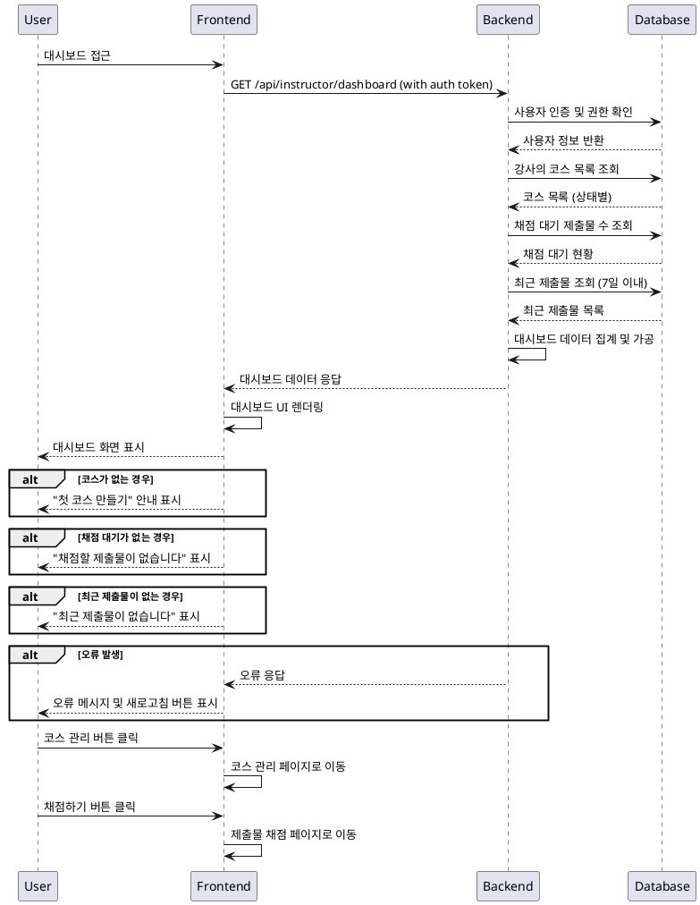

# Instructor 대시보드 - 상세 유스케이스

## Primary Actor
- **Instructor**: 자신이 개설한 코스와 과제를 관리하고 현황을 파악하고자 하는 강사

## Precondition
- 사용자가 Instructor 역할로 로그인되어 있음
- 최소 하나 이상의 코스를 개설했거나 개설 중임

## Trigger
- Instructor가 대시보드 페이지에 접근
- 메인 네비게이션에서 "대시보드" 메뉴 클릭
- 로그인 후 자동 리다이렉트

## Main Scenario

### 1. 대시보드 접근
1. Instructor가 대시보드 URL에 접근하거나 관련 메뉴를 클릭
2. 시스템이 사용자 인증 상태 및 Instructor 권한을 확인
3. 강사의 코스 및 과제 현황 데이터를 조회

### 2. 내 코스 목록 표시
1. 시스템이 강사가 개설한 모든 코스를 상태별로 조회
   - Draft: 작성 중인 코스
   - Published: 공개된 코스
   - Archived: 보관된 코스
2. 각 코스별 기본 정보와 수강생 수를 표시
3. 코스 상태에 따른 액션 버튼 제공 (편집, 게시, 보관 등)

### 3. 채점 대기 현황 표시
1. 시스템이 강사의 모든 코스에서 채점 대기 중인 제출물 수를 계산
2. 코스별, 과제별 채점 대기 현황을 집계
3. 우선순위가 높은 채점 대기 항목을 상위에 표시

### 4. 최근 제출물 표시
1. 시스템이 최근 7일 이내 제출된 과제를 조회
2. 제출 시간 순으로 정렬하여 최대 10개까지 표시
3. 각 제출물의 과제명, 학습자명, 제출일시, 채점 상태를 표시

### 5. 대시보드 정보 렌더링
1. 수집된 모든 정보를 대시보드 레이아웃에 배치
2. 통계 정보를 시각적 차트나 카드 형태로 표시
3. 빠른 액션을 위한 버튼들을 적절한 위치에 배치

## Edge Cases

### E1. 개설한 코스가 없는 경우
- **상황**: 아직 코스를 개설하지 않은 신규 강사인 경우
- **처리**: "첫 코스 만들기" 안내 메시지와 함께 코스 생성 버튼 제공

### E2. 채점 대기 제출물이 없는 경우
- **상황**: 모든 제출물이 채점 완료되었거나 제출물이 없는 경우
- **처리**: "채점할 제출물이 없습니다" 메시지 표시

### E3. 최근 제출물이 없는 경우
- **상황**: 최근 7일 이내 새로운 제출물이 없는 경우
- **처리**: "최근 제출물이 없습니다" 메시지 표시

### E4. 데이터 로딩 실패
- **상황**: 네트워크 오류나 서버 문제로 데이터 조회 실패
- **처리**: 오류 메시지 표시 및 새로고침 버튼 제공

### E5. 권한 없는 접근
- **상황**: Learner나 비로그인 사용자가 접근하는 경우
- **처리**: 접근 거부 메시지 표시 및 적절한 페이지로 리다이렉트

## Business Rules

### BR1. 접근 권한
- Instructor 역할의 사용자만 접근 가능
- 본인이 개설한 코스 정보만 조회 가능

### BR2. 코스 상태별 표시
- Draft: 편집 가능, 게시 버튼 활성화
- Published: 수강생 관리, 과제 관리, 보관 버튼 활성화
- Archived: 읽기 전용, 복원 버튼만 활성화

### BR3. 채점 우선순위
- 마감일이 지난 과제의 제출물 우선 표시
- 제출일이 오래된 순서로 정렬
- 재제출 요청된 과제는 별도 구분 표시

### BR4. 통계 계산
- 채점 대기 수 = 'submitted' 상태인 제출물 수
- 수강생 수 = 활성 상태(is_active=true)인 수강신청 수
- 완료율 = 채점 완료된 제출물 / 전체 제출물

### BR5. 데이터 실시간성
- 대시보드 정보는 실시간으로 업데이트
- 새로운 제출물이나 수강신청이 있으면 즉시 반영
- 캐시 시간은 최대 5분으로 제한

### BR6. 성능 최적화
- 대용량 데이터의 경우 페이지네이션 적용
- 최근 제출물은 최대 10개로 제한
- 불필요한 데이터 조회 최소화

## Sequence Diagram

