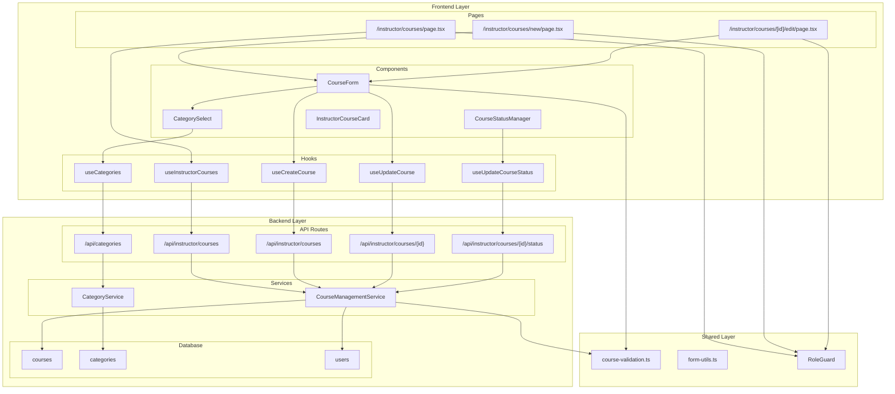

# 코스 관리 (Instructor) 구현 계획

## 개요

Instructor가 자신의 코스를 생성, 수정, 상태 관리할 수 있는 기능을 구현하기 위한 모듈화 설계입니다. 기존 courses feature의 조회 기능을 확장하여 CRUD 기능을 추가하고, 소유권 기반 접근 제어를 구현합니다.

### 모듈 목록

| 모듈 이름 | 위치 | 설명 |
|-----------|------|------|
| **CourseManagement Backend** | `src/features/courses/backend/` | 기존 service.ts 확장하여 생성/수정/상태변경 기능 추가 |
| **CourseManagement Routes** | `src/features/courses/backend/route.ts` | 기존 라우터에 POST/PUT/PATCH 엔드포인트 추가 |
| **CourseManagement Schema** | `src/features/courses/backend/schema.ts` | 생성/수정 요청 스키마 추가 |
| **Course Validation Utils** | `src/lib/validation/course.ts` | 코스 데이터 검증 공통 로직 |
| **CourseForm Component** | `src/features/courses/components/course-form.tsx` | 코스 생성/수정 폼 컴포넌트 |
| **CourseStatusManager** | `src/features/courses/components/course-status-manager.tsx` | 상태 전환 관리 컴포넌트 |
| **CategorySelect Component** | `src/features/courses/components/category-select.tsx` | 카테고리 선택 드롭다운 |
| **Course Management Hooks** | `src/features/courses/hooks/` | 생성/수정/삭제 React Query 훅들 |
| **Course Management Pages** | `src/app/instructor/courses/` | 코스 관리 페이지들 |
| **Categories API** | `src/features/categories/` | 카테고리 조회 전용 feature 모듈 |

## Diagram



## Implementation Plan

### 1. Backend Layer

#### 1.1 Course Management Service 확장 (`src/features/courses/backend/service.ts`)

**새로 추가할 함수들:**
```typescript
// 강사의 코스 목록 조회 (모든 상태 포함)
export const getInstructorCourses = async (
  client: SupabaseClient,
  instructorId: string,
  status?: 'draft' | 'published' | 'archived'
): Promise<HandlerResult<InstructorCoursesResponse, CoursesServiceError, unknown>>

// 코스 생성
export const createCourse = async (
  client: SupabaseClient,
  instructorId: string,
  courseData: CreateCourseRequest
): Promise<HandlerResult<CourseResponse, CoursesServiceError, unknown>>

// 코스 수정
export const updateCourse = async (
  client: SupabaseClient,
  courseId: string,
  instructorId: string,
  courseData: UpdateCourseRequest
): Promise<HandlerResult<CourseResponse, CoursesServiceError, unknown>>

// 코스 상태 변경
export const updateCourseStatus = async (
  client: SupabaseClient,
  courseId: string,
  instructorId: string,
  newStatus: 'draft' | 'published' | 'archived'
): Promise<HandlerResult<CourseResponse, CoursesServiceError, unknown>>

// 코스 소유권 확인
const validateCourseOwnership = async (
  client: SupabaseClient,
  courseId: string,
  instructorId: string
): Promise<HandlerResult<boolean, CoursesServiceError, unknown>>
```

**Unit Tests:**
```typescript
describe('CourseManagementService', () => {
  describe('createCourse', () => {
    it('should create course with valid data', async () => {
      // 정상적인 코스 생성 테스트
    });
    
    it('should fail with invalid instructor', async () => {
      // 잘못된 강사 ID로 생성 시도 테스트
    });
    
    it('should validate required fields', async () => {
      // 필수 필드 누락 시 실패 테스트
    });
    
    it('should check title uniqueness per instructor', async () => {
      // 동일 강사의 제목 중복 체크 테스트
    });
  });
  
  describe('updateCourse', () => {
    it('should update course by owner', async () => {
      // 소유자의 코스 수정 테스트
    });
    
    it('should fail for non-owner', async () => {
      // 비소유자의 수정 시도 테스트
    });
    
    it('should respect published course restrictions', async () => {
      // 게시된 코스의 수정 제한 테스트
    });
  });
  
  describe('updateCourseStatus', () => {
    it('should transition draft to published', async () => {
      // draft → published 전환 테스트
    });
    
    it('should require complete data for publishing', async () => {
      // 게시 시 필수 데이터 완성 확인 테스트
    });
    
    it('should handle enrollment impact on archiving', async () => {
      // 보관 시 수강생 영향 처리 테스트
    });
  });
});
```

#### 1.2 API Routes 확장 (`src/features/courses/backend/route.ts`)

**새로 추가할 엔드포인트들:**
```typescript
// GET /api/instructor/courses - 강사의 코스 목록 조회
app.get('/instructor/courses', async (c) => {
  // 인증 확인, 강사 권한 체크
  // 상태별 필터링 지원
  // 페이지네이션 지원
});

// POST /api/instructor/courses - 새 코스 생성
app.post('/instructor/courses', async (c) => {
  // 요청 데이터 검증
  // 소유권 확인
  // 코스 생성
});

// PUT /api/instructor/courses/:id - 코스 수정
app.put('/instructor/courses/:id', async (c) => {
  // 소유권 확인
  // 수정 권한 체크 (상태별)
  // 코스 업데이트
});

// PATCH /api/instructor/courses/:id/status - 상태 변경
app.patch('/instructor/courses/:id/status', async (c) => {
  // 소유권 확인
  // 상태 전환 규칙 체크
  // 상태 업데이트
});
```

#### 1.3 Schema 확장 (`src/features/courses/backend/schema.ts`)

**새로 추가할 스키마들:**
```typescript
export const CreateCourseRequestSchema = z.object({
  title: z.string().min(3).max(200),
  description: z.string().min(10).max(2000),
  curriculum: z.string().max(5000).optional(),
  categoryId: z.string().uuid(),
  difficulty: z.enum(['beginner', 'intermediate', 'advanced']),
});

export const UpdateCourseRequestSchema = CreateCourseRequestSchema.partial();

export const CourseStatusUpdateSchema = z.object({
  status: z.enum(['draft', 'published', 'archived']),
});

export const InstructorCoursesQuerySchema = z.object({
  status: z.enum(['draft', 'published', 'archived']).optional(),
  page: z.number().min(1).default(1),
  limit: z.number().min(1).max(50).default(20),
});
```

#### 1.4 Categories Feature 모듈 (`src/features/categories/`)

**새로운 feature 모듈 구조:**
```
src/features/categories/
├── backend/
│   ├── route.ts          # GET /api/categories
│   ├── service.ts        # 카테고리 조회 서비스
│   ├── schema.ts         # 카테고리 스키마
│   └── error.ts          # 카테고리 에러 코드
├── hooks/
│   └── useCategories.ts  # 카테고리 조회 훅
└── lib/
    └── dto.ts            # 카테고리 DTO
```

### 2. Shared Utilities

#### 2.1 Course Validation (`src/lib/validation/course.ts`)

```typescript
/**
 * 코스 제목 검증
 */
export const validateCourseTitle = (title: string): ValidationResult => {
  if (!title.trim()) {
    return { isValid: false, message: '코스 제목을 입력해주세요.' };
  }
  
  if (title.length < 3) {
    return { isValid: false, message: '코스 제목은 3자 이상이어야 합니다.' };
  }
  
  if (title.length > 200) {
    return { isValid: false, message: '코스 제목은 200자를 초과할 수 없습니다.' };
  }
  
  // 특수문자 제한 체크
  const invalidChars = /[<>{}]/;
  if (invalidChars.test(title)) {
    return { isValid: false, message: '제목에 사용할 수 없는 문자가 포함되어 있습니다.' };
  }
  
  return { isValid: true };
};

/**
 * 코스 설명 검증
 */
export const validateCourseDescription = (description: string): ValidationResult => {
  if (!description.trim()) {
    return { isValid: false, message: '코스 설명을 입력해주세요.' };
  }
  
  if (description.length < 10) {
    return { isValid: false, message: '코스 설명은 10자 이상이어야 합니다.' };
  }
  
  if (description.length > 2000) {
    return { isValid: false, message: '코스 설명은 2000자를 초과할 수 없습니다.' };
  }
  
  return { isValid: true };
};

/**
 * 커리큘럼 검증
 */
export const validateCourseCurriculum = (curriculum?: string): ValidationResult => {
  if (!curriculum) {
    return { isValid: true }; // 선택 필드
  }
  
  if (curriculum.length > 5000) {
    return { isValid: false, message: '커리큘럼은 5000자를 초과할 수 없습니다.' };
  }
  
  return { isValid: true };
};

/**
 * 코스 데이터 전체 검증
 */
export const validateCourseData = (data: {
  title: string;
  description: string;
  curriculum?: string;
  categoryId: string;
  difficulty: string;
}): { isValid: boolean; errors: Record<string, string> } => {
  const errors: Record<string, string> = {};
  
  // 각 필드 검증
  const titleValidation = validateCourseTitle(data.title);
  if (!titleValidation.isValid && titleValidation.message) {
    errors.title = titleValidation.message;
  }
  
  const descriptionValidation = validateCourseDescription(data.description);
  if (!descriptionValidation.isValid && descriptionValidation.message) {
    errors.description = descriptionValidation.message;
  }
  
  const curriculumValidation = validateCourseCurriculum(data.curriculum);
  if (!curriculumValidation.isValid && curriculumValidation.message) {
    errors.curriculum = curriculumValidation.message;
  }
  
  if (!data.categoryId) {
    errors.categoryId = '카테고리를 선택해주세요.';
  }
  
  if (!data.difficulty) {
    errors.difficulty = '난이도를 선택해주세요.';
  }
  
  return {
    isValid: Object.keys(errors).length === 0,
    errors
  };
};
```

### 3. Frontend Layer

#### 3.1 React Query Hooks

**Course Management Hooks (`src/features/courses/hooks/`):**
```typescript
// useInstructorCourses.ts
export const useInstructorCourses = (status?: CourseStatus) => {
  return useQuery({
    queryKey: ['instructor-courses', status],
    queryFn: async () => {
      const params = new URLSearchParams();
      if (status) params.append('status', status);
      const { data } = await apiClient.get(`/api/instructor/courses?${params}`);
      return InstructorCoursesResponseSchema.parse(data);
    },
    staleTime: 5 * 60 * 1000, // 5분 캐시
  });
};

// useCreateCourse.ts
export const useCreateCourse = () => {
  const queryClient = useQueryClient();
  
  return useMutation({
    mutationFn: async (courseData: CreateCourseRequest) => {
      const { data } = await apiClient.post('/api/instructor/courses', courseData);
      return CourseResponseSchema.parse(data);
    },
    onSuccess: () => {
      queryClient.invalidateQueries({ queryKey: ['instructor-courses'] });
    },
  });
};

// useUpdateCourse.ts
export const useUpdateCourse = () => {
  const queryClient = useQueryClient();
  
  return useMutation({
    mutationFn: async ({ courseId, courseData }: { courseId: string; courseData: UpdateCourseRequest }) => {
      const { data } = await apiClient.put(`/api/instructor/courses/${courseId}`, courseData);
      return CourseResponseSchema.parse(data);
    },
    onSuccess: (_, { courseId }) => {
      queryClient.invalidateQueries({ queryKey: ['instructor-courses'] });
      queryClient.invalidateQueries({ queryKey: ['course', courseId] });
    },
  });
};

// useUpdateCourseStatus.ts
export const useUpdateCourseStatus = () => {
  const queryClient = useQueryClient();
  
  return useMutation({
    mutationFn: async ({ courseId, status }: { courseId: string; status: CourseStatus }) => {
      const { data } = await apiClient.patch(`/api/instructor/courses/${courseId}/status`, { status });
      return CourseResponseSchema.parse(data);
    },
    onSuccess: (_, { courseId }) => {
      queryClient.invalidateQueries({ queryKey: ['instructor-courses'] });
      queryClient.invalidateQueries({ queryKey: ['course', courseId] });
    },
  });
};
```

#### 3.2 Components

**CourseForm Component (`src/features/courses/components/course-form.tsx`):**
- React Hook Form + Zod 검증
- 생성/수정 모드 지원
- 실시간 검증 및 에러 표시
- 임시저장 기능
- 카테고리 선택 드롭다운 통합

**QA Sheet (CourseForm):**
| 테스트 시나리오 | 예상 결과 | 검증 방법 |
|----------------|-----------|-----------|
| 필수 필드 누락 시 제출 | 해당 필드에 에러 메시지 표시 | 폼 검증 확인 |
| 제목 길이 초과 입력 | 실시간 에러 메시지 표시 | 문자 수 제한 확인 |
| 중복 제목 입력 | 서버 에러 메시지 표시 | API 응답 처리 확인 |
| 임시저장 버튼 클릭 | draft 상태로 저장 | 상태 확인 |
| 카테고리 미선택 | 드롭다운에 에러 스타일 적용 | UI 상태 확인 |
| 네트워크 오류 발생 | 에러 토스트 및 재시도 버튼 | 에러 처리 확인 |

**CourseStatusManager Component (`src/features/courses/components/course-status-manager.tsx`):**
- 현재 상태 표시
- 가능한 상태 전환 버튼 제공
- 확인 다이얼로그
- 수강생 영향 안내

**QA Sheet (CourseStatusManager):**
| 테스트 시나리오 | 예상 결과 | 검증 방법 |
|----------------|-----------|-----------|
| Draft 코스 게시 | 필수 정보 완성 확인 후 게시 | 검증 로직 확인 |
| 수강생 있는 코스 보관 | 영향 안내 메시지 표시 | 확인 다이얼로그 |
| 권한 없는 상태 변경 | 버튼 비활성화 | 권한 체크 |
| 상태 변경 성공 | 성공 메시지 및 UI 업데이트 | 상태 반영 확인 |

**CategorySelect Component (`src/features/courses/components/category-select.tsx`):**
- 활성 카테고리만 표시
- 로딩 상태 처리
- 에러 상태 처리
- 검색 기능 (옵션)

#### 3.3 Pages

**Course List Page (`src/app/instructor/courses/page.tsx`):**
```typescript
export default function InstructorCoursesPage() {
  return (
    <RoleGuard allowedRoles={['instructor']}>
      <div className="container mx-auto py-8">
        <div className="flex justify-between items-center mb-6">
          <h1 className="text-3xl font-bold">내 코스 관리</h1>
          <Button asChild>
            <Link href="/instructor/courses/new">새 코스 만들기</Link>
          </Button>
        </div>
        
        <CourseStatusTabs />
        <InstructorCourseList />
      </div>
    </RoleGuard>
  );
}
```

**Course Creation Page (`src/app/instructor/courses/new/page.tsx`):**
```typescript
export default function NewCoursePage() {
  return (
    <RoleGuard allowedRoles={['instructor']}>
      <div className="container mx-auto py-8">
        <div className="mb-6">
          <h1 className="text-3xl font-bold">새 코스 만들기</h1>
          <p className="text-muted-foreground mt-2">
            새로운 코스를 개설하고 학습자들과 지식을 공유하세요.
          </p>
        </div>
        
        <CourseForm mode="create" />
      </div>
    </RoleGuard>
  );
}
```

**Course Edit Page (`src/app/instructor/courses/[id]/edit/page.tsx`):**
```typescript
export default function EditCoursePage({ params }: { params: Promise<{ id: string }> }) {
  return (
    <RoleGuard allowedRoles={['instructor']}>
      <div className="container mx-auto py-8">
        <div className="mb-6">
          <h1 className="text-3xl font-bold">코스 수정</h1>
          <p className="text-muted-foreground mt-2">
            코스 정보를 수정하고 업데이트하세요.
          </p>
        </div>
        
        <CourseForm mode="edit" courseId={params.id} />
      </div>
    </RoleGuard>
  );
}
```

### 4. Integration Points

#### 4.1 Navigation Updates
- Instructor 대시보드에서 "새 코스 만들기" 버튼 연결
- 메인 네비게이션에 "내 코스" 메뉴 추가

#### 4.2 Route Registration
```typescript
// src/backend/hono/app.ts에 categories 라우터 추가
import { registerCategoriesRoutes } from '@/features/categories/backend/route';

registerCategoriesRoutes(app);
```

### 5. Error Handling Strategy

#### 5.1 Backend Error Codes
```typescript
export const courseManagementErrorCodes = {
  unauthorized: 'COURSE_MANAGEMENT_UNAUTHORIZED',
  notOwner: 'COURSE_MANAGEMENT_NOT_OWNER',
  invalidStatus: 'COURSE_MANAGEMENT_INVALID_STATUS',
  titleDuplicate: 'COURSE_MANAGEMENT_TITLE_DUPLICATE',
  publishRequirements: 'COURSE_MANAGEMENT_PUBLISH_REQUIREMENTS',
  hasEnrollments: 'COURSE_MANAGEMENT_HAS_ENROLLMENTS',
} as const;
```

#### 5.2 Frontend Error Boundaries
- 폼 검증 에러: 필드별 인라인 메시지
- 서버 에러: 토스트 알림 + 재시도 옵션
- 권한 에러: 접근 거부 페이지
- 네트워크 에러: 연결 상태 확인 안내

### 6. Performance Considerations

#### 6.1 Database Optimization
- 코스 소유권 확인을 위한 인덱스: `courses(instructor_id)`
- 상태별 조회를 위한 복합 인덱스: `courses(instructor_id, status)`
- 카테고리 조회 최적화: `categories(is_active)`

#### 6.2 Frontend Optimization
- React Query 캐싱: 5분 TTL
- 폼 상태 로컬 저장: 임시저장 기능
- 이미지 업로드 최적화: 압축 및 리사이징
- 컴포넌트 지연 로딩: 큰 폼 컴포넌트

### 7. Security Considerations

#### 7.1 Access Control
- 모든 엔드포인트에서 Instructor 권한 확인
- 코스 소유권 검증 (instructor_id 매칭)
- CSRF 보호: SameSite 쿠키 설정

#### 7.2 Data Validation
- 클라이언트와 서버 양쪽에서 검증
- SQL Injection 방지: 파라미터화된 쿼리
- XSS 방지: 입력 데이터 이스케이프

## 구현 우선순위

1. **Phase 1**: Categories API 및 Backend Service 확장
2. **Phase 2**: Course Management API 엔드포인트 구현
3. **Phase 3**: Frontend Components 및 Hooks 구현
4. **Phase 4**: Pages 구현 및 Navigation 연결
5. **Phase 5**: 테스트 코드 작성 및 최적화

## 예상 개발 시간

- Backend API 확장: 3-4일
- Frontend Components: 4-5일
- Pages 및 통합: 2-3일
- 테스트 및 최적화: 2-3일
- **총 예상 시간**: 11-15일

## 잠재적 개선사항

1. **이미지 업로드**: 코스 썸네일 이미지 업로드 기능
2. **버전 관리**: 코스 변경 이력 추적
3. **일괄 작업**: 여러 코스 상태 동시 변경
4. **템플릿**: 코스 생성 템플릿 제공
5. **미리보기**: 게시 전 코스 미리보기 기능
