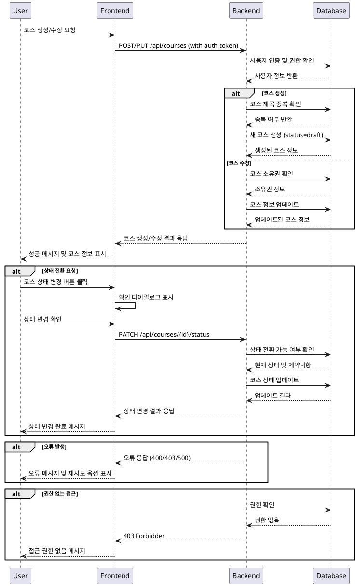

# 코스 관리 (Instructor) - 상세 유스케이스

## Primary Actor
- **Instructor**: 자신이 개설한 코스를 생성, 수정, 상태 관리하고자 하는 강사

## Precondition
- 사용자가 Instructor 역할로 로그인되어 있음
- 코스 생성 시: 기본 프로필 정보가 완성되어 있음
- 코스 수정 시: 수정하려는 코스의 소유자여야 함

## Trigger
- Instructor가 "새 코스 만들기" 버튼 클릭
- 기존 코스의 "편집" 버튼 클릭
- 코스 상태 변경 버튼 클릭 (게시, 보관, 복원)

## Main Scenario

### 1. 코스 생성
1. Instructor가 대시보드에서 "새 코스 만들기" 버튼 클릭
2. 시스템이 코스 생성 폼을 표시
3. Instructor가 필수 정보 입력
   - 코스 제목 (필수)
   - 코스 소개 (필수)
   - 카테고리 선택 (필수)
   - 난이도 선택 (필수)
   - 커리큘럼 내용 (선택)
4. 시스템이 입력 데이터 검증
5. "임시저장" 또는 "저장" 버튼 클릭
6. 시스템이 코스를 draft 상태로 생성
7. 코스 관리 페이지로 이동하여 생성 완료 확인

### 2. 코스 수정
1. Instructor가 코스 목록에서 "편집" 버튼 클릭
2. 시스템이 기존 코스 정보로 수정 폼을 표시
3. Instructor가 원하는 정보 수정
4. 시스템이 변경된 데이터 검증
5. "저장" 버튼 클릭
6. 시스템이 코스 정보 업데이트
7. 수정 완료 메시지 표시

### 3. 코스 상태 전환
1. Instructor가 코스 상태 변경 버튼 클릭
   - Draft → Published: "게시" 버튼
   - Published → Archived: "보관" 버튼
   - Archived → Published: "복원" 버튼
2. 시스템이 상태 전환 가능 여부 확인
3. 확인 다이얼로그 표시
4. Instructor가 확인
5. 시스템이 코스 상태 업데이트
6. 상태 변경 완료 메시지 표시

## Edge Cases

### E1. 필수 정보 누락
- **상황**: 제목, 소개, 카테고리, 난이도 중 누락된 정보가 있는 경우
- **처리**: 해당 필드에 오류 메시지 표시하고 저장 차단

### E2. 중복 코스 제목
- **상황**: 동일한 강사가 같은 제목의 코스를 생성하려는 경우
- **처리**: 경고 메시지 표시하고 제목 수정 요청

### E3. 게시된 코스 수정 제한
- **상황**: Published 상태의 코스에서 핵심 정보(제목, 카테고리) 수정 시도
- **처리**: 수정 가능한 항목만 활성화하고 제한 사항 안내

### E4. 수강생이 있는 코스 삭제/보관
- **상황**: 활성 수강생이 있는 코스를 보관하려는 경우
- **처리**: 수강생 수 표시하고 보관 시 영향 안내 후 확인 요청

### E5. 권한 없는 접근
- **상황**: 다른 강사의 코스에 접근하려는 경우
- **처리**: 403 오류와 함께 접근 거부 메시지 표시

### E6. 네트워크 오류
- **상황**: 저장 중 네트워크 오류 발생
- **처리**: 오류 메시지 표시하고 재시도 버튼 제공, 임시 데이터 보존

## Business Rules

### BR1. 소유권 검증
- 코스 생성자만 해당 코스를 수정/삭제할 수 있음
- 다른 강사의 코스는 읽기 전용으로만 접근 가능

### BR2. 상태 전환 규칙
- Draft → Published: 필수 정보 완성 시에만 가능
- Published → Archived: 언제든 가능하나 신규 수강 차단
- Archived → Published: 언제든 복원 가능
- 삭제는 Draft 상태에서만 가능

### BR3. 데이터 검증 규칙
- 코스 제목: 3-200자, 특수문자 제한
- 코스 소개: 10-2000자
- 커리큘럼: 최대 5000자
- 카테고리: 활성 상태인 카테고리만 선택 가능

### BR4. 수강생 영향 고려
- Published 코스 보관 시 기존 수강생은 계속 접근 가능
- 신규 수강신청만 차단
- 코스 정보 수정 시 수강생에게 변경 알림

### BR5. 버전 관리
- 중요 변경사항은 변경 이력 기록
- 게시 후 수정 시 수정일시 업데이트
- 수강생이 있는 코스의 주요 변경은 별도 승인 프로세스

## Sequence Diagram

