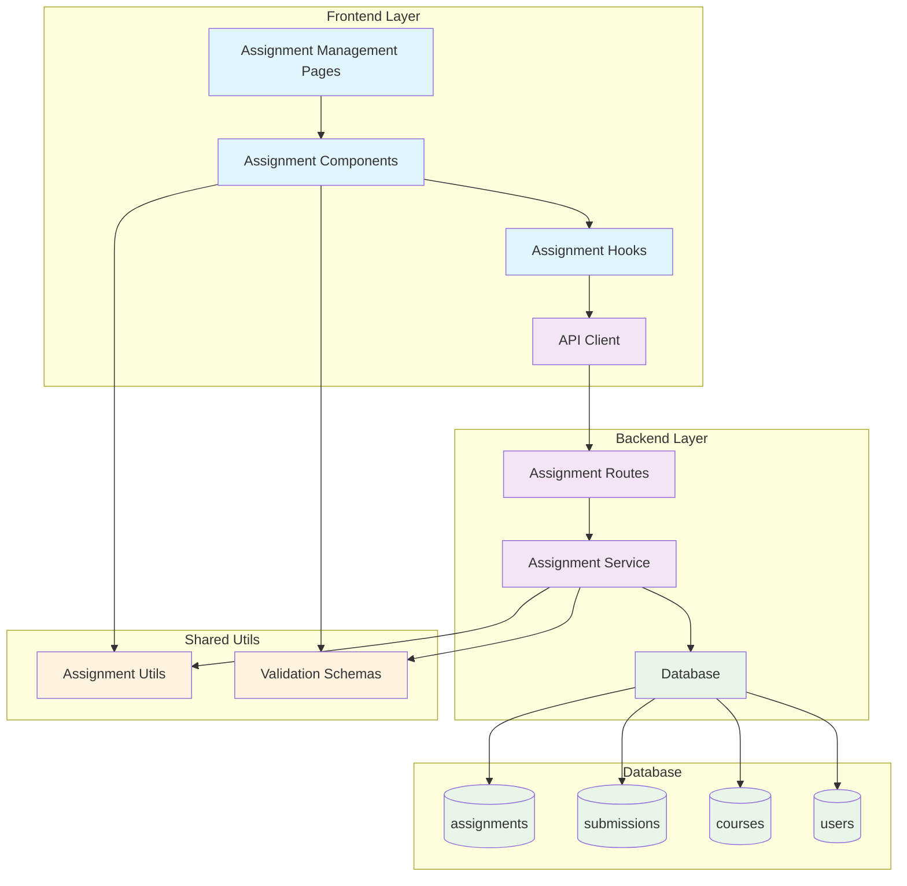

# 과제 관리 (Instructor) - 구현 계획

## 개요

과제 관리 기능은 강사가 자신의 코스에서 과제를 생성, 수정, 상태 관리, 제출물 관리를 할 수 있는 기능입니다. 기존 assignments 기능을 확장하여 강사 관점의 CRUD 및 관리 기능을 추가합니다.

### 모듈 목록

| 모듈명 | 위치 | 설명 |
|--------|------|------|
| **Assignment Management Backend** | `src/features/assignments/backend/` | 강사용 과제 CRUD API 확장 |
| **Assignment Management Components** | `src/features/assignments/components/instructor/` | 강사용 과제 관리 UI 컴포넌트 |
| **Assignment Management Hooks** | `src/features/assignments/hooks/instructor/` | 강사용 과제 관리 React Query 훅 |
| **Assignment Validation Utils** | `src/lib/utils/assignment.ts` | 과제 검증 및 상태 전환 유틸리티 |
| **Assignment Form Validation** | `src/lib/validation/assignment.ts` | 과제 폼 검증 스키마 |
| **Instructor Assignment Pages** | `src/app/instructor/courses/[id]/assignments/` | 강사용 과제 관리 페이지 |

## Diagram



## Implementation Plan

### 1. Backend Layer 확장

#### 1.1 Assignment Service 확장 (`src/features/assignments/backend/service.ts`)

**구현 내용:**
- 강사용 과제 생성 서비스 (`createAssignmentForInstructor`)
- 강사용 과제 수정 서비스 (`updateAssignmentForInstructor`)
- 강사용 과제 삭제 서비스 (`deleteAssignmentForInstructor`)
- 과제 상태 전환 서비스 (`updateAssignmentStatus`)
- 강사용 과제 목록 조회 (`getInstructorAssignments`)
- 강사용 제출물 목록 조회 (`getAssignmentSubmissions`)

**Unit Tests:**
```typescript
describe('Assignment Service - Instructor Functions', () => {
  describe('createAssignmentForInstructor', () => {
    it('강사가 자신의 코스에 과제를 생성할 수 있다')
    it('다른 강사의 코스에는 과제를 생성할 수 없다')
    it('점수 비중이 100%를 초과하면 경고를 반환한다')
    it('필수 필드가 누락되면 검증 오류를 반환한다')
  })
  
  describe('updateAssignmentStatus', () => {
    it('draft에서 published로 상태 전환이 가능하다')
    it('published에서 closed로 상태 전환이 가능하다')
    it('제출물이 있는 과제는 삭제할 수 없다')
    it('마감일이 지난 과제는 자동으로 closed 상태가 된다')
  })
  
  describe('getAssignmentSubmissions', () => {
    it('강사는 자신의 과제 제출물을 조회할 수 있다')
    it('제출물을 상태별로 필터링할 수 있다')
    it('다른 강사의 과제 제출물은 조회할 수 없다')
  })
})
```

#### 1.2 Assignment Schema 확장 (`src/features/assignments/backend/schema.ts`)

**구현 내용:**
- 강사용 과제 생성 요청 스키마 (`CreateAssignmentRequestSchema`)
- 강사용 과제 수정 요청 스키마 (`UpdateAssignmentRequestSchema`)
- 과제 상태 전환 요청 스키마 (`AssignmentStatusUpdateSchema`)
- 강사용 과제 목록 응답 스키마 (`InstructorAssignmentsResponseSchema`)
- 제출물 목록 응답 스키마 (`AssignmentSubmissionsResponseSchema`)

#### 1.3 Assignment Routes 확장 (`src/features/assignments/backend/route.ts`)

**구현 내용:**
- `POST /api/instructor/courses/:courseId/assignments` - 과제 생성
- `PUT /api/instructor/assignments/:id` - 과제 수정
- `DELETE /api/instructor/assignments/:id` - 과제 삭제
- `PATCH /api/instructor/assignments/:id/status` - 상태 전환
- `GET /api/instructor/courses/:courseId/assignments` - 과제 목록 조회
- `GET /api/instructor/assignments/:id/submissions` - 제출물 목록 조회

#### 1.4 Assignment Error 확장 (`src/features/assignments/backend/error.ts`)

**구현 내용:**
- 강사 권한 관련 에러 코드
- 점수 비중 초과 에러 코드
- 상태 전환 불가 에러 코드

### 2. Frontend Components

#### 2.1 강사용 과제 관리 컴포넌트

**위치:** `src/features/assignments/components/instructor/`

**컴포넌트 목록:**
- `assignment-form.tsx` - 과제 생성/수정 폼
- `assignment-list.tsx` - 강사용 과제 목록
- `assignment-status-manager.tsx` - 과제 상태 관리
- `submission-list.tsx` - 제출물 목록 및 관리
- `assignment-stats.tsx` - 과제 통계 (제출률, 평균 점수 등)

**QA Sheet:**
```markdown
## Assignment Form Component QA

### 기능 테스트
- [ ] 과제 제목 입력 시 실시간 검증이 작동하는가?
- [ ] 마감일 선택 시 과거 날짜 선택을 방지하는가?
- [ ] 점수 비중 입력 시 0-100 범위를 벗어나면 오류 표시하는가?
- [ ] 임시저장과 저장 버튼이 올바르게 작동하는가?

### UI/UX 테스트
- [ ] 폼 필드가 논리적 순서로 배치되어 있는가?
- [ ] 오류 메시지가 명확하고 이해하기 쉬운가?
- [ ] 로딩 상태가 적절히 표시되는가?
- [ ] 모바일에서도 사용하기 편한가?

### 접근성 테스트
- [ ] 키보드만으로 모든 기능을 사용할 수 있는가?
- [ ] 스크린 리더가 폼 구조를 올바르게 읽는가?
- [ ] 포커스 순서가 논리적인가?
```

#### 2.2 강사용 과제 관리 훅

**위치:** `src/features/assignments/hooks/instructor/`

**훅 목록:**
- `useCreateAssignment.ts` - 과제 생성 뮤테이션
- `useUpdateAssignment.ts` - 과제 수정 뮤테이션
- `useDeleteAssignment.ts` - 과제 삭제 뮤테이션
- `useUpdateAssignmentStatus.ts` - 상태 전환 뮤테이션
- `useInstructorAssignments.ts` - 강사용 과제 목록 쿼리
- `useAssignmentSubmissions.ts` - 제출물 목록 쿼리

### 3. Shared Utilities

#### 3.1 Assignment Utils (`src/lib/utils/assignment.ts`)

**구현 내용:**
```typescript
// 과제 상태 전환 검증
export function validateStatusTransition(
  currentStatus: AssignmentStatus,
  newStatus: AssignmentStatus,
  hasSubmissions: boolean
): { isValid: boolean; reason?: string }

// 점수 비중 합계 계산
export function calculateTotalScoreWeight(
  assignments: Assignment[],
  excludeId?: string
): number

// 마감일 자동 처리 검증
export function shouldAutoClose(assignment: Assignment): boolean

// 과제 수정 가능 여부 검증
export function canEditAssignment(
  assignment: Assignment,
  submissionCount: number
): { canEdit: boolean; restrictions: string[] }
```

#### 3.2 Assignment Validation (`src/lib/validation/assignment.ts`)

**구현 내용:**
```typescript
// 과제 생성/수정 폼 검증 스키마
export const assignmentFormSchema = z.object({
  title: z.string().min(3).max(200),
  description: z.string().min(10).max(5000),
  dueDate: z.date().min(new Date()),
  scoreWeight: z.number().min(0).max(100),
  allowLateSubmission: z.boolean(),
  allowResubmission: z.boolean(),
})

// 점수 비중 검증
export function validateScoreWeightTotal(
  currentWeight: number,
  existingWeights: number[]
): ValidationResult
```

### 4. Pages

#### 4.1 강사용 과제 관리 페이지

**위치:** `src/app/instructor/courses/[id]/assignments/`

**페이지 구조:**
```
assignments/
├── page.tsx              # 과제 목록 페이지
├── new/
│   └── page.tsx         # 과제 생성 페이지
├── [assignmentId]/
│   ├── page.tsx         # 과제 상세/수정 페이지
│   └── submissions/
│       └── page.tsx     # 제출물 관리 페이지
```

### 5. Database 확장 (필요시)

현재 assignments, submissions 테이블이 이미 존재하므로 추가 마이그레이션은 불필요합니다. 단, 다음과 같은 인덱스 최적화를 고려할 수 있습니다:

```sql
-- 강사별 과제 조회 최적화를 위한 복합 인덱스
CREATE INDEX IF NOT EXISTS idx_assignments_instructor_status 
ON assignments(course_id, status, updated_at DESC);

-- 제출물 통계 조회 최적화
CREATE INDEX IF NOT EXISTS idx_submissions_assignment_stats 
ON submissions(assignment_id, status, submitted_at);
```

## 구현 순서

1. **Phase 1: Backend 확장**
   - Assignment Service 확장
   - Schema 및 Error 정의
   - Routes 추가
   - Unit Tests 작성

2. **Phase 2: Shared Utils**
   - Assignment Utils 구현
   - Validation Schemas 작성
   - Utils Unit Tests 작성

3. **Phase 3: Frontend Hooks**
   - React Query 훅 구현
   - API 연동 테스트

4. **Phase 4: UI Components**
   - 기본 컴포넌트 구현
   - QA Sheet 기반 테스트

5. **Phase 5: Pages Integration**
   - 페이지 구성 및 라우팅
   - 전체 플로우 테스트

## 품질 보증

### Backend Testing
- Unit Tests: 모든 서비스 함수에 대한 단위 테스트
- Integration Tests: API 엔드포인트 통합 테스트
- Error Handling: 모든 에러 케이스에 대한 테스트

### Frontend Testing
- Component Tests: 각 컴포넌트의 렌더링 및 상호작용 테스트
- Hook Tests: React Query 훅의 상태 관리 테스트
- E2E Tests: 전체 과제 관리 플로우 테스트

### Performance Considerations
- 과제 목록 페이지네이션
- 제출물 목록 가상화 (많은 제출물 처리)
- 실시간 상태 업데이트 최적화
- 캐싱 전략 (React Query staleTime 설정)

## 보안 고려사항

1. **권한 검증**: 모든 API에서 강사 권한 및 코스 소유권 검증
2. **입력 검증**: 클라이언트와 서버 양쪽에서 데이터 검증
3. **SQL Injection 방지**: Supabase 쿼리 빌더 사용
4. **XSS 방지**: 사용자 입력 데이터 이스케이핑
5. **CSRF 방지**: JWT 토큰 기반 인증

## 확장성 고려사항

1. **알림 시스템**: 과제 게시/마감 알림 (향후 확장)
2. **파일 업로드**: 과제 첨부파일 지원 (향후 확장)
3. **자동 채점**: 객관식/코딩 과제 자동 채점 (향후 확장)
4. **과제 템플릿**: 재사용 가능한 과제 템플릿 (향후 확장)
5. **통계 대시보드**: 상세한 과제 분석 리포트 (향후 확장)
