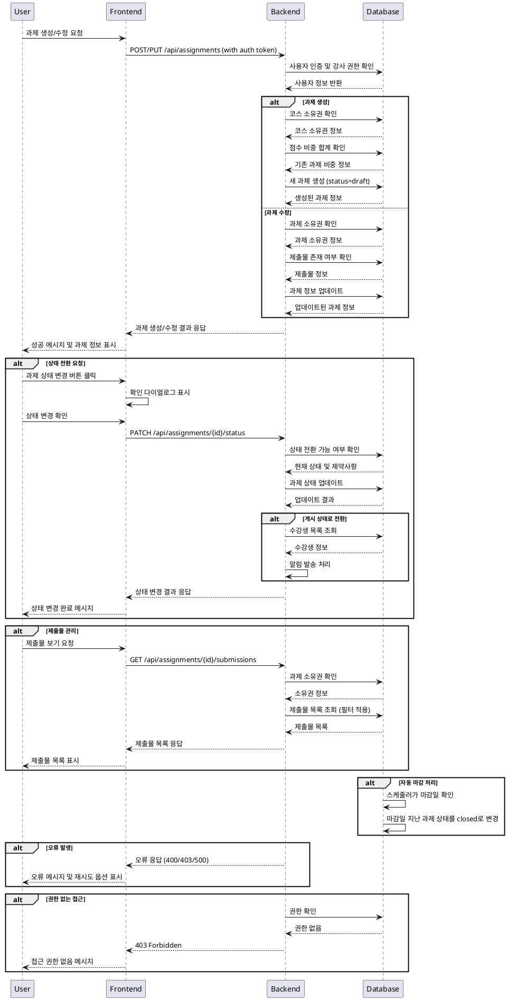

# 과제 관리 (Instructor) - 상세 유스케이스

## Primary Actor
- **Instructor**: 자신이 개설한 코스의 과제를 생성, 수정, 관리하고자 하는 강사

## Precondition
- 사용자가 Instructor 역할로 로그인되어 있음
- 과제를 생성할 코스가 존재하고 해당 코스의 소유자여야 함
- 과제 수정 시: 수정하려는 과제의 소유 코스 강사여야 함

## Trigger
- Instructor가 코스 내에서 "새 과제 만들기" 버튼 클릭
- 기존 과제의 "편집" 버튼 클릭
- 과제 상태 변경 버튼 클릭 (게시, 마감, 복원)
- 제출물 관리 페이지 접근

## Main Scenario

### 1. 과제 생성
1. Instructor가 코스 상세 페이지에서 "새 과제 만들기" 버튼 클릭
2. 시스템이 과제 생성 폼을 표시
3. Instructor가 필수 정보 입력
   - 과제 제목 (필수)
   - 과제 설명 (필수)
   - 마감일 (필수)
   - 점수 비중 (필수, 0-100%)
   - 지각 제출 허용 여부 (선택)
   - 재제출 허용 여부 (선택)
4. 시스템이 입력 데이터 검증
5. "임시저장" 또는 "저장" 버튼 클릭
6. 시스템이 과제를 draft 상태로 생성
7. 과제 관리 페이지로 이동하여 생성 완료 확인

### 2. 과제 수정
1. Instructor가 과제 목록에서 "편집" 버튼 클릭
2. 시스템이 기존 과제 정보로 수정 폼을 표시
3. Instructor가 원하는 정보 수정
4. 시스템이 변경된 데이터 검증 및 제약사항 확인
5. "저장" 버튼 클릭
6. 시스템이 과제 정보 업데이트
7. 수정 완료 메시지 표시

### 3. 과제 상태 전환
1. Instructor가 과제 상태 변경 버튼 클릭
   - Draft → Published: "게시" 버튼
   - Published → Closed: "마감" 버튼
   - Closed → Published: "재개" 버튼
2. 시스템이 상태 전환 가능 여부 및 영향 확인
3. 확인 다이얼로그 표시 (제출물 영향 안내)
4. Instructor가 확인
5. 시스템이 과제 상태 업데이트
6. 상태 변경 완료 메시지 표시

### 4. 제출물 관리
1. Instructor가 과제의 "제출물 보기" 버튼 클릭
2. 시스템이 제출물 목록을 표시 (필터링 옵션 제공)
3. Instructor가 필터 적용 (미채점/지각/재제출요청)
4. 제출물 목록 확인 및 개별 제출물 상세 보기

## Edge Cases

### E1. 필수 정보 누락
- **상황**: 제목, 설명, 마감일, 점수 비중 중 누락된 정보가 있는 경우
- **처리**: 해당 필드에 오류 메시지 표시하고 저장 차단

### E2. 점수 비중 초과
- **상황**: 코스 내 모든 과제의 점수 비중 합이 100%를 초과하는 경우
- **처리**: 경고 메시지 표시하고 비중 조정 요청

### E3. 과거 마감일 설정
- **상황**: 현재 시점보다 과거의 마감일을 설정하려는 경우
- **처리**: 경고 메시지 표시하고 확인 후 저장 허용

### E4. 게시된 과제 수정 제한
- **상황**: Published 상태의 과제에서 핵심 정보(마감일, 점수 비중) 수정 시도
- **처리**: 제출물이 있는 경우 수정 제한 안내 및 확인 요청

### E5. 제출물이 있는 과제 삭제
- **상황**: 학습자 제출물이 있는 과제를 삭제하려는 경우
- **처리**: 제출물 수 표시하고 삭제 시 영향 안내 후 확인 요청

### E6. 마감일 자동 처리
- **상황**: 마감일이 지난 published 과제
- **처리**: 시스템이 자동으로 closed 상태로 전환

### E7. 권한 없는 접근
- **상황**: 다른 강사의 과제에 접근하려는 경우
- **처리**: 403 오류와 함께 접근 거부 메시지 표시

## Business Rules

### BR1. 소유권 검증
- 과제는 해당 코스의 강사만 생성/수정/삭제할 수 있음
- 다른 강사의 과제는 읽기 전용으로만 접근 가능

### BR2. 상태 전환 규칙
- Draft → Published: 필수 정보 완성 시에만 가능
- Published → Closed: 언제든 가능하나 제출 차단
- Closed → Published: 마감일이 미래인 경우에만 가능
- 삭제는 Draft 상태이거나 제출물이 없는 경우에만 가능

### BR3. 데이터 검증 규칙
- 과제 제목: 3-200자, 특수문자 제한
- 과제 설명: 10-5000자
- 마감일: 현재 시점 이후 권장
- 점수 비중: 0-100%, 소수점 2자리까지
- 코스 내 모든 과제 비중 합계 100% 권장

### BR4. 제출물 영향 고려
- Published 과제 수정 시 기존 제출물에 영향 최소화
- 마감일 연장 시 지각 제출물 상태 재계산
- 점수 비중 변경 시 기존 성적 재계산 안내

### BR5. 자동화 규칙
- 마감일 경과 시 자동으로 closed 상태 전환
- 지각 제출 허용 설정에 따른 제출 가능 여부 자동 판단
- 재제출 허용 설정에 따른 재제출 버튼 표시/숨김

### BR6. 알림 및 통지
- 과제 게시 시 수강생에게 알림
- 마감일 변경 시 수강생에게 통지
- 과제 상태 변경 시 관련자에게 알림

## Sequence Diagram

