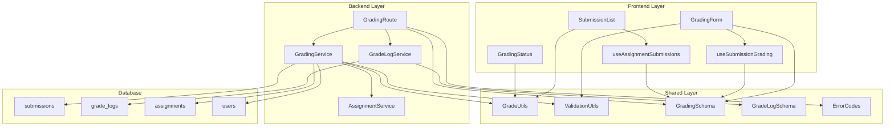

# 제출물 채점 & 피드백 기능 - 모듈화 설계

## 개요

제출물 채점 & 피드백 기능을 구현하기 위한 모듈 설계입니다. 기존 코드베이스의 구조와 패턴을 따라 백엔드(Hono + Supabase), 프론트엔드(React + React Query), 공통 유틸리티로 구성됩니다.

### 모듈 목록

| 모듈명 | 위치 | 설명 |
|--------|------|------|
| **Grading Backend API** | `src/features/assignments/backend/` | 제출물 채점 API 라우터 및 서비스 확장 |
| **Grading Components** | `src/features/assignments/components/instructor/` | 채점 폼 및 제출물 관리 컴포넌트 |
| **Grading Hooks** | `src/features/assignments/hooks/instructor/` | 채점 관련 React Query 훅 |
| **Grade Log Service** | `src/features/grades/backend/` | 채점 이력 관리 서비스 |
| **Validation Utils** | `src/lib/validation/` | 채점 데이터 검증 로직 (공통) |
| **Grade Utils** | `src/lib/utils/` | 채점 상태 및 점수 계산 유틸리티 (공통) |
| **Schema Extensions** | `src/features/assignments/backend/schema.ts` | 채점 관련 스키마 확장 |
| **Error Handling** | `src/features/assignments/backend/error.ts` | 채점 관련 에러 코드 추가 |

## Diagram



## Implementation Plan

### 1. Backend API 확장

#### 1.1 Grading Service (`src/features/assignments/backend/service.ts`)

**구현 내용:**
- `gradeSubmission`: 제출물 채점 서비스
- `getSubmissionsForGrading`: 강사용 제출물 목록 조회
- `getSubmissionDetail`: 채점용 제출물 상세 조회

**Unit Tests:**
```typescript
describe('GradingService', () => {
  describe('gradeSubmission', () => {
    it('should successfully grade a submission with valid data', async () => {
      // 정상적인 채점 데이터로 채점 성공 테스트
    });
    
    it('should reject grading with invalid score range', async () => {
      // 0-100 범위를 벗어난 점수로 채점 실패 테스트
    });
    
    it('should reject grading without feedback', async () => {
      // 피드백 없이 채점 시도 시 실패 테스트
    });
    
    it('should verify instructor ownership before grading', async () => {
      // 다른 강사의 코스 제출물 채점 시도 시 권한 오류 테스트
    });
    
    it('should handle resubmission request correctly', async () => {
      // 재제출 요청 처리 테스트
    });
    
    it('should create grade log entry on successful grading', async () => {
      // 채점 성공 시 이력 로그 생성 테스트
    });
  });
  
  describe('getSubmissionsForGrading', () => {
    it('should return submissions for instructor-owned courses only', async () => {
      // 강사 소유 코스의 제출물만 반환 테스트
    });
    
    it('should filter submissions by status', async () => {
      // 상태별 제출물 필터링 테스트
    });
    
    it('should include student and assignment information', async () => {
      // 학습자 및 과제 정보 포함 테스트
    });
  });
});
```

#### 1.2 Grade Log Service (`src/features/grades/backend/service.ts`)

**구현 내용:**
- `createGradeLog`: 채점 이력 생성
- `getGradingHistory`: 채점 이력 조회

**Unit Tests:**
```typescript
describe('GradeLogService', () => {
  describe('createGradeLog', () => {
    it('should create grade log with all required fields', async () => {
      // 필수 필드를 포함한 채점 이력 생성 테스트
    });
    
    it('should handle different grading actions (grade/resubmit)', async () => {
      // 채점 완료/재제출 요청 액션별 로그 생성 테스트
    });
  });
  
  describe('getGradingHistory', () => {
    it('should return chronological grading history', async () => {
      // 시간순 채점 이력 반환 테스트
    });
    
    it('should include grader information', async () => {
      // 채점자 정보 포함 테스트
    });
  });
});
```

#### 1.3 API Routes (`src/features/assignments/backend/route.ts`)

**구현 내용:**
- `POST /api/instructor/assignments/{id}/submissions/{submissionId}/grade`: 제출물 채점
- `GET /api/instructor/assignments/{id}/submissions`: 채점용 제출물 목록 조회
- `GET /api/instructor/submissions/{id}`: 채점용 제출물 상세 조회

### 2. Frontend Components

#### 2.1 Submission List Component (`src/features/assignments/components/instructor/submission-list.tsx`)

**구현 내용:**
- 제출물 목록 표시 (테이블 형태)
- 상태별 필터링 (미채점/채점완료/재제출요청)
- 정렬 기능 (제출일시/학습자명/상태)
- 채점 페이지로 이동 버튼

**QA Sheet:**
```markdown
## Submission List Component QA

### 기능 테스트
- [ ] 제출물 목록이 올바르게 표시되는가?
- [ ] 상태별 필터링이 정상 작동하는가?
- [ ] 정렬 기능이 올바르게 작동하는가?
- [ ] 채점 버튼 클릭 시 올바른 페이지로 이동하는가?
- [ ] 로딩 상태가 적절히 표시되는가?
- [ ] 에러 상태가 적절히 처리되는가?

### UI/UX 테스트
- [ ] 테이블이 반응형으로 표시되는가?
- [ ] 상태 배지가 직관적으로 표시되는가?
- [ ] 지각 제출 표시가 명확한가?
- [ ] 빈 상태 메시지가 적절한가?

### 접근성 테스트
- [ ] 키보드 네비게이션이 가능한가?
- [ ] 스크린 리더 지원이 적절한가?
- [ ] 색상 대비가 충분한가?
```

#### 2.2 Grading Form Component (`src/features/assignments/components/instructor/grading-form.tsx`)

**구현 내용:**
- 제출물 내용 표시
- 점수 입력 필드 (0-100 범위)
- 피드백 텍스트 에리어
- 채점완료/재제출요청 선택 버튼
- 폼 검증 및 제출

**QA Sheet:**
```markdown
## Grading Form Component QA

### 기능 테스트
- [ ] 제출물 내용이 올바르게 표시되는가?
- [ ] 점수 입력 범위 검증이 작동하는가?
- [ ] 피드백 필수 입력 검증이 작동하는가?
- [ ] 채점완료 버튼이 올바르게 작동하는가?
- [ ] 재제출요청 버튼이 올바르게 작동하는가?
- [ ] 폼 제출 후 적절한 피드백이 표시되는가?

### 유효성 검증 테스트
- [ ] 0 미만 점수 입력 시 오류 표시되는가?
- [ ] 100 초과 점수 입력 시 오류 표시되는가?
- [ ] 피드백 없이 제출 시 오류 표시되는가?
- [ ] 네트워크 오류 시 적절한 처리가 되는가?

### UI/UX 테스트
- [ ] 폼 레이아웃이 직관적인가?
- [ ] 제출 중 로딩 상태가 표시되는가?
- [ ] 성공/실패 메시지가 명확한가?
```

#### 2.3 Grading Status Component (`src/features/assignments/components/instructor/grading-status.tsx`)

**구현 내용:**
- 채점 진행률 표시
- 상태별 제출물 수 표시
- 빠른 필터링 버튼

**QA Sheet:**
```markdown
## Grading Status Component QA

### 기능 테스트
- [ ] 채점 진행률이 정확히 계산되는가?
- [ ] 상태별 카운트가 올바른가?
- [ ] 필터 버튼이 정상 작동하는가?

### 시각적 테스트
- [ ] 진행률 바가 직관적으로 표시되는가?
- [ ] 상태별 색상이 일관성 있는가?
- [ ] 반응형 레이아웃이 적절한가?
```

### 3. React Query Hooks

#### 3.1 Submission Grading Hook (`src/features/assignments/hooks/instructor/useSubmissionGrading.ts`)

**구현 내용:**
- 제출물 채점 뮤테이션
- 성공 시 관련 쿼리 무효화
- 에러 처리 및 재시도 로직

#### 3.2 Assignment Submissions Hook (`src/features/assignments/hooks/instructor/useAssignmentSubmissions.ts`)

**구현 내용:**
- 과제별 제출물 목록 조회
- 필터링 및 정렬 지원
- 실시간 업데이트 지원

### 4. Shared Utilities

#### 4.1 Grade Utils (`src/lib/utils/grade.ts`)

**구현 내용:**
- `calculateGradePercentage`: 점수 백분율 계산
- `getGradeStatusColor`: 상태별 색상 반환
- `formatGradeScore`: 점수 포맷팅
- `isValidGradeScore`: 점수 유효성 검증

**Unit Tests:**
```typescript
describe('GradeUtils', () => {
  describe('calculateGradePercentage', () => {
    it('should calculate correct percentage', () => {
      expect(calculateGradePercentage(85, 100)).toBe(85);
      expect(calculateGradePercentage(42.5, 50)).toBe(85);
    });
  });
  
  describe('isValidGradeScore', () => {
    it('should validate score range correctly', () => {
      expect(isValidGradeScore(0)).toBe(true);
      expect(isValidGradeScore(100)).toBe(true);
      expect(isValidGradeScore(-1)).toBe(false);
      expect(isValidGradeScore(101)).toBe(false);
    });
  });
});
```

#### 4.2 Validation Utils (`src/lib/validation/grading.ts`)

**구현 내용:**
- 채점 데이터 Zod 스키마
- 피드백 길이 제한
- 점수 범위 검증

### 5. Schema Extensions

#### 5.1 Grading Schemas (`src/features/assignments/backend/schema.ts`)

**구현 내용:**
```typescript
// 채점 요청 스키마
export const GradeSubmissionRequestSchema = z.object({
  score: z.number().min(0).max(100).optional(),
  feedback: z.string().min(1).max(2000),
  action: z.enum(['grade', 'request_resubmission']),
});

// 제출물 목록 조회 스키마
export const SubmissionsForGradingResponseSchema = z.object({
  submissions: z.array(SubmissionForGradingSchema),
  pagination: PaginationSchema,
  stats: z.object({
    total: z.number(),
    pending: z.number(),
    graded: z.number(),
    resubmissionRequired: z.number(),
  }),
});

// 채점용 제출물 스키마
export const SubmissionForGradingSchema = z.object({
  id: z.string().uuid(),
  assignmentId: z.string().uuid(),
  assignmentTitle: z.string(),
  learnerName: z.string(),
  learnerEmail: z.string(),
  content: z.string(),
  linkUrl: z.string().nullable(),
  isLate: z.boolean(),
  status: z.enum(['submitted', 'graded', 'resubmission_required']),
  score: z.number().nullable(),
  feedback: z.string().nullable(),
  submittedAt: z.string(),
  gradedAt: z.string().nullable(),
});
```

#### 5.2 Grade Log Schema (`src/features/grades/backend/schema.ts`)

**구현 내용:**
```typescript
// 채점 이력 스키마
export const GradeLogSchema = z.object({
  id: z.string().uuid(),
  submissionId: z.string().uuid(),
  graderId: z.string().uuid(),
  graderName: z.string(),
  action: z.enum(['grade', 'request_resubmission']),
  score: z.number().nullable(),
  feedback: z.string(),
  createdAt: z.string(),
});
```

### 6. Database Migration

#### 6.1 Grade Logs Table (`supabase/migrations/0010_create_grade_logs_table.sql`)

**구현 내용:**
```sql
-- 채점 이력 테이블 생성
CREATE TABLE IF NOT EXISTS public.grade_logs (
  id UUID PRIMARY KEY DEFAULT gen_random_uuid(),
  submission_id UUID NOT NULL REFERENCES public.submissions(id) ON DELETE CASCADE,
  grader_id UUID NOT NULL REFERENCES public.users(id) ON DELETE CASCADE,
  action VARCHAR(20) NOT NULL CHECK (action IN ('grade', 'request_resubmission')),
  score INTEGER CHECK (score >= 0 AND score <= 100),
  feedback TEXT NOT NULL,
  created_at TIMESTAMPTZ NOT NULL DEFAULT NOW()
);

-- 인덱스 생성
CREATE INDEX IF NOT EXISTS idx_grade_logs_submission_id ON public.grade_logs(submission_id);
CREATE INDEX IF NOT EXISTS idx_grade_logs_grader_id ON public.grade_logs(grader_id);
CREATE INDEX IF NOT EXISTS idx_grade_logs_created_at ON public.grade_logs(created_at);

-- 코멘트 추가
COMMENT ON TABLE public.grade_logs IS '채점 이력 및 감사 추적 테이블';
COMMENT ON COLUMN public.grade_logs.action IS '채점 액션: grade(채점완료), request_resubmission(재제출요청)';
```

### 7. Error Handling Extensions

#### 7.1 Grading Error Codes (`src/features/assignments/backend/error.ts`)

**구현 내용:**
```typescript
export const gradingErrorCodes = {
  // 권한 관련
  notInstructorOwned: 'GRADING_NOT_INSTRUCTOR_OWNED',
  submissionNotFound: 'GRADING_SUBMISSION_NOT_FOUND',
  
  // 유효성 검증
  invalidScore: 'GRADING_INVALID_SCORE',
  feedbackRequired: 'GRADING_FEEDBACK_REQUIRED',
  invalidAction: 'GRADING_INVALID_ACTION',
  
  // 상태 관련
  alreadyGraded: 'GRADING_ALREADY_GRADED',
  submissionNotSubmitted: 'GRADING_SUBMISSION_NOT_SUBMITTED',
  
  // 시스템 오류
  gradingFailed: 'GRADING_FAILED',
  logCreationFailed: 'GRADING_LOG_CREATION_FAILED',
} as const;
```

## 구현 우선순위

1. **Phase 1**: Backend API 및 서비스 구현
   - Grading Service 확장
   - API Routes 추가
   - Schema 정의

2. **Phase 2**: Frontend Components 구현
   - Submission List Component
   - Grading Form Component
   - React Query Hooks

3. **Phase 3**: 공통 유틸리티 및 최적화
   - Grade Utils 구현
   - Validation Utils 구현
   - 에러 처리 개선

4. **Phase 4**: 테스트 및 문서화
   - Unit Tests 작성
   - QA 시트 검증
   - 사용자 가이드 작성

## 성능 고려사항

- **페이지네이션**: 제출물 목록 조회 시 페이지네이션 적용
- **캐싱**: React Query를 통한 적절한 캐싱 전략
- **실시간 업데이트**: 채점 완료 시 관련 쿼리 무효화
- **배치 처리**: 대량 채점 시 배치 처리 고려

## 보안 고려사항

- **권한 검증**: 강사 소유 코스의 제출물만 채점 가능
- **입력 검증**: 모든 사용자 입력에 대한 서버사이드 검증
- **감사 추적**: 모든 채점 활동에 대한 로그 기록
- **데이터 보호**: 민감한 피드백 정보 보호
