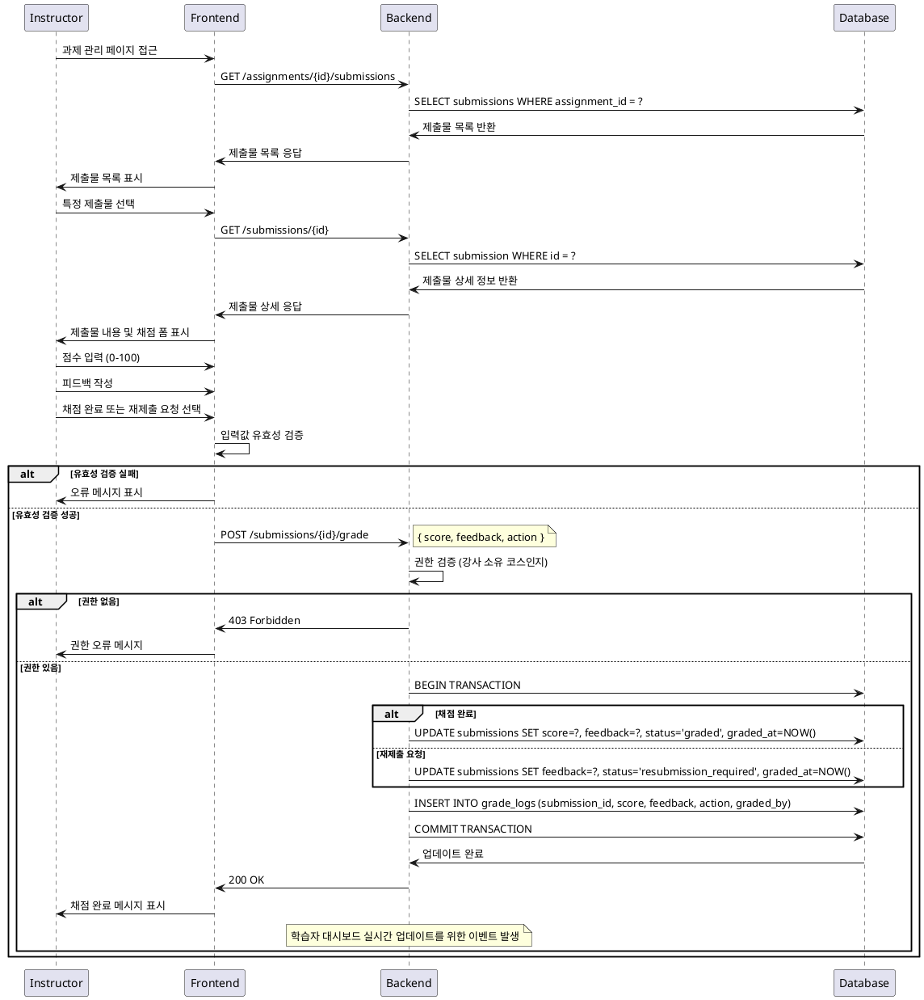

# 제출물 채점 & 피드백 기능 상세 유스케이스

## Primary Actor
- **Instructor**: 코스를 담당하는 강사

## Precondition
- 강사가 로그인되어 있음
- 강사가 해당 코스의 소유자임
- 과제가 생성되어 있고 학습자가 제출물을 제출한 상태임
- 제출물이 `submitted` 상태임

## Trigger
- 강사가 과제 관리 페이지에서 제출물 목록을 조회
- 특정 제출물을 선택하여 채점 페이지에 진입

## Main Scenario

### 1. 제출물 조회
1. 강사가 과제 관리 페이지에 접근
2. 시스템이 해당 과제의 모든 제출물 목록을 표시
3. 강사가 채점할 제출물을 선택

### 2. 채점 수행
1. 시스템이 제출물 상세 정보를 표시 (제출 내용, 제출일시, 지각 여부)
2. 강사가 점수를 입력 (0~100점)
3. 강사가 피드백을 작성 (필수)
4. 강사가 다음 중 하나를 선택:
   - **채점 완료**: 점수와 피드백 저장
   - **재제출 요청**: 재제출이 필요함을 표시

### 3. 결과 저장
1. 시스템이 입력된 데이터를 검증
2. 제출물 상태를 업데이트:
   - 채점 완료 시: `graded`
   - 재제출 요청 시: `resubmission_required`
3. 점수와 피드백을 데이터베이스에 저장
4. 학습자에게 결과 반영

## Edge Cases

### 1. 유효성 검증 오류
- **점수 범위 초과**: 0~100 범위를 벗어난 점수 입력 시 오류 메시지 표시
- **피드백 누락**: 피드백이 비어있을 경우 입력 요구
- **중복 채점**: 이미 채점된 제출물 재채점 시 확인 메시지 표시

### 2. 권한 오류
- **소유권 없음**: 다른 강사의 코스 제출물 접근 시 접근 거부
- **세션 만료**: 로그인 세션 만료 시 로그인 페이지로 리다이렉트

### 3. 데이터 오류
- **제출물 없음**: 존재하지 않는 제출물 ID 접근 시 404 오류
- **네트워크 오류**: 저장 중 네트워크 오류 발생 시 재시도 옵션 제공

### 4. 상태 충돌
- **제출물 상태 변경**: 채점 중 제출물이 삭제되거나 상태가 변경된 경우 오류 처리

## Business Rules

### 1. 채점 규칙
- 점수는 0~100점 범위 내에서만 입력 가능
- 피드백은 필수 입력 사항
- 한 번 채점된 제출물도 재채점 가능 (최신 점수로 업데이트)

### 2. 권한 규칙
- 해당 코스의 소유자(강사)만 제출물 채점 가능
- 다른 강사의 코스 제출물은 조회 및 채점 불가

### 3. 상태 관리 규칙
- 채점 완료 시 제출물 상태가 `graded`로 변경
- 재제출 요청 시 제출물 상태가 `resubmission_required`로 변경
- 재제출 요청된 제출물은 학습자가 다시 제출 가능

### 4. 알림 규칙
- 채점 완료 시 학습자 대시보드에 즉시 반영
- 재제출 요청 시 학습자에게 알림 표시

### 5. 데이터 보존 규칙
- 이전 채점 이력은 로그로 보관 (감사 추적)
- 피드백 내용은 학습자에게 공개
- 점수는 성적 집계에 즉시 반영

## Sequence Diagram

