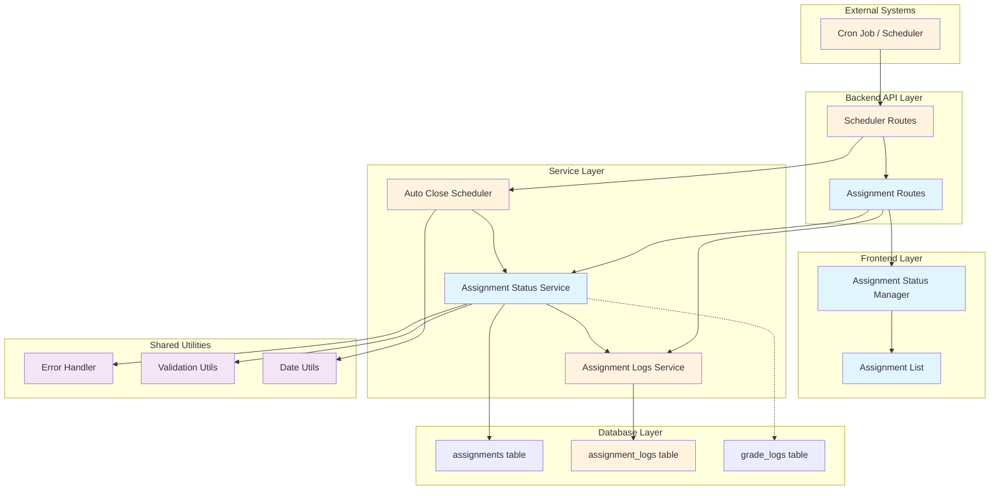

# Assignment 게시/마감 기능 구현 계획

## 개요

Assignment 게시/마감 기능의 완전한 구현을 위한 모듈 설계 및 구현 계획입니다. 기존 구현된 기능을 확장하여 자동 마감 스케줄러, 상태 변경 이력 로깅, 개선된 오류 처리를 추가합니다.

### 주요 모듈 목록

| 모듈명 | 위치 | 설명 | 상태 |
|--------|------|------|------|
| Assignment Status Service | `src/features/assignments/backend/service.ts` | 과제 상태 전환 비즈니스 로직 | ✅ 구현됨 |
| Assignment Status Manager | `src/features/assignments/components/instructor/assignment-status-manager.tsx` | 상태 전환 UI 컴포넌트 | ✅ 구현됨 |
| Auto Close Scheduler | `src/features/assignments/backend/scheduler.ts` | 자동 마감 처리 스케줄러 | 🔄 신규 구현 |
| Assignment Logs Service | `src/features/assignments/backend/logs-service.ts` | 상태 변경 이력 관리 | 🔄 신규 구현 |
| Scheduler API Routes | `src/features/assignments/backend/scheduler-route.ts` | 스케줄러 관리 API | 🔄 신규 구현 |
| Assignment Logs Schema | `src/features/assignments/backend/logs-schema.ts` | 로그 관련 스키마 정의 | 🔄 신규 구현 |
| Enhanced Error Handling | `src/features/assignments/backend/error.ts` | 확장된 에러 코드 | 🔄 확장 필요 |
| Database Migration | `supabase/migrations/0011_create_assignment_logs.sql` | 상태 변경 로그 테이블 | 🔄 신규 구현 |

## Diagram



## Implementation Plan

### 1. Database Schema Extensions

#### 1.1 Assignment Logs Table (`supabase/migrations/0011_create_assignment_logs.sql`)

**목적**: Assignment 상태 변경 이력을 추적하기 위한 로그 테이블 생성

**구현 내용**:
```sql
-- Assignment 상태 변경 로그 테이블
CREATE TABLE IF NOT EXISTS public.assignment_logs (
  id UUID PRIMARY KEY DEFAULT gen_random_uuid(),
  assignment_id UUID NOT NULL REFERENCES public.assignments(id) ON DELETE CASCADE,
  changed_by UUID NOT NULL REFERENCES public.users(id) ON DELETE CASCADE,
  previous_status VARCHAR(20) NOT NULL CHECK (previous_status IN ('draft', 'published', 'closed')),
  new_status VARCHAR(20) NOT NULL CHECK (new_status IN ('draft', 'published', 'closed')),
  change_reason VARCHAR(50) NOT NULL CHECK (change_reason IN ('manual', 'auto_close', 'system')),
  metadata JSONB DEFAULT '{}',
  created_at TIMESTAMPTZ NOT NULL DEFAULT NOW()
);

-- 인덱스 생성
CREATE INDEX IF NOT EXISTS idx_assignment_logs_assignment_id ON public.assignment_logs(assignment_id);
CREATE INDEX IF NOT EXISTS idx_assignment_logs_changed_by ON public.assignment_logs(changed_by);
CREATE INDEX IF NOT EXISTS idx_assignment_logs_created_at ON public.assignment_logs(created_at);
CREATE INDEX IF NOT EXISTS idx_assignment_logs_change_reason ON public.assignment_logs(change_reason);

-- 코멘트 추가
COMMENT ON TABLE public.assignment_logs IS 'Assignment 상태 변경 이력 및 감사 추적 테이블';
COMMENT ON COLUMN public.assignment_logs.change_reason IS '변경 사유: manual(수동), auto_close(자동마감), system(시스템)';
COMMENT ON COLUMN public.assignment_logs.metadata IS '추가 메타데이터 (JSON 형태)';
```

**Unit Tests**:
- 테이블 생성 및 제약조건 검증
- 인덱스 성능 테스트
- 외래키 제약조건 테스트

### 2. Backend Service Extensions

#### 2.1 Assignment Logs Service (`src/features/assignments/backend/logs-service.ts`)

**목적**: Assignment 상태 변경 이력 관리를 위한 서비스 레이어

**구현 내용**:
```typescript
/**
 * Assignment 상태 변경 로그 생성 서비스
 */
export const createAssignmentLog = async (
  client: SupabaseClient,
  data: CreateAssignmentLogRequest
): Promise<HandlerResult<AssignmentLog, string, unknown>>

/**
 * Assignment 상태 변경 이력 조회 서비스
 */
export const getAssignmentLogs = async (
  client: SupabaseClient,
  assignmentId: string,
  params: AssignmentLogsQuery
): Promise<HandlerResult<AssignmentLogsResponse, string, unknown>>

/**
 * 강사별 Assignment 상태 변경 이력 조회
 */
export const getInstructorAssignmentLogs = async (
  client: SupabaseClient,
  instructorId: string,
  params: InstructorAssignmentLogsQuery
): Promise<HandlerResult<AssignmentLogsResponse, string, unknown>>
```

**Unit Tests**:
- 로그 생성 성공/실패 케이스
- 권한 검증 테스트
- 페이지네이션 테스트
- 필터링 기능 테스트

#### 2.2 Auto Close Scheduler (`src/features/assignments/backend/scheduler.ts`)

**목적**: 마감일이 지난 Assignment를 자동으로 마감 처리하는 스케줄러

**구현 내용**:
```typescript
/**
 * 마감일이 지난 Assignment 자동 마감 처리
 */
export const processAutoCloseAssignments = async (
  client: SupabaseClient
): Promise<HandlerResult<AutoCloseResult, string, unknown>>

/**
 * 스케줄러 상태 조회
 */
export const getSchedulerStatus = async (
  client: SupabaseClient
): Promise<HandlerResult<SchedulerStatus, string, unknown>>

/**
 * 수동 스케줄러 실행 (관리자용)
 */
export const manualTriggerAutoClose = async (
  client: SupabaseClient,
  adminId: string
): Promise<HandlerResult<AutoCloseResult, string, unknown>>
```

**Unit Tests**:
- 자동 마감 대상 Assignment 식별 테스트
- 상태 전환 로직 테스트
- 로그 생성 연동 테스트
- 오류 상황 처리 테스트

#### 2.3 Enhanced Assignment Status Service (기존 확장)

**목적**: 기존 상태 전환 서비스에 로깅 기능 추가

**구현 내용**:
```typescript
// 기존 updateAssignmentStatus 함수 확장
export const updateAssignmentStatus = async (
  client: SupabaseClient,
  assignmentId: string,
  instructorId: string,
  data: AssignmentStatusUpdate
): Promise<HandlerResult<InstructorAssignmentResponse, string, unknown>> => {
  // ... 기존 로직 ...
  
  // 상태 변경 로그 생성 추가
  await createAssignmentLog(client, {
    assignmentId,
    changedBy: instructorId,
    previousStatus: currentStatus,
    newStatus: newStatus,
    changeReason: 'manual',
    metadata: { userAgent: context.userAgent }
  });
  
  // ... 나머지 로직 ...
}
```

**Unit Tests**:
- 로그 생성 연동 테스트
- 트랜잭션 롤백 테스트
- 동시성 처리 테스트

### 3. API Routes Extensions

#### 3.1 Scheduler API Routes (`src/features/assignments/backend/scheduler-route.ts`)

**목적**: 스케줄러 관리를 위한 API 엔드포인트

**구현 내용**:
```typescript
// POST /api/assignments/scheduler/trigger - 수동 스케줄러 실행
// GET /api/assignments/scheduler/status - 스케줄러 상태 조회
// GET /api/assignments/logs/:assignmentId - Assignment 로그 조회
// GET /api/assignments/logs/instructor/:instructorId - 강사별 로그 조회
```

**QA Sheet**:
| 테스트 케이스 | 입력 | 예상 결과 | 실제 결과 | 상태 |
|---------------|------|-----------|-----------|------|
| 수동 스케줄러 실행 - 성공 | POST /api/assignments/scheduler/trigger (관리자 권한) | 200 OK, 처리된 Assignment 수 반환 | | ⏳ |
| 수동 스케줄러 실행 - 권한 없음 | POST /api/assignments/scheduler/trigger (일반 사용자) | 403 Forbidden | | ⏳ |
| 스케줄러 상태 조회 | GET /api/assignments/scheduler/status | 200 OK, 마지막 실행 시간 등 반환 | | ⏳ |
| Assignment 로그 조회 - 성공 | GET /api/assignments/logs/uuid (소유자) | 200 OK, 로그 목록 반환 | | ⏳ |
| Assignment 로그 조회 - 권한 없음 | GET /api/assignments/logs/uuid (타인) | 403 Forbidden | | ⏳ |

#### 3.2 Assignment Routes Extensions (기존 확장)

**목적**: 기존 Assignment API에 로그 관련 엔드포인트 추가

**구현 내용**:
- 기존 `registerAssignmentsRoutes` 함수에 새로운 라우트 추가
- 로그 조회 권한 검증 미들웨어 추가

### 4. Schema Definitions

#### 4.1 Assignment Logs Schema (`src/features/assignments/backend/logs-schema.ts`)

**목적**: Assignment 로그 관련 요청/응답 스키마 정의

**구현 내용**:
```typescript
// Assignment 로그 생성 요청 스키마
export const CreateAssignmentLogRequestSchema = z.object({
  assignmentId: z.string().uuid(),
  changedBy: z.string().uuid(),
  previousStatus: z.enum(['draft', 'published', 'closed']),
  newStatus: z.enum(['draft', 'published', 'closed']),
  changeReason: z.enum(['manual', 'auto_close', 'system']),
  metadata: z.record(z.any()).optional(),
});

// Assignment 로그 응답 스키마
export const AssignmentLogSchema = z.object({
  id: z.string().uuid(),
  assignmentId: z.string().uuid(),
  changedBy: z.string().uuid(),
  changedByName: z.string(),
  previousStatus: z.enum(['draft', 'published', 'closed']),
  newStatus: z.enum(['draft', 'published', 'closed']),
  changeReason: z.enum(['manual', 'auto_close', 'system']),
  metadata: z.record(z.any()),
  createdAt: z.string(),
});

// 스케줄러 결과 스키마
export const AutoCloseResultSchema = z.object({
  processedCount: z.number().int().min(0),
  processedAssignments: z.array(z.string().uuid()),
  errors: z.array(z.object({
    assignmentId: z.string().uuid(),
    error: z.string(),
  })),
  executedAt: z.string(),
});
```

**Unit Tests**:
- 스키마 유효성 검증 테스트
- 타입 안전성 테스트
- 에러 메시지 테스트

### 5. Error Handling Extensions

#### 5.1 Enhanced Error Codes (`src/features/assignments/backend/error.ts`)

**목적**: Assignment 게시/마감 관련 새로운 에러 코드 추가

**구현 내용**:
```typescript
export const assignmentErrorCodes = {
  // ... 기존 에러 코드들 ...
  
  // 스케줄러 관련
  schedulerNotAuthorized: 'ASSIGNMENT_SCHEDULER_NOT_AUTHORIZED',
  schedulerExecutionFailed: 'ASSIGNMENT_SCHEDULER_EXECUTION_FAILED',
  autoCloseFailed: 'ASSIGNMENT_AUTO_CLOSE_FAILED',
  
  // 로그 관련
  logCreationFailed: 'ASSIGNMENT_LOG_CREATION_FAILED',
  logAccessDenied: 'ASSIGNMENT_LOG_ACCESS_DENIED',
  logNotFound: 'ASSIGNMENT_LOG_NOT_FOUND',
  
  // 동시성 관련
  concurrentModification: 'ASSIGNMENT_CONCURRENT_MODIFICATION',
  optimisticLockFailed: 'ASSIGNMENT_OPTIMISTIC_LOCK_FAILED',
} as const;
```

**Unit Tests**:
- 에러 코드 유니크성 테스트
- 에러 메시지 일관성 테스트

### 6. Frontend Component Extensions

#### 6.1 Assignment Status Manager Enhancement (기존 확장)

**목적**: 상태 변경 이력 표시 기능 추가

**구현 내용**:
- 상태 변경 이력 조회 및 표시
- 자동 마감 알림 기능
- 개선된 오류 처리 UI

**QA Sheet**:
| 테스트 케이스 | 사용자 액션 | 예상 결과 | 실제 결과 | 상태 |
|---------------|-------------|-----------|-----------|------|
| 상태 변경 이력 표시 | 과제 상세에서 이력 탭 클릭 | 상태 변경 이력 목록 표시 | | ⏳ |
| 자동 마감 알림 | 자동 마감된 과제 확인 | "자동으로 마감됨" 배지 표시 | | ⏳ |
| 동시성 오류 처리 | 다른 사용자가 상태 변경 후 본인이 변경 시도 | 충돌 감지 및 새로고침 안내 | | ⏳ |
| 네트워크 오류 처리 | 네트워크 연결 끊김 상태에서 상태 변경 | 재시도 옵션 제공 | | ⏳ |

#### 6.2 Assignment Logs Component (`src/features/assignments/components/instructor/assignment-logs.tsx`)

**목적**: Assignment 상태 변경 이력을 표시하는 새로운 컴포넌트

**구현 내용**:
```typescript
interface AssignmentLogsProps {
  assignmentId: string;
  showFilters?: boolean;
  maxItems?: number;
}

export function AssignmentLogs({ 
  assignmentId, 
  showFilters = true, 
  maxItems = 10 
}: AssignmentLogsProps)
```

**QA Sheet**:
| 테스트 케이스 | 사용자 액션 | 예상 결과 | 실제 결과 | 상태 |
|---------------|-------------|-----------|-----------|------|
| 로그 목록 표시 | 컴포넌트 로드 | 최신 로그부터 시간순 표시 | | ⏳ |
| 필터링 기능 | 변경 사유별 필터 선택 | 해당 사유의 로그만 표시 | | ⏳ |
| 페이지네이션 | 더보기 버튼 클릭 | 추가 로그 로드 | | ⏳ |
| 빈 상태 처리 | 로그가 없는 Assignment | "변경 이력이 없습니다" 메시지 | | ⏳ |

### 7. Shared Utilities Extensions

#### 7.1 Date Utilities Enhancement (`src/lib/utils/date.ts`)

**목적**: 스케줄러 관련 날짜 처리 유틸리티 추가

**구현 내용**:
```typescript
/**
 * 다음 스케줄러 실행 시간 계산
 */
export const getNextSchedulerRun = (intervalMinutes: number = 5): Date

/**
 * Assignment 자동 마감 대상 여부 확인
 */
export const isEligibleForAutoClose = (
  assignment: { status: string; dueDate: string }
): boolean

/**
 * 시간대별 마감 처리 최적화
 */
export const getOptimalCloseTime = (dueDate: Date): Date
```

**Unit Tests**:
- 시간대 처리 테스트
- 마감일 계산 정확성 테스트
- 경계값 테스트

#### 7.2 Assignment Utilities Enhancement (`src/lib/utils/assignment.ts`)

**목적**: 상태 전환 및 로깅 관련 유틸리티 추가

**구현 내용**:
```typescript
/**
 * 상태 전환 이력 포맷팅
 */
export const formatStatusChangeHistory = (
  logs: AssignmentLog[]
): FormattedStatusChange[]

/**
 * 자동 마감 대상 Assignment 필터링
 */
export const filterAutoCloseEligible = (
  assignments: Assignment[]
): Assignment[]

/**
 * 동시성 충돌 감지
 */
export const detectConcurrentModification = (
  currentVersion: string,
  expectedVersion: string
): boolean
```

**Unit Tests**:
- 포맷팅 정확성 테스트
- 필터링 로직 테스트
- 동시성 감지 테스트

### 8. Integration & Deployment

#### 8.1 Cron Job Integration

**목적**: 외부 스케줄러와의 연동 설정

**구현 내용**:
- Vercel Cron Jobs 또는 외부 스케줄러 설정
- API 엔드포인트 호출 스크립트
- 모니터링 및 알림 설정

**설정 예시**:
```javascript
// vercel.json
{
  "crons": [
    {
      "path": "/api/assignments/scheduler/trigger",
      "schedule": "*/5 * * * *"
    }
  ]
}
```

#### 8.2 Monitoring & Logging

**목적**: 스케줄러 실행 및 오류 모니터링

**구현 내용**:
- 스케줄러 실행 로그 수집
- 오류 알림 시스템
- 성능 메트릭 수집

## 구현 우선순위

### Phase 1: Core Infrastructure (1-2일)
1. Database Migration (Assignment Logs Table)
2. Assignment Logs Service 구현
3. Enhanced Error Codes 추가

### Phase 2: Scheduler Implementation (2-3일)
1. Auto Close Scheduler 서비스 구현
2. Scheduler API Routes 구현
3. 기존 Assignment Status Service 확장

### Phase 3: Frontend Integration (2-3일)
1. Assignment Status Manager 확장
2. Assignment Logs Component 구현
3. 개선된 오류 처리 UI

### Phase 4: Testing & Optimization (1-2일)
1. Unit Tests 작성 및 실행
2. Integration Tests
3. Performance Optimization

### Phase 5: Deployment & Monitoring (1일)
1. Cron Job 설정
2. 모니터링 시스템 구축
3. 문서화 완료

## 총 예상 개발 기간: 7-11일

## 위험 요소 및 대응 방안

### 1. 동시성 문제
- **위험**: 여러 사용자가 동시에 상태 변경 시 데이터 일관성 문제
- **대응**: 낙관적 잠금 및 버전 관리 구현

### 2. 스케줄러 안정성
- **위험**: 스케줄러 실행 실패 시 Assignment 마감 누락
- **대응**: 재시도 로직 및 수동 실행 기능 제공

### 3. 성능 문제
- **위험**: 대량의 Assignment 처리 시 성능 저하
- **대응**: 배치 처리 및 인덱스 최적화

### 4. 로그 데이터 증가
- **위험**: 시간이 지남에 따라 로그 테이블 크기 증가
- **대응**: 로그 보관 정책 및 아카이빙 전략 수립
