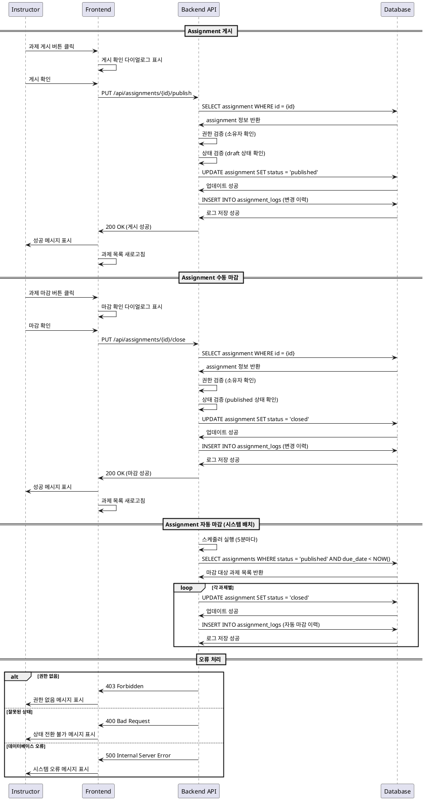

# Assignment 게시/마감 기능 상세 유스케이스

## Use Case: Assignment 게시/마감 관리

### Primary Actor
- Instructor (강사)

### Precondition
- 강사가 로그인되어 있음
- 강사가 소유한 코스가 존재함
- 해당 코스에 과제(Assignment)가 생성되어 있음
- 과제 상태가 `draft` 또는 `published` 상태임

### Trigger
- 강사가 과제 관리 페이지에서 "게시" 또는 "마감" 버튼을 클릭
- 시스템이 마감일 도달을 감지하여 자동 마감 처리

### Main Scenario

#### 1. 과제 게시 (draft → published)
1. 강사가 과제 목록에서 `draft` 상태의 과제를 선택
2. "게시" 버튼을 클릭
3. 시스템이 과제 상태를 `published`로 변경
4. 해당 코스에 등록된 모든 학습자에게 과제가 노출됨
5. 성공 메시지 표시

#### 2. 과제 수동 마감 (published → closed)
1. 강사가 과제 목록에서 `published` 상태의 과제를 선택
2. "마감" 버튼을 클릭
3. 마감 확인 다이얼로그 표시
4. 강사가 마감을 확인
5. 시스템이 과제 상태를 `closed`로 변경
6. 학습자의 제출 기능이 비활성화됨
7. 성공 메시지 표시

#### 3. 과제 자동 마감
1. 시스템이 주기적으로 마감일을 확인
2. 마감일이 지난 `published` 상태의 과제를 감지
3. 해당 과제의 상태를 자동으로 `closed`로 변경
4. 학습자의 제출 기능이 자동으로 비활성화됨

### Edge Cases

#### 1. 권한 오류
- **상황**: 다른 강사의 과제에 접근 시도
- **처리**: 403 Forbidden 오류 반환, 접근 거부 메시지 표시

#### 2. 잘못된 상태 전환
- **상황**: 이미 `closed` 상태인 과제를 게시하려고 시도
- **처리**: 400 Bad Request 오류 반환, 상태 전환 불가 메시지 표시

#### 3. 네트워크 오류
- **상황**: 상태 변경 중 네트워크 연결 실패
- **처리**: 재시도 옵션 제공, 실패 시 이전 상태 유지

#### 4. 동시성 문제
- **상황**: 여러 강사가 동시에 같은 과제 상태를 변경
- **처리**: 낙관적 잠금을 통한 충돌 감지, 최신 상태로 새로고침 요청

#### 5. 데이터베이스 오류
- **상황**: 상태 변경 중 데이터베이스 연결 실패
- **처리**: 500 Internal Server Error, 관리자 알림 및 재시도 안내

### Business Rules

#### 1. 상태 전환 규칙
- `draft` → `published`: 언제든지 가능
- `published` → `closed`: 언제든지 가능 (수동/자동)
- `closed` → `published`: 불가능 (새 과제 생성 필요)

#### 2. 권한 규칙
- 과제 소유자(해당 코스의 강사)만 상태 변경 가능
- 시스템 관리자는 모든 과제 상태 변경 가능

#### 3. 자동 마감 규칙
- 마감일 기준 UTC 시간으로 처리
- 마감일 당일 23:59:59까지 제출 가능
- 자동 마감은 5분 간격으로 확인

#### 4. 알림 규칙
- 과제 게시 시 등록된 학습자에게 알림 (선택사항)
- 과제 마감 시 미제출 학습자에게 알림 (선택사항)

#### 5. 데이터 일관성 규칙
- 상태 변경은 트랜잭션으로 처리
- 상태 변경 이력은 로그 테이블에 기록
- 관련된 제출물 상태도 함께 업데이트

## Sequence Diagram

