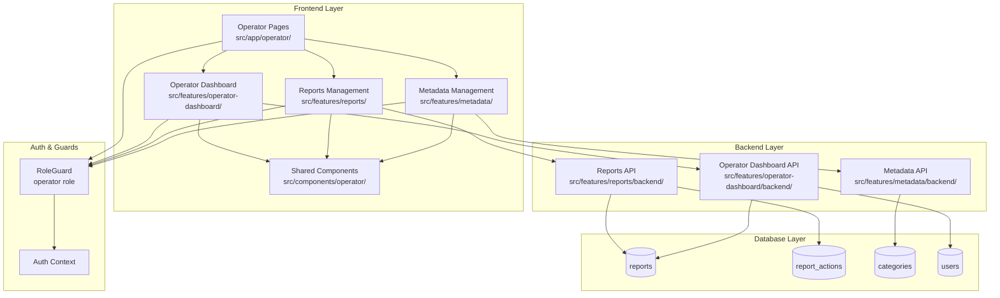

# 운영자 기능 구현 계획 (UC-012)

## 개요

운영자 기능을 구현하기 위한 모듈 설계입니다. 신고 처리와 메타데이터 관리 기능을 중심으로 구성됩니다.

### 주요 모듈 목록

| 모듈명 | 위치 | 설명 |
|--------|------|------|
| **Reports Feature** | `src/features/reports/` | 신고 접수 및 처리 관리 |
| **Operator Dashboard** | `src/features/operator-dashboard/` | 운영자 전용 대시보드 |
| **Metadata Management** | `src/features/metadata/` | 카테고리/난이도 관리 (categories 확장) |
| **Operator Pages** | `src/app/operator/` | 운영자 전용 페이지 라우팅 |
| **Shared Components** | `src/components/operator/` | 운영자 전용 공통 컴포넌트 |
| **Database Migration** | `supabase/migrations/` | 신고 액션 로그 테이블 추가 |

## Diagram



## Implementation Plan

### 1. Database Layer

#### 1.1 Report Actions 테이블 생성
**파일**: `supabase/migrations/0012_create_report_actions_table.sql`

```sql
-- 신고 처리 액션 로그 테이블
CREATE TABLE IF NOT EXISTS public.report_actions (
  id UUID PRIMARY KEY DEFAULT gen_random_uuid(),
  report_id UUID NOT NULL REFERENCES public.reports(id) ON DELETE CASCADE,
  action_type VARCHAR(50) NOT NULL CHECK (action_type IN ('warn', 'invalidate_submission', 'restrict_account', 'dismiss')),
  action_details JSONB,
  performed_by UUID NOT NULL REFERENCES public.users(id),
  performed_at TIMESTAMPTZ NOT NULL DEFAULT NOW()
);
```

### 2. Backend Layer

#### 2.1 Reports Feature Backend
**위치**: `src/features/reports/backend/`

**파일 구조**:
- `route.ts`: 신고 관련 API 엔드포인트
- `service.ts`: 신고 처리 비즈니스 로직
- `schema.ts`: 요청/응답 스키마 정의
- `error.ts`: 에러 코드 정의

**주요 API 엔드포인트**:
- `GET /api/reports` - 신고 목록 조회
- `GET /api/reports/:id` - 신고 상세 조회
- `PATCH /api/reports/:id` - 신고 상태 업데이트
- `POST /api/reports/:id/actions` - 신고 처리 액션 실행

**Unit Tests**:
```typescript
// src/features/reports/backend/__tests__/service.test.ts
describe('Reports Service', () => {
  describe('getReports', () => {
    it('should return paginated reports list');
    it('should filter by status');
    it('should handle database errors');
  });
  
  describe('updateReportStatus', () => {
    it('should update report status to investigating');
    it('should update report status to resolved');
    it('should validate status transitions');
  });
  
  describe('executeReportAction', () => {
    it('should execute warn action');
    it('should execute invalidate submission action');
    it('should execute account restriction action');
    it('should log action details');
  });
});
```

#### 2.2 Operator Dashboard Backend
**위치**: `src/features/operator-dashboard/backend/`

**주요 기능**:
- 운영자 대시보드 통계 데이터 제공
- 최근 신고 현황
- 처리 대기 신고 수

#### 2.3 Metadata Management Backend
**위치**: `src/features/metadata/backend/`

**주요 기능**:
- 카테고리 CRUD (기존 categories 확장)
- 난이도 메타데이터 관리
- 사용 중인 메타데이터 검증

### 3. Frontend Layer

#### 3.1 Operator Pages
**위치**: `src/app/operator/`

**페이지 구조**:
- `layout.tsx`: 운영자 레이아웃 (RoleGuard 적용)
- `dashboard/page.tsx`: 운영자 대시보드
- `reports/page.tsx`: 신고 목록
- `reports/[id]/page.tsx`: 신고 상세 처리
- `metadata/page.tsx`: 메타데이터 관리

**QA Sheet**:
```markdown
### Operator Dashboard Page
- [ ] 운영자 권한이 없는 사용자 접근 시 권한 오류 표시
- [ ] 대시보드 통계 데이터 정상 로드
- [ ] 최근 신고 목록 표시
- [ ] 처리 대기 신고 수 표시

### Reports Management Page
- [ ] 신고 목록 페이지네이션 동작
- [ ] 상태별 필터링 기능
- [ ] 신고 상세 페이지 이동
- [ ] 신고 상태 변경 기능

### Report Detail Page
- [ ] 신고 상세 정보 표시
- [ ] 조치 선택 및 실행
- [ ] 처리 결과 피드백
- [ ] 상태 변경 히스토리 표시
```

#### 3.2 Reports Feature Components
**위치**: `src/features/reports/components/`

**컴포넌트 목록**:
- `reports-list.tsx`: 신고 목록 테이블
- `report-detail.tsx`: 신고 상세 정보
- `report-action-form.tsx`: 신고 처리 액션 폼
- `report-status-badge.tsx`: 신고 상태 배지

#### 3.3 Operator Dashboard Components
**위치**: `src/features/operator-dashboard/components/`

**컴포넌트 목록**:
- `operator-stats.tsx`: 운영자 통계 대시보드
- `recent-reports.tsx`: 최근 신고 목록
- `pending-actions.tsx`: 처리 대기 액션

#### 3.4 Metadata Management Components
**위치**: `src/features/metadata/components/`

**컴포넌트 목록**:
- `categories-manager.tsx`: 카테고리 관리
- `metadata-form.tsx`: 메타데이터 생성/수정 폼
- `metadata-usage-checker.tsx`: 사용 중인 메타데이터 확인

#### 3.5 Shared Operator Components
**위치**: `src/components/operator/`

**공통 컴포넌트**:
- `operator-layout.tsx`: 운영자 페이지 공통 레이아웃
- `action-confirmation-dialog.tsx`: 액션 확인 다이얼로그
- `operator-breadcrumb.tsx`: 운영자 페이지 브레드크럼

### 4. Hooks Layer

#### 4.1 Reports Hooks
**위치**: `src/features/reports/hooks/`

**훅 목록**:
- `useReportsQuery.ts`: 신고 목록 조회
- `useReportQuery.ts`: 신고 상세 조회
- `useReportStatusMutation.ts`: 신고 상태 변경
- `useReportActionMutation.ts`: 신고 처리 액션 실행

#### 4.2 Operator Dashboard Hooks
**위치**: `src/features/operator-dashboard/hooks/`

**훅 목록**:
- `useOperatorStatsQuery.ts`: 운영자 통계 조회

#### 4.3 Metadata Hooks
**위치**: `src/features/metadata/hooks/`

**훅 목록**:
- `useMetadataQuery.ts`: 메타데이터 조회
- `useMetadataMutation.ts`: 메타데이터 생성/수정/삭제

### 5. Integration Points

#### 5.1 Hono App 라우터 등록
**파일**: `src/backend/hono/app.ts`

```typescript
import { registerReportsRoutes } from '@/features/reports/backend/route';
import { registerOperatorDashboardRoutes } from '@/features/operator-dashboard/backend/route';
import { registerMetadataRoutes } from '@/features/metadata/backend/route';

// 라우터 등록
registerReportsRoutes(app);
registerOperatorDashboardRoutes(app);
registerMetadataRoutes(app);
```

#### 5.2 권한 가드 적용
모든 운영자 페이지에 `RoleGuard` 적용:

```typescript
<RoleGuard allowedRoles={['operator']}>
  {/* 운영자 전용 컴포넌트 */}
</RoleGuard>
```

### 6. 구현 우선순위

1. **Phase 1**: Database Migration + Reports Backend
2. **Phase 2**: Reports Frontend Components
3. **Phase 3**: Operator Dashboard
4. **Phase 4**: Metadata Management
5. **Phase 5**: Integration & Testing

### 7. 고려사항

#### 7.1 보안
- 모든 운영자 API에 권한 검증 미들웨어 적용
- 민감한 액션(계정 제한 등)에 대한 추가 로깅
- 운영자 활동 감사 로그 기록

#### 7.2 성능
- 신고 목록 페이지네이션 구현
- 대용량 신고 데이터 처리를 위한 인덱스 최적화
- 실시간 알림 시스템 (선택사항)

#### 7.3 확장성
- 신고 타입 확장 가능한 구조
- 액션 타입 플러그인 방식 고려
- 메타데이터 타입 확장 가능한 설계
