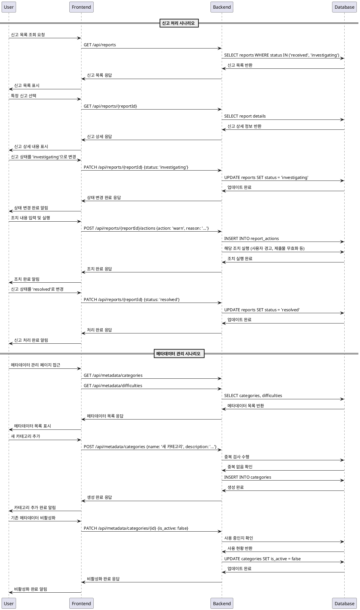

# UC-012: 운영 관리 (Operator)

## Primary Actor
- **Operator (운영자)**: 시스템 관리 권한을 가진 사용자

## Precondition
- 운영자 권한으로 로그인된 상태
- 운영자 대시보드에 접근 가능한 상태

## Trigger
- 신고 접수 처리 요청
- 메타데이터 관리 요청 (카테고리, 난이도 등)

## Main Scenario

### 신고 처리 시나리오
1. 운영자가 신고 목록을 조회한다
2. 특정 신고를 선택하여 상세 내용을 확인한다
3. 신고 상태를 'investigating'으로 변경한다
4. 신고 내용을 검토하고 적절한 조치를 결정한다
5. 조치 내용을 입력하고 실행한다 (경고, 제출물 무효화, 계정 제한 등)
6. 신고 상태를 'resolved'로 변경한다
7. 처리 결과가 관련 사용자에게 알림으로 전송된다

### 메타데이터 관리 시나리오
1. 운영자가 메타데이터 관리 페이지에 접근한다
2. 카테고리 또는 난이도 목록을 조회한다
3. 새로운 메타데이터를 추가하거나 기존 항목을 수정한다
4. 사용 중인 메타데이터의 경우 비활성화 처리를 선택한다
5. 변경사항이 시스템에 반영된다

## Edge Cases

### 신고 처리 관련
- **중복 신고**: 동일한 대상에 대한 여러 신고가 있는 경우, 통합 처리
- **잘못된 신고**: 신고 내용이 부적절한 경우, 신고 반려 처리
- **처리 권한 부족**: 특정 조치에 대한 권한이 없는 경우, 상급자 에스컬레이션
- **대상 사용자 탈퇴**: 신고 대상이 이미 탈퇴한 경우, 신고 자동 종료

### 메타데이터 관리 관련
- **사용 중인 메타데이터 삭제**: 현재 사용 중인 카테고리/난이도 삭제 시도 시 경고 및 비활성화 권장
- **중복 메타데이터**: 동일한 이름의 메타데이터 생성 시도 시 오류 처리
- **필수 메타데이터**: 시스템 기본 메타데이터 삭제 시도 시 차단

## Business Rules

### 신고 처리 규칙
- 신고는 접수일로부터 7일 이내에 처리되어야 함
- 모든 신고 처리는 로그로 기록되어야 함
- 중대한 위반 사항은 즉시 처리되어야 함
- 처리 결과는 신고자와 피신고자 모두에게 통지되어야 함

### 메타데이터 관리 규칙
- 메타데이터 변경 시 기존 데이터와의 호환성을 유지해야 함
- 사용 중인 메타데이터는 삭제할 수 없으며, 비활성화만 가능함
- 새로운 메타데이터 추가 시 중복 검사를 수행해야 함
- 메타데이터 변경 이력은 감사를 위해 보관되어야 함

### 권한 관리 규칙
- 운영자 권한은 최소 권한 원칙을 따라야 함
- 민감한 조치(계정 제한 등)는 추가 승인이 필요할 수 있음
- 모든 운영자 활동은 감사 로그에 기록되어야 함

## Sequence Diagram

